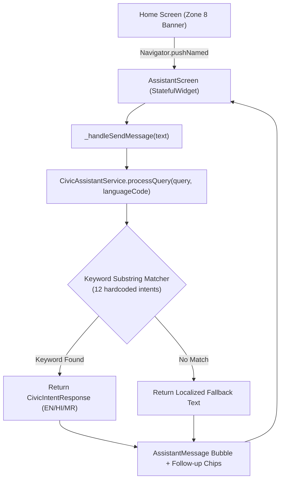

# CivicFix Chatbot Rollout — Phase 1: Current State Audit & Baseline Report

**Execution Date:** October 8, 2026  
**Status:** Completed  
**Scope:** In-depth audit and baseline classification of the current CivicFix Citizen Assistant.

---

## 1. Chatbot Architecture & File Map

The current CivicFix Citizen Chatbot is implemented across the following components in the codebase:

| Component | File Path | Role & Description |
|---|---|---|
| **Chat Screen** | `TeamCivicSense/civic_app/lib/User UI/screens/assistant_screen.dart` | `AssistantScreen` (StatefulWidget) managing chat UI, message list state, scrolling, and user text input. |
| **Message Bubble Widget** | `TeamCivicSense/civic_app/lib/User UI/widgets/assistant/assistant_message_bubble.dart` | `AssistantMessageBubble` rendering user bubbles (right-aligned, primary blue) and assistant bubbles (left-aligned, card surface, avatar, follow-up suggestion chips). |
| **Entrypoint Banner** | `TeamCivicSense/civic_app/lib/User UI/widgets/home_assistant_banner.dart` | `HomeAssistantBanner` on Citizen Home screen (Zone 8) providing one-tap navigation to the assistant. |
| **Service Layer** | `TeamCivicSense/civic_app/lib/User UI/services/assistant_service.dart` | `CivicAssistantService` containing 12 hardcoded intent responses, static system prompt builder, localized greetings, and keyword matcher. |
| **Data Models** | `TeamCivicSense/civic_app/lib/core/models/assistant_message_model.dart` | `AssistantMessage` and `AssistantMessageSender` (`user`, `assistant`) domain entities. |
| **Routing** | `TeamCivicSense/civic_app/lib/core/routing/app_router.dart` | `AppRoutes.assistant` route mapping. |
| **Localization Context** | `TeamCivicSense/civic_app/lib/core/localization/locale_controller.dart` | Supplies active locale (`en`, `hi`, `mr`) to resolve language-specific greetings and canned responses. |



---

## 2. Message Flow Trace

### Scenario A: User sends `"Hello"`
1. **Chat UI:** User enters `"Hello"` in `TextField` on `AssistantScreen` and taps Send.
2. **Controller/State:** `_handleSendMessage` appends user `AssistantMessage` to in-memory `_messages` list and sets `_isProcessing = true`.
3. **Service:** Calls `_assistantService.processQuery(query: "Hello", languageCode: "en")`.
4. **Intent Evaluation:** Query is normalized to `"hello"`. The service scans all 12 hardcoded intents using substring matching (`clean.contains(keyword)`).
5. **Model/AI:** **No AI or LLM is called.** No intent contains greeting keywords (`"hello"`, `"hi"`, `"hey"`).
6. **Fallback Response:** Falls through to `_getFallbackText("en")`:  
   `"I'm still learning how to help with that. Try asking about reporting an issue, tracking a complaint, locations, categories, or complaint statuses."`
7. **UI Rendering:** Renders assistant bubble with fallback text and 4 suggested topic chips.

### Scenario B: User asks `"What happens after I submit a complaint?"`
1. **Chat UI:** User submits `"What happens after I submit a complaint?"`.
2. **Controller/State:** Same `_handleSendMessage` execution path.
3. **Service:** Calls `_assistantService.processQuery(query: "What happens after I submit a complaint?", languageCode: "en")`.
4. **Intent Evaluation:** The query contains the substring `"submit"` (length 6), which matches Intent 1 (*Report Issue*).
5. **Response:** Returns canned text for *Report Issue*:  
   `"To report a civic issue: Tap 'Report an Issue' on the Home screen. Fill in the title, select a category, attach photos in Evidence (optional, up to 3), confirm your location on the map, then review and submit."`
6. **Observation:** **Both messages follow the exact same deterministic code path.** Because matching is purely based on naive keyword substring containment, the bot provides instructions on *how to submit a complaint* rather than explaining the *post-submission lifecycle stages*.

---

## 3. Current AI Model & Infrastructure Audit

| Attribute | Chatbot Implementation Status |
|---|---|
| **AI Provider** | **None (Mock/Rule-based)**. No LLM integration exists in `assistant_service.dart`. |
| **Model Identifier** | N/A for chatbot. |
| **Configuration Location** | Local Dart constants in `lib/User UI/services/assistant_service.dart`. |
| **Execution Environment** | 100% Client-side synchronous Dart logic. |
| **API Key Protection** | **Safe**. No API keys are present or needed in the chatbot codebase. |
| **Timeout & Retry Behavior** | N/A (local execution completes in < 1ms). |

*(Note: Other modules in CivicFix utilize Gemini—such as `GeminiAiAuthenticityService` using `gemini-2.5-flash` via Firebase AI Logic for image authenticity, and Supabase Edge Functions using `gemini-3.5-flash` for department verification with server-side secrets. However, the Citizen Chatbot itself is entirely disconnected from these AI pipelines).*

---

## 4. Current System Prompt Audit

The codebase contains a static helper method `CivicAssistantService.generateLanguageSystemPrompt(languageCode)`:

```text
You are the official CivicFix AI Assistant for Mumbai, India.
You MUST respond exclusively in English.
Adhere strictly to approved municipal terminology:
Complaint, Ward, Department, Evidence, Resolution, Verification, Pothole, Water Leakage, Garbage Overflow.
Always reply in English even if the citizen queries in Hindi or Marathi.
```

### System Prompt Findings:
- **Runtime Usage:** **Unused**. The method is never called by `processQuery` or any other runtime flow.
- **Identity & Tone:** Institutional, rigid municipal persona.
- **Scope Restrictions:** Enforces strict language locking (responding only in English, Hindi, or Marathi based on locale), but defines zero operational scope boundaries.
- **Hallucination Controls:** None defined.
- **Safety Rules:** None defined.
- **BMC Operational Context:** Completely missing knowledge of Junior Engineers, Field Execution Officers, Ward Department Leads, SLAs, automated routing, evidence requirements, or rework cycles.

---

## 5. Casual Conversation Test Results

| Input Query | Current Chatbot Response | Assessment |
|---|---|---|
| `Hello` | *"I'm still learning how to help with that. Try asking about reporting an issue..."* | ❌ Failed (Generic Fallback) |
| `Hi` | *"I'm still learning how to help with that. Try asking about reporting an issue..."* | ❌ Failed (Generic Fallback) |
| `How are you?` | *"I'm still learning how to help with that. Try asking about reporting an issue..."* | ❌ Failed (Generic Fallback) |
| `What are you doing?` | *"I'm still learning how to help with that. Try asking about reporting an issue..."* | ❌ Failed (Generic Fallback) |
| `Thank you` | *"I'm still learning how to help with that. Try asking about reporting an issue..."* | ❌ Failed (Generic Fallback) |
| `Good morning` | *"I'm still learning how to help with that. Try asking about reporting an issue..."* | ❌ Failed (Generic Fallback) |
| `Who are you?` | *"I'm still learning how to help with that. Try asking about reporting an issue..."* | ❌ Failed (Generic Fallback) |

**Result:** Casual conversation is **MISSING**. 100% of non-civic greetings trigger the robotic fallback.

---

## 6. CivicFix Knowledge Test Results

| Test Question | Matching Mechanism | Chatbot Output | Quality Assessment |
|---|---|---|---|
| *What is CivicFix?* | None | Fallback string | ❌ **Missing** (No intent defined) |
| *How do I report a complaint?* | Matches `"report"` (Intent 1) | Step-by-step reporting guide | ⚠️ **Partial** (Canned static text) |
| *What happens after submission?* | Matches `"submit"` (Intent 1) | Step-by-step reporting guide | ❌ **Inaccurate** (Keyword collision) |
| *What does Under Verification mean?* | None (keyword expects `"verified mean"`) | Fallback string | ❌ **Missing** (Brittle keyword matching) |
| *Who handles my complaint?* | None | Fallback string | ❌ **Missing** (No JE/Field Officer context) |
| *What is a Junior Engineer?* | None | Fallback string | ❌ **Missing** (No role context) |
| *What is an Execution Officer?* | None | Fallback string | ❌ **Missing** (No role context) |
| *What happens if AI verification is unavailable?* | None | Fallback string | ❌ **Missing** (No fallback knowledge) |
| *How do I track my complaint?* | Matches `"how to track"` (Intent 2) | Step-by-step tracking guide | ⚠️ **Partial** (Canned static text) |
| *What happens when a complaint is reopened?* | None | Fallback string | ❌ **Missing** (No rework knowledge) |
| *How does the map work?* | None (keyword expects `"hazard map"`) | Fallback string | ❌ **Missing** (Brittle keyword matching) |

---

## 7. Out-of-Scope Behavior

| Question | Current Behavior | Observation |
|---|---|---|
| *What is photosynthesis?* | Returns civic fallback string | Refuses implicitly due to lack of intent. |
| *Tell me a joke.* | Returns civic fallback string | Refuses implicitly due to lack of intent. |
| *What is the capital of Japan?* | Returns civic fallback string | Refuses implicitly due to lack of intent. |

**Observation:** The bot safely ignores out-of-scope questions, but only because it has no LLM capability. It lacks graceful conversational redirection.

---

## 8. Conversation Memory Audit

- **Message History Storage:** Ephemeral `List<AssistantMessage>` stored in `_AssistantScreenState`.
- **Context Window Sent to Engine:** **0 messages**. `processQuery` receives only the current raw query string.
- **Multi-Turn Context:** Completely unsupported. If a user asks *"My complaint is under verification"* followed by *"What happens next?"*, the second message is evaluated in isolation and triggers the generic fallback.
- **Persistence:** **None**. Navigating away from `AssistantScreen` destroys all message history.

---

## 9. App Context Access Audit

| Context Parameter | Injected to Chatbot? | Details |
|---|---|---|
| **User Role (Citizen vs Govt)** | ❌ No | Chatbot has no knowledge of user role. |
| **Active Citizen Profile** | ❌ No | Only `languageCode` is fetched on screen init. |
| **Current Screen / Route** | ❌ No | Chatbot operates in complete isolation. |
| **Selected Complaint / Ticket ID** | ❌ No | Cannot inspect complaints or status. |
| **Live Firestore Data** | ❌ No | Zero database integration. |
| **Active App Language** | ✅ Yes | Injected via `LocaleController` / `Localizations`. |

---

## 10. Knowledge Sources Audit

- **Hardcoded Intents:** Exactly 12 static `CivicIntentResponse` items defined directly in `assistant_service.dart`:
  1. `Report Issue`
  2. `Track Complaint`
  3. `Status: Reported`
  4. `Status: Verified`
  5. `Status: Assigned`
  6. `Status: In Progress`
  7. `Status: Resolved`
  8. `Categories`
  9. `Add Photo / Evidence`
  10. `Select Location`
  11. `View My Complaints`
  12. `Hazard Map / Nearby`
- **Dynamic Knowledge / FAQs / Brain.md:** None connected.
- **RAG / Embeddings / Vector Search:** **Completely ABSENT**.

---

## 11. Multilingual Baseline

| Language | Welcome Greeting | Suggested Chips | Intent Responses | Natural NLU / Transliteration |
|---|---|---|---|---|
| **English (`en`)** | ✅ Localized | ✅ 4 Chips | ✅ 12 static responses | ❌ Brittle keyword only |
| **Hindi (`hi`)** | ✅ Localized | ✅ 4 Chips | ✅ 12 static responses | ❌ Fails on inflections/Hinglish |
| **Marathi (`mr`)** | ✅ Localized | ✅ 4 Chips | ✅ 12 static responses | ❌ Fails on inflections/Marathlish |

---

## 12. Security Audit

- **API Key Storage:** **SAFE**. No API keys exist in the chatbot code.
- **PII Exposure:** **SAFE**. No citizen data, officer data, or phone numbers are passed or logged.
- **Government Secrets:** **SAFE**. Chatbot is isolated from administrative credentials.
- **Logging:** No sensitive chat transcripts are persisted or logged.

---

## 13. UI Architecture & Features

- ✅ **Message Bubbles:** Custom styled user & assistant bubbles with timestamps.
- ✅ **Action Chips:** Predefined follow-up suggestion chips below assistant bubbles and at the top bar.
- ✅ **Chat Clear:** Action button in app bar to reset conversation.
- ✅ **Smooth Scrolling:** Auto-scrolls to newest message on send.
- ❌ **Rich Text / Markdown:** Plain `Text` widget used; bold, lists, and tables cannot be rendered.
- ❌ **Copy Message:** No clipboard action available.
- ❌ **Voice / TTS:** No Text-to-Speech audio readout or microphone input.
- ❌ **Retry Action:** No retry button on failed or fallback messages.

---

## 14. Current Baseline Scorecard

| Evaluation Dimension | Baseline Rating | Summary |
|---|---|---|
| **Casual Conversation** | **MISSING** | 100% of greetings fail to generic fallback. |
| **CivicFix Knowledge** | **PARTIAL** | Only 12 static intents; keyword collisions occur; fails on roles/SLAs. |
| **RAG (Retrieval Augmented Generation)** | **ABSENT** | Zero vector DB, document retrieval, or dynamic grounding. |
| **Conversation Memory** | **MISSING** | 0 context window; single-turn only; zero persistence. |
| **App Context Access** | **MISSING** | No user, ticket, or live complaint data passed. |
| **Multilingual Support** | **PARTIAL** | Static translations for 12 intents; no conversational NLU. |
| **Error Recovery** | **PARTIAL** | Graceful fallback text, but no retry or self-correction. |
| **Security & Privacy** | **SAFE** | Zero secrets exposed; no PII transmission. |

---

## 15. Recommended Priorities for Phase 2

1. **AI Service Integration:** Connect `CivicAssistantService` to an authentic Gemini model endpoint (`gemini-2.5-flash` or `gemini-1.5-flash`) with robust retry and error handling.
2. **Comprehensive System Prompt:** Author a grounded system prompt covering the full BMC municipal workflow (24 Wards, 18 Departments, Junior Engineers, Field Execution Officers, Ward Department Leads, SLAs, Evidence Authenticity, Reopening).
3. **Conversational Natural Language & Greetings:** Enable natural conversational greetings, polite out-of-scope redirection, and helpful contextual assistance.
4. **Multi-Turn Conversation Memory:** Maintain sliding-window conversation history (`List<Content>`) within the session.
5. **Rich Text & Markdown Rendering:** Upgrade `AssistantMessageBubble` to render structured markdown formatting (bullet points, bold highlights, numbered steps).
6. **Robust Multilingual NLU:** Implement true multi-turn multilingual conversation across English, Hindi, and Marathi adhering to canonical municipal terms.

---

## Final Verdict

| Checkpoint | Status |
|---|---|
| **CHATBOT LOCATED** | **PASS** |
| **MESSAGE FLOW UNDERSTOOD** | **PASS** |
| **MODEL IDENTIFIED** | **PASS** |
| **CURRENT PROMPT AUDITED** | **PASS** |
| **CASUAL CONVERSATION TESTED** | **PASS** |
| **CIVICFIX KNOWLEDGE TESTED** | **PASS** |
| **CONVERSATION MEMORY AUDITED** | **PASS** |
| **APP CONTEXT AUDITED** | **PASS** |
| **MULTILINGUAL BASELINE TESTED** | **PASS** |
| **SECURITY AUDITED** | **PASS** |
| **READY FOR PHASE 2** | **YES** |
