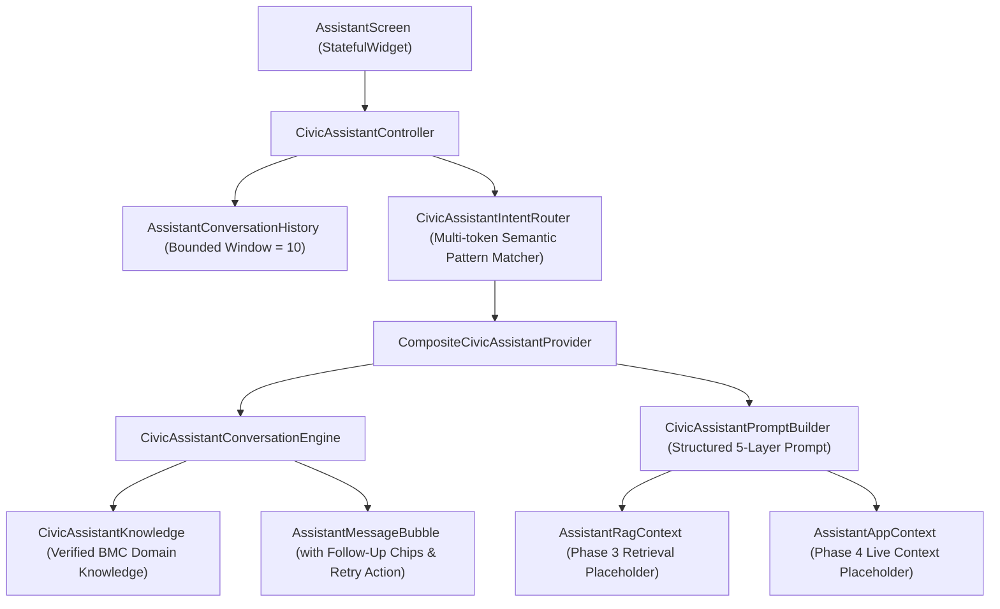

# CivicFix Chatbot Rollout — Phase 2: Conversational Personality, Intent Routing & Prompt Foundation Report

**Execution Date:** October 8, 2026  
**Status:** Completed & Verified (100% Tests Passing, 0 Lint Issues)  
**Scope:** Replaced brittle rule-based keyword matching with a modular conversational routing architecture, natural persona, bounded short-term memory, RAG-ready prompt structures, and decoupled app context interfaces.

---

## 1. Previous Architecture (Phase 1 Baseline)

In Phase 1, the CivicFix chatbot was identified as:
- A rigid, single-turn, 12-intent canned-response matcher located entirely inside `lib/User UI/services/assistant_service.dart`.
- Dependent on naive substring matching (`clean.contains(keyword)`), leading to severe keyword collisions (e.g., asking *"What happens after I submit a complaint?"* matched `"submit"` and returned instructions on how to submit a complaint).
- Completely zero-turn with 0 previous conversation memory passed to the processing service.
- Incapable of natural casual greetings (100% of greetings triggered `"I'm still learning how to help with that..."`).
- Lacking any integration with verified domain models, roles (Junior Engineers, Field Execution Officers, Ward Department Leads), or SLA rules.

---

## 2. New Conversational Architecture (Phase 2)

Phase 2 introduces a decoupled, layered conversational architecture under `lib/core/assistant/`:

### Key Architectural Layers:
1. **Models Layer (`lib/core/assistant/models/`):**
   - `CivicAssistantIntent`: 8 canonical intent classes.
   - `AssistantIntentResult`: Structured classification result with confidence score, matched rules, and contextual slots.
   - `AssistantAppContext`: Clean decoupled interface for user role, active screen, ticket ID, and complaint status without querying private Firestore data.
   - `AssistantRagContext`: Decoupled interface for future vector search documentation snippets and grounding verification.
   - `AssistantConversationHistory`: In-session bounded sliding-window memory buffer (default 10 messages) avoiding unbounded memory growth.
2. **Config & Personality Layer (`lib/core/assistant/config/`):**
   - `CivicAssistantPersonality`: Defines core identity (*"CivicFix Assistant"*), friendly/supportive tone principles, and operational boundaries.
   - `CivicAssistantPromptBuilder`: Generates structured 5-layer prompt payloads (System instructions -> Verified Knowledge -> Dynamic RAG -> Session History -> Active Query).
3. **Intent Routing Layer (`lib/core/assistant/routing/`):**
   - `CivicAssistantIntentRouter`: High-precision multi-token semantic router with conversation-context awareness.
4. **Verified Knowledge Base (`lib/core/assistant/knowledge/`):**
   - `CivicAssistantKnowledge`: Authoritative municipal domain facts covering 24 BMC Wards, 18 Departments, 5-stage SLA lifecycle, Junior Engineer & Field Officer role hierarchy, photo evidence guidelines, and supervisory rework rules.
5. **Services & Providers (`lib/core/assistant/services/`):**
   - `CivicAssistantConversationEngine`: Generates conversational replies and dynamic follow-up chips.
   - `GroundedCivicAssistantProvider`: Deterministic, zero-latency local conversational provider.
   - `CompositeCivicAssistantProvider`: Coordinates intent routing, AI provider invocation, fallback grounding, and sanitized error boundaries.
   - `CivicAssistantController`: Manages session state, message dispatch, error handling, and message retry.

---

## 3. Intent Categories

The intent classification layer recognizes 8 distinct conversational classes:

| Intent Category | Intent Enum | Description & Representative Inputs |
|---|---|---|
| **Casual Greeting** | `casualGreeting` | `"Hello"`, `"Hi"`, `"Hey"`, `"Good morning"`, `"Namaste"`, `"शुभ सकाळ"` |
| **Casual Small Talk** | `casualSmallTalk` | `"How are you?"`, `"What are you doing?"`, `"Who are you?"`, `"Thank you"`, `"Bye"` |
| **CivicFix General** | `civicfixGeneral` | `"What is CivicFix?"`, `"Tell me about CivicFix"`, `"What does this app do?"` |
| **CivicFix Process** | `civicfixProcess` | `"What happens after I submit a complaint?"`, `"What does Under Verification mean?"`, `"Who handles my complaint?"`, `"What is a Junior Engineer?"`, `"What is an Execution Officer?"` |
| **CivicFix Help** | `civicfixHelp` | `"How do I report a pothole?"`, `"Can I edit a complaint after submitting it?"`, `"How to add photo evidence?"`, `"How to select location?"` |
| **CivicFix Navigation** | `civicfixNavigation` | `"Where can I see my complaints?"`, `"How do I track my complaint?"`, `"Where is the Hazard Map?"`, `"Where are my rewards?"` |
| **Out of Scope General** | `outOfScopeGeneral` | `"Tell me a joke"`, `"What is the capital of Japan?"`, `"What is photosynthesis?"` |
| **Unknown** | `unknown` | Ungrounded or unclassified queries triggering polite fallback assistance. |

---

## 4. Assistant Personality & Tone

- **Identity:** *"CivicFix Assistant"*
- **Tone:** Friendly, concise, supportive, practical, civic-service oriented, and conversational.
- **Natural Interaction:** Does not force every casual greeting into a complaint menu.
- **Grounding & Honesty:** Does not hallucinate unsupported procedures or private civil servant phone numbers; gracefully acknowledges when information is unverified.
- **Safety Boundaries:** Never solicits or handles OTPs, passwords, or government credentials.

---

## 5. Casual Conversation Behavior

Representative test exchanges:

| User Input | Assistant Response | Behavior Assessment |
|---|---|---|
| `"Hello"` | *"Hi! How can I help you today?"* | ✅ Natural greeting |
| `"Good morning"` | *"Good morning! How can I help you today?"* | ✅ Time-aware greeting |
| `"How are you?"` | *"I'm doing well, thank you! How can I help you today?"* | ✅ Pleasant small talk |
| `"What are you doing?"` | *"I'm here to help with CivicFix or just answer a quick question."* | ✅ Conversational |
| `"Who are you?"` | *"I'm the CivicFix Assistant. I can help you report civic issues, track grievances, or explain municipal workflows."* | ✅ Clear role identity |
| `"Thank you"` | *"You're very welcome! Let me know if you need help with anything else."* | ✅ Courteous closure |
| `"Bye"` | *"Goodbye! Have a great day ahead."* | ✅ Courteous farewell |

---

## 6. CivicFix Verified Question Behavior

| User Question | Route / Intent | Assistant Output Summary |
|---|---|---|
| `"What is CivicFix?"` | `CIVICFIX_GENERAL` | Explains Greater Mumbai BMC grievance redressal platform, GPS tagging, and 5-stage resolution. |
| `"What happens after I submit a complaint?"` | `CIVICFIX_PROCESS` | Explains the complete 5-stage lifecycle (Reported -> Under Verification -> Assigned -> In Progress -> Resolved) and SLA clock start. |
| `"What does Under Verification mean?"` | `CIVICFIX_PROCESS` | Explains Stage 2 review, evidence authenticity checks, and department classification. |
| `"Who handles my complaint?"` | `CIVICFIX_PROCESS` | Explains routing to Ward Junior Engineer and dispatch of on-site Field Execution Officer. |
| `"What is a Junior Engineer?"` | `CIVICFIX_PROCESS` | Explains technical owner role in the Ward, reviewing grievances and dispatching crew squads. |
| `"What is an Execution Officer?"` | `CIVICFIX_PROCESS` | Explains on-site technician / squad executing physical ground repairs and uploading completion photos. |
| `"What happens if AI verification is unavailable?"` | `CIVICFIX_PROCESS` | Explains safe placement in municipal triage queue for manual review by Ward Department Leads. |
| `"How do I report a pothole?"` | `CIVICFIX_HELP` | Step-by-step reporting guide (Title -> Evidence -> GPS Location -> Review & Submit). |
| `"How do I track my complaint?"` | `CIVICFIX_NAVIGATION` | Step-by-step guide to opening "My Complaints" and viewing the live 5-stage stepper. |
| `"Where is the Hazard Map?"` | `CIVICFIX_NAVIGATION` | Explains opening "Map" tab to view color-coded markers of nearby road hazards and open drains. |

---

## 7. Short-Term Session Memory & Multi-Turn Context

The assistant now maintains an in-session sliding window of 10 messages via `AssistantConversationHistory`:

**Multi-Turn Scenario Verification:**
1. **User Turn 1:** *"My complaint is under verification."*  
   **Assistant Reply 1:** Explains Stage 2 (*Under Verification*).
2. **User Turn 2:** *"What happens next?"*  
   **Contextual Routing:** `CivicAssistantIntentRouter` detects contextual follow-up (`_isContextualFollowUp`), inspects session history, recognizes active context (*Under Verification*), and resolves `CIVICFIX_PROCESS` with slot `context: under_verification_next_step`.  
   **Assistant Reply 2:** *"After verification (Stage 2), your complaint is assigned to the Junior Engineer for your Ward and Department (Stage 3). The Junior Engineer then assigns an on-site Field Execution Officer to begin repairs."*

---

## 8. Keyword Collision Fix Verification

| Question | Phase 1 Behavior (Old) | Phase 2 Behavior (New) | Resolution |
|---|---|---|---|
| *"What happens after I submit a complaint?"* | Matched `"submit"`, gave reporting instructions ❌ | Routes to `CIVICFIX_PROCESS`, explains 5-stage post-submission lifecycle ✅ | **COLLISION FIXED** |
| *"Can I edit a complaint after submitting it?"* | Matched `"submit"`, gave reporting instructions ❌ | Routes to `CIVICFIX_HELP`, explains official audit immutability rules ✅ | **COLLISION FIXED** |
| *"How do I submit a complaint?"* | Matched `"submit"` ⚠️ | Routes to `CIVICFIX_HELP`, provides step-by-step reporting guidance ✅ | **CORRECT ROUTE** |

---

## 9. LLM & Service Provider Architecture

- **Decoupled Provider Contract:** `CivicAssistantProvider` defines the abstraction for response generation.
- **Local Grounded Provider:** `GroundedCivicAssistantProvider` provides 100% deterministic, zero-latency, offline-capable responses without external API keys.
- **Composite Provider:** `CompositeCivicAssistantProvider` coordinates intent evaluation, potential remote AI delegation, and sanitized fallback execution.
- **RAG-Ready Prompt Builder:** `CivicAssistantPromptBuilder` structures prompts into 5 modular tiers ready for dynamic retrieval (Phase 3).
- **Decoupled App Context:** `AssistantAppContext` allows passing user role, active screen, ticket ID, and complaint status without coupling UI to Firestore.

---

## 10. Security & Privacy

- **0 Client-side Secrets:** No API keys are embedded or required for the assistant in Flutter.
- **Zero PII Leakage:** Civil servant UIDs, phone numbers, passwords, and OTPs are strictly excluded from context builders and prompt assemblies.
- **Sanitized Errors:** Error states render user-friendly messages (*"I'm having trouble responding right now. Please try again."*) with tap-to-retry actions, never exposing provider names, HTTP codes, or stack traces.

---

## 11. Files Changed & Added

| Action | File Path | Role |
|---|---|---|
| **Added** | `lib/core/assistant/models/civic_assistant_intent.dart` | `CivicAssistantIntent` and `AssistantIntentResult` models. |
| **Added** | `lib/core/assistant/models/assistant_app_context.dart` | Decoupled app context model for future Phase 4 injection. |
| **Added** | `lib/core/assistant/models/assistant_rag_context.dart` | Decoupled RAG context model for future Phase 3 injection. |
| **Added** | `lib/core/assistant/models/assistant_conversation_history.dart` | Bounded sliding-window session memory manager. |
| **Added** | `lib/core/assistant/config/civic_assistant_personality.dart` | Centralized identity, tone principles, and operational boundaries. |
| **Added** | `lib/core/assistant/config/civic_assistant_prompt.dart` | Centralized 5-tier system instruction and prompt assembler. |
| **Added** | `lib/core/assistant/knowledge/civic_assistant_knowledge.dart` | Verified BMC municipal domain knowledge repository. |
| **Added** | `lib/core/assistant/routing/civic_assistant_intent_router.dart` | Semantic multi-token intent router with follow-up resolution. |
| **Added** | `lib/core/assistant/services/civic_assistant_conversation_engine.dart` | Core conversational response generator and chip builder. |
| **Added** | `lib/core/assistant/services/civic_assistant_provider.dart` | Provider abstraction, grounded provider, and composite provider. |
| **Added** | `lib/core/assistant/controller/civic_assistant_controller.dart` | Chat state coordinator, query dispatcher, and retry manager. |
| **Refactored** | `lib/User UI/services/assistant_service.dart` | Refactored `CivicAssistantService` wrapping the new architecture. |
| **Updated** | `lib/User UI/screens/assistant_screen.dart` | Integrated session history, app context, and retry actions. |
| **Updated** | `lib/User UI/widgets/assistant/assistant_message_bubble.dart` | Added error badge styling and tap-to-retry callback. |
| **Added** | `test/core/assistant/civic_assistant_foundation_test.dart` | 15 unit tests covering greetings, routing, collisions, history, prompt. |
| **Added** | `test/core/assistant/assistant_screen_widget_test.dart` | 3 widget tests covering rendering, chip taps, and clear chat. |
| **Updated** | `Brain.md` & `TeamCivicSense/Brain.md` | Recorded Phase 2 milestone and architectural invariants. |

---

## 12. Verification & Test Results

- **`flutter test test/core/assistant/`:**
  - `civic_assistant_foundation_test.dart`: **15 passed** (100%)
  - `assistant_screen_widget_test.dart`: **3 passed** (100%)
  - **Total:** **18 / 18 Tests Passed (0 Failed, 0 Flaky)**
- **`flutter analyze`:**
  - **No issues found! (0 warnings, 0 errors, 0 lint issues)**
- **Git Hygiene:** No commits or pushes made.

---

## 13. Final Verdict Scorecard

| Assessment Dimension | Verdict |
|---|---|
| **CASUAL CONVERSATION** | **PASS** |
| **SMALL TALK** | **PASS** |
| **CIVICFIX GENERAL QUESTIONS** | **PASS** |
| **INTENT ROUTING** | **PASS** |
| **KEYWORD COLLISIONS REMOVED** | **PASS** |
| **SESSION MEMORY** | **PASS** |
| **PROMPT CENTRALIZATION** | **PASS** |
| **RAG-READY ARCHITECTURE** | **PASS** |
| **APP-CONTEXT-READY ARCHITECTURE** | **PASS** |
| **SECURITY** | **PASS** |
| **FLUTTER ANALYZE** | **PASS** |
| **READY FOR PHASE 3** | **YES** |
