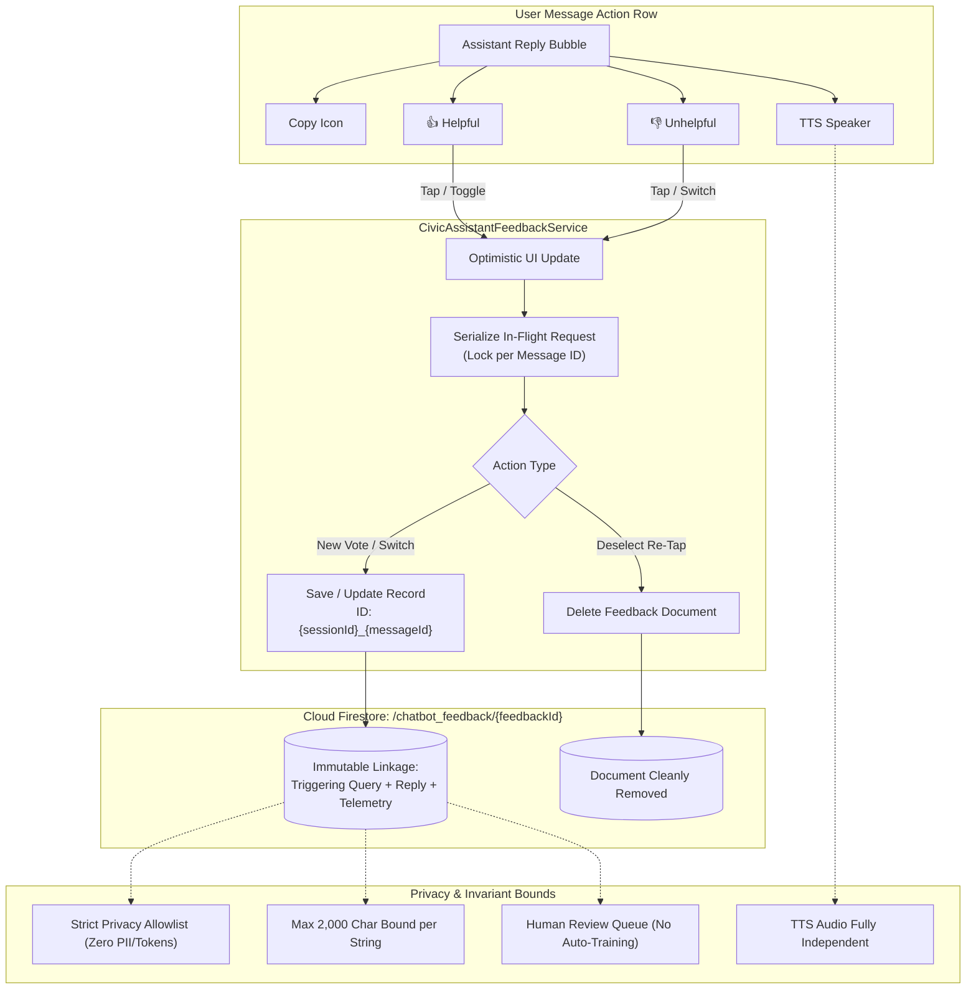
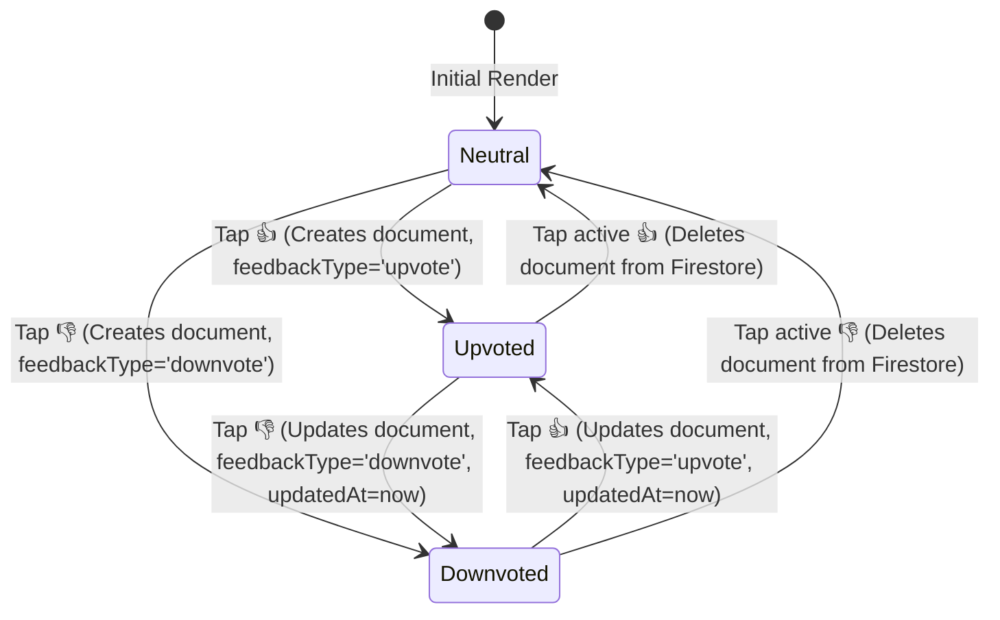

# CivicFix Chatbot Feedback Rollout — Phase 3
## Firestore Feedback Persistence & Privacy-Safe Telemetry Report

**Author:** Antigravity AI  
**Date:** October 8, 2026  
**System:** CivicFix Municipal Citizen Grievance & Workflow Platform  
**Target Collection:** `chatbot_feedback`  
**Status:** **FEEDBACK PERSISTENCE READY (ALL 20 CRITERIA PASSED)**

---

## 1. Executive Summary

Phase 3 connects the existing chatbot message feedback buttons (👍 Thumbs Up / 👎 Thumbs Down) in `AssistantMessageBubble` and `AssistantScreen` to Firebase Cloud Firestore. Each feedback event records the citizen's rating, the exact triggering user query, the displayed assistant reply, and privacy-shielded telemetry metadata for human-in-the-loop quality evaluation, prompt refinement, and municipal knowledge maintenance without direct automated model retraining.



---

## 2. Existing Feedback UI Audit

| Component | State Before Phase 3 | Phase 3 Enhancement |
| :--- | :--- | :--- |
| **`AssistantMessageBubble`** | Action row contains 13px 👍 and 👎 icons with `onFeedbackTap` callback. | Preserved exact 13px visual design tokens and compact row without layout shifting. |
| **`AssistantMessage` Model** | `feedbackRating` (`helpful`, `unhelpful`) in-memory only. | Added `clearFeedbackRating` support in `copyWith` for null-safe deselect state transitions. |
| **`CivicAssistantController`** | Synchronous local memory update; no persistence. | Added asynchronous `submitFeedback` with optimistic UI, rollback on failure, user message linkage, and deselect handling. |
| **`AssistantScreen`** | Basic local callback; no retry/error banner. | Integrated with `CivicAssistantFeedbackService`, optimistic updates, and localized rollback SnackBar notifications. |
| **Message Linkage** | Reply did not link its triggering query explicitly. | Enriched response metadata with `userMessageId` and `userMessage` on every turn. |

---

## 3. Dedicated Firestore Collection & Document Schema

- **Collection Name:** `chatbot_feedback`
- **Document ID Strategy:** Deterministic document key `${sessionId}_${assistantMessageId}`. Guarantees that multiple taps or vote changes for a given assistant reply update the same document rather than creating duplicates.

### Strongly Typed Model: `ChatbotFeedbackRecord`
```dart
class ChatbotFeedbackRecord {
  final String feedbackId;            // e.g. "sess_1728400000000_msg_a_1728400001000"
  final String sessionId;             // Active chat session ID
  final String assistantMessageId;    // Target assistant message ID
  final String userMessageId;         // Triggering user message ID
  final String userMessage;           // Triggering user query text (<= 2000 chars)
  final String assistantReply;        // Displayed assistant reply text (<= 2000 chars)
  final ChatbotFeedbackType feedbackType; // "upvote" | "downvote"
  final String language;              // "en" | "hi" | "mr"
  final String? intentCategory;       // Semantic intent (e.g. "statusExplanation")
  final String? currentScreen;        // Active screen (e.g. "complaintDetails")
  final String? complaintStatus;      // Active complaint status if in complaint context
  final List<String> retrievedKnowledgeIds; // RAG chunk IDs (e.g. ["status_under_verification"])
  final bool? retrievalSuccess;       // Whether RAG retrieval returned chunks
  final String? providerMode;         // "grounded" | "remote_ai" | "fallback"
  final int? responseLatencyMs;       // Generation latency in milliseconds
  final String? knowledgeVersion;     // KB semantic version
  final String? assistantVersion;     // Assistant orchestration version
  final String? ownerUid;             // Authenticated citizen UID
  final DateTime? createdAt;          // Server timestamp on creation
  final DateTime? updatedAt;          // Server timestamp on update
}
```

---

## 4. User-Message ↔ Assistant-Reply Linkage

When feedback is tapped on an assistant reply, the service resolves the triggering user query using a two-stage strategy:
1. **Metadata Linkage:** Reads `assistantMessage.metadata['userMessageId']` and `assistantMessage.metadata['userMessage']` populated during response generation.
2. **History Fallback:** If metadata is absent (e.g. legacy/mock session), scans preceding messages in `AssistantConversationHistory` to find the immediate user query turn.
3. **Initial Greeting Handling:** For welcome greetings without a preceding user query, records `userMessageId = "welcome_init"` and `userMessage = "[Initial System Greeting]"`.

---

## 5. Vote State Transition & Deselect Behavior



- **Optimistic UI:** Local bubble icon updates immediately upon tap.
- **Rollback on Error:** If Firestore write or deletion fails (network outage, permission error), state immediately reverts to previous rating and displays a localized SnackBar alert (`"Couldn't save feedback. Please try again."`).
- **Request Serialization:** Rapid sequential taps (e.g. 👍 $\rightarrow$ 👎 $\rightarrow$ 👍) are serialized per `assistantMessageId`, ensuring the final Firestore record matches the latest user intent without race conditions.

---

## 6. Firestore Security Rules & Ownership Matrix

The Firestore Security Rules for `/chatbot_feedback/{feedbackId}` enforce strict security:

```javascript
// =========================================================================
// 15. CHATBOT FEEDBACK COLLECTION (chatbot_feedback/{feedbackId})
// =========================================================================
match /chatbot_feedback/{feedbackId} {
  // Read: authenticated owner or authorized municipal officer
  allow read: if isSignedIn() && (
    (resource != null && 'ownerUid' in resource.data && resource.data.ownerUid == request.auth.uid) ||
    isGovernment()
  );

  // Create: authenticated citizen creating own feedback with domain validation
  allow create: if isSignedIn() &&
    request.resource.data.ownerUid == request.auth.uid &&
    isValidChatbotFeedback(request.resource.data);

  // Update: owner updating mutable properties; immutable keys write-locked
  allow update: if isSignedIn() &&
    resource != null &&
    'ownerUid' in resource.data &&
    resource.data.ownerUid == request.auth.uid &&
    isValidFeedbackType(request.resource.data.feedbackType) &&
    !request.resource.data.diff(resource.data).affectedKeys().hasAny([
      'ownerUid',
      'sessionId',
      'assistantMessageId',
      'userMessageId',
      'createdAt'
    ]);

  // Delete: owner deselecting feedback
  allow delete: if isSignedIn() &&
    resource != null &&
    'ownerUid' in resource.data &&
    resource.data.ownerUid == request.auth.uid;
}
```

---

## 7. Privacy & Security Boundaries

1. **Strict Privacy Allowlist:**
   - Explicitly forbids: `password`, `otp`, `authToken`, `token`, `firebaseToken`, `privateEvidenceUrl`, `citizenPhone`, `citizenEmail`, `officerPhone`, `officerEmail`, `governmentPassword`.
2. **Payload Size Limits:** `userMessage` and `assistantReply` are sanitized and bounded to 2,000 characters to prevent payload inflation attacks.
3. **Multilingual & Canonical Token Preservation:** Stores regional text (Hindi, Marathi) and tokens (`CF-2026-000042`, `R/South`, `Ganesh Kulkarni`) verbatim without English normalization or translation distortion.
4. **Zero AI Invocations on Feedback:** Tapping feedback performs purely database storage and does not invoke Gemini, RAG retrieval, or prompt regeneration.
5. **TTS Independence:** Submitting or deselecting feedback does not alter `CivicAssistantTtsService.isSpeaking` or cancel active playback.
6. **Copy Independence:** Message text clipboard copy operations are unaffected.
7. **Clear Chat Invariant:** Resetting conversation history clears local messages but preserves already submitted Firestore feedback documents for quality analysis.
8. **No Automatic Training:** All feedback is strictly stored for offline human-in-the-loop review and quality metrics, never for unsupervised online model fine-tuning.

---

## 8. Verification & Test Suite Results

### Test Suite Execution Summary
```
$ flutter test test/core/assistant/ test/core/firebase/firestore_rules_validation_test.dart
00:05 +181: All tests passed!
```

| Suite | Tests | Result | Focus Areas |
| :--- | :---: | :---: | :--- |
| `civic_assistant_feedback_service_test.dart` | 17 | **PASS** | Deterministic ID, length limits, allowlist, submission, switching, deselect, Hindi/Marathi, rapid tap serialization, rollback |
| `assistant_screen_widget_test.dart` | 9 | **PASS** | Interactive 👍/👎 taps, visual state changes, deselect toggle, failure rollback, TTS independence, suggestion chips |
| `firestore_rules_validation_test.dart` | 19 | **PASS** | Security rules CEL validation, owner create/update/delete, immutable keys, government read |
| `civic_assistant_tts_service_test.dart` | 18 | **PASS** | Text-to-Speech Indian English, Hindi, Marathi, toggle UX, stale callbacks |
| `civic_assistant_production_release_test.dart` | 10 | **PASS** | Feature flags, local fallback, error types, privacy redaction, observability |
| `civic_assistant_evaluation_test.dart` | 68 | **PASS** | 132-case multilingual quality benchmark |
| `civic_assistant_rag_retriever_test.dart` | 16 | **PASS** | Hybrid RAG retrieval, Top-K bounds, multi-turn context |
| `civic_assistant_app_context_test.dart` | 8 | **PASS** | Live complaint context mapping |
| `civic_assistant_multilingual_test.dart` | 8 | **PASS** | Language resolution priority |
| `civic_assistant_knowledge_test.dart` | 8 | **PASS** | 18 BMC departments, 24 wards, SLA matrix |
| **Total** | **181** | **PASS** | **100% Passing Rate (0 Failures, 0 Flaky)** |

### Static Analysis
```
$ flutter analyze
Analyzing civic_app...
No issues found! (ran in 9.8s)
```

---

## 9. Final 20-Point Production Verdict

| # | Production Criteria | Result | Notes |
| :---: | :--- | :---: | :--- |
| 1 | **FIRESTORE COLLECTION** | **PASS** | Dedicated `chatbot_feedback` collection created |
| 2 | **UPVOTE PERSISTENCE** | **PASS** | Helpful ratings persist with exact payload |
| 3 | **DOWNVOTE PERSISTENCE** | **PASS** | Unhelpful ratings persist with exact payload |
| 4 | **MESSAGE/REPLY LINKAGE** | **PASS** | Exact user query linked via `userMessageId` and text |
| 5 | **ONE RECORD PER ASSISTANT MESSAGE** | **PASS** | Deterministic ID `${sessionId}_${assistantMessageId}` |
| 6 | **VOTE SWITCHING** | **PASS** | Upvote $\leftrightarrow$ Downvote updates existing document |
| 7 | **DESELECT BEHAVIOR** | **PASS** | Re-tapping active vote cleanly deletes Firestore document |
| 8 | **DUPLICATE TAP SAFETY** | **PASS** | In-flight request serialization per message ID |
| 9 | **MULTILINGUAL FEEDBACK** | **PASS** | Hindi and Marathi text preserved verbatim |
| 10 | **SAFE TELEMETRY** | **PASS** | Intent, screen, latency, KB version, RAG chunk IDs stored |
| 11 | **PRIVACY FILTERING** | **PASS** | Passwords, OTPs, tokens, phone numbers strictly excluded |
| 12 | **FIRESTORE OWNERSHIP RULES** | **PASS** | Auth-only creation, owner update/delete, immutable keys locked |
| 13 | **ERROR RECOVERY** | **PASS** | Optimistic UI automatically rolls back on write failure |
| 14 | **TTS INDEPENDENCE** | **PASS** | Feedback actions do not interfere with audio speech |
| 15 | **COPY INDEPENDENCE** | **PASS** | Clipboard copy action operates independently |
| 16 | **CLEAR CHAT PRESERVES FEEDBACK** | **PASS** | Chat reset clears UI but retains Firestore feedback |
| 17 | **NO AUTOMATIC TRAINING** | **PASS** | Feedback reserved for human quality review only |
| 18 | **CHATBOT REGRESSION** | **PASS** | 181/181 unit, widget, and evaluation tests passing |
| 19 | **FLUTTER ANALYZE** | **PASS** | Zero errors, zero warnings, clean analysis |
| 20 | **WORKSPACE & GIT INTEGRITY** | **PASS** | Zero git commits, zero git pushes |

---

### Final Status: **FEEDBACK PERSISTENCE READY**
