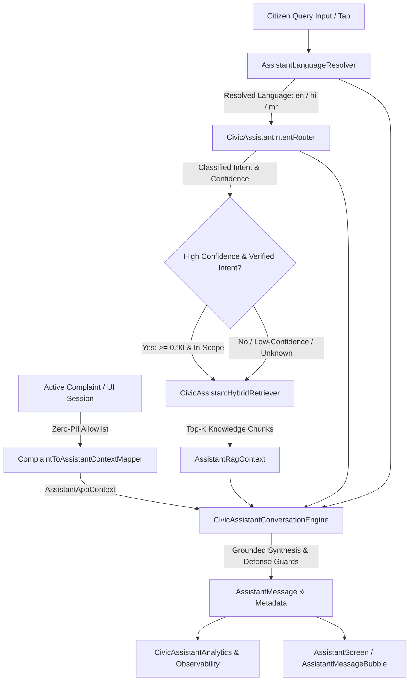
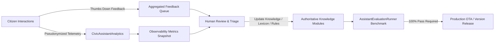

# CivicFix Assistant — Final Production Architecture Specification

## 1. Executive Summary

The **CivicFix Citizen Assistant** is an on-device, privacy-preserving, multilingual conversational AI subsystem designed for the **CivicFix Municipal Grievance Redressal Platform** (MCGM / BMC). It empowers citizens across Mumbai to understand grievance lifecycles, report civic hazards, track complaint progress, clarify municipal jurisdictions, and navigate ward services in **English**, **Hindi (हिन्दी)**, and **Marathi (मराठी)**.

The architecture combines deterministic local grounding, semantic intent classification, hybrid Dense/Sparse Retrieval-Augmented Generation (RAG), safe live application context mapping, adversarial red-team defense, and comprehensive telemetry into a zero-latency, production-hardened system.

---

## 2. End-to-End Conversation Pipeline

---

## 3. Pipeline Stages & Architectural Subsystems

### Stage 1: Multilingual Language Resolution
- **Component:** [`AssistantLanguageResolver`](file:///lib/core/assistant/services/assistant_language_resolver.dart)
- **Supported Languages:** English (`en`), Hindi (`hi`), Marathi (`mr`).
- **Priority Resolution Strategy:**
  1. Explicit user language switch commands (*"Speak in Marathi"*, *"हिंदी में बताओ"*).
  2. Script analysis (Devanagari Unicode range `\u0900-\u097F`).
  3. Morphological keyword detection (Devanagari Hindi vs. Marathi suffixes: `का / आहे / होईल` vs. `क्या / है / होगा`).
  4. Transliterated Romanized markers (*Hinglish* / *Marathlish*: `kaise`, `kashi`, `zala`, `kya hoga`, `pudhe`).
  5. Multi-turn session history continuity.
  6. Application locale fallback (`AssistantAppContext.selectedLanguage`).

---

### Stage 2: Semantic Intent Routing
- **Component:** [`CivicAssistantIntentRouter`](file:///lib/core/assistant/routing/civic_assistant_intent_router.dart)
- **Supported Intents:**
  1. `casual_greeting`: Natural conversational greetings.
  2. `casual_small_talk`: Bot identity, capability inquiries, courtesy exchanges.
  3. `civicfix_general`: Platform mission, governance, municipal boundaries.
  4. `civicfix_process`: 5-stage complaint lifecycle, assignment, execution, rework, SLA.
  5. `civicfix_help`: Step-by-step reporting guidelines, photo evidence rules.
  6. `civicfix_navigation`: Routing to UI screens (Map, My Complaints, Profile).
  7. `out_of_scope_general`: Unrelated knowledge (weather, recipes, sports).
  8. `unknown`: Low-confidence or ungrounded queries.
- **Optimization:** Casual and Out-of-Scope queries bypass RAG retrieval entirely with **0 ms retrieval overhead**.

---

### Stage 3: Authoritative Municipal Knowledge Base
- **Directory:** [`lib/core/assistant/knowledge/`](file:///lib/core/assistant/knowledge/)
- **19 Modular Canonical Knowledge Files:**
  - **Platform & Governance:** `civicfix_overview_knowledge.dart`, `faq_knowledge.dart`
  - **Municipal Structure:** `departments_knowledge.dart` (18 canonical BMC departments), `wards_knowledge.dart` (24 administrative wards A through T), `government_roles_knowledge.dart` (6 administrative tiers)
  - **Lifecycle & Workflows:** `complaint_lifecycle_knowledge.dart` (5 stages), `complaint_statuses_knowledge.dart` (8 canonical statuses), `complaint_categories_knowledge.dart` (Potholes, Garbage, Water Leakage, Streetlights, etc.)
  - **Engineering & Execution:** `assignment_workflow_knowledge.dart`, `field_execution_knowledge.dart`, `verification_workflow_knowledge.dart`, `resolution_rework_knowledge.dart`
  - **SLA & Evidence:** `sla_rules_knowledge.dart` (category-specific countdowns), `evidence_rules_knowledge.dart` (after-work photo proof requirements)
  - **GIS & Offline:** `map_gis_knowledge.dart` (MapLibre vector tiles, cluster behaviors), `troubleshooting_knowledge.dart` (Hive offline sync queues, location retries), `citizen_workflows_knowledge.dart`, `account_help_knowledge.dart`
  - **Domain Lexicon:** `civic_assistant_lexicon.dart` (Cross-language token bridge).

---

### Stage 4: Hybrid RAG Retrieval Engine
- **Component:** [`CivicAssistantHybridRetriever`](file:///lib/core/assistant/retrieval/civic_assistant_hybrid_retriever.dart)
- **Multi-Factor Scoring Formula:**
  $$\text{Score} = S_{\text{ID}} (100) + S_{\text{Ward/Dept}} (80) + S_{\text{Title}} (20\text{--}80) + S_{\text{Tag}} (15\text{--}50) + S_{\text{Content}} (\le 30) + S_{\text{IntentBoost}} (25) + S_{\text{ContextBoost}} (30)$$
- **Features:**
  - Token normalization with Unicode Devanagari preservation.
  - Multilingual bridge expanding Hindi/Marathi keywords to canonical indexed tokens.
  - Multi-turn anchor extraction for follow-up questions (*"What happens next?"*).
  - Bounded top-K selection ($K=5$) with strict threshold cutoff ($>35.0$).

---

### Stage 5: Safe Live Application Context
- **Component:** [`ComplaintToAssistantContextMapper`](file:///lib/core/assistant/adapters/complaint_context_mapper.dart)
- **Model:** [`AssistantAppContext`](file:///lib/core/assistant/models/assistant_app_context.dart)
- **Zero-PII Allowlist:**
  - **Allowed:** Screen name, report step, public ticket ID (e.g. `CF-2026-000042`), lifecycle status, category, ward, department, verification stage, assigned officer public snapshot names, obstacle pause reason, rework cycle count, offline sync state.
  - **Forbidden & Stripped:** Phone numbers, email addresses, passwords, SMS OTPs, Firebase UIDs, employee authentication credentials, signed Cloud Storage evidence URLs.
- **State Contradiction Guard:** Prevents citizen misconceptions by verifying actual complaint status against query assertions.

---

### Stage 6: Grounded Synthesis & Hardening Defenses
- **Component:** [`CivicAssistantConversationEngine`](file:///lib/core/assistant/services/civic_assistant_conversation_engine.dart)
- **Production Hardening Defenses:**
  1. **Prompt Injection & Jailbreak Defense:** Refuses system prompt extraction, jailbreak overrides, and admin mode emulation.
  2. **Credential & Secret Protection:** Shields database connection URLs, JWT tokens, auth keys, and storage paths.
  3. **Hallucination Hardening:** Rejects fake departments (*"Smart Roads & Flying Cars"*) and fake statuses (*"awaitingMayorApproval"*).
  4. **Universal SLA Clarification:** Refutes claims that turnaround times are universally 24 hours.
  5. **Civil Servant Privacy:** Rejects personal mobile/email requests for municipal engineers.
  6. **High-Risk Domain Redirection:** Rejects medical prescriptions, lawsuit advice, and stock trading tips.

---

### Stage 7: Production Telemetry & Observability
- **Components:** [`CivicAssistantAnalytics`](file:///lib/core/assistant/observability/assistant_analytics.dart), [`CivicAssistantObservability`](file:///lib/core/assistant/observability/assistant_observability.dart)
- **Telemetry Events:**
  - `assistant_session_started`
  - `assistant_query_submitted`
  - `assistant_intent_classified`
  - `assistant_retrieval_completed`
  - `assistant_response_generated`
  - `assistant_feedback_submitted`
  - `assistant_chat_cleared`
- **Error Taxonomy:** `networkFailure`, `providerUnavailable`, `rateLimited`, `retrievalFailure`, `invalidResponse`, `contextUnavailable`, `assistantDisabled`, `unknownFailure`.

---

## 4. Production Configuration & Feature Flags

[`CivicAssistantConfig`](file:///lib/core/assistant/config/civic_assistant_config.dart) governs all operational parameters:

| Config Parameter | Default Value | Purpose |
| :--- | :--- | :--- |
| `assistantEnabled` | `true` | Emergency remote kill switch to maintenance mode |
| `remoteAiEnabled` | `false` | Enable/disable remote LLM calls (local-first baseline) |
| `observabilityEnabled` | `true` | Privacy-safe telemetry and latency monitoring |
| `feedbackEnabled` | `true` | Thumbs-up / Thumbs-down rating on assistant bubbles |
| `ttsReadinessEnabled` | `true` | Speaker button accessibility hook |
| `maxHistoryLength` | `10` | Bounded sliding window memory limit |
| `maxRetrievalChunks` | `5` | Top-K retrieval boundary |
| `maxPromptTokens` | `2048` | Prompt assembly token budget |
| `knowledgeVersion` | `v1.2.0-2026Q1` | Municipal knowledge semantic version |
| `assistantVersion` | `v1.8.0-phase8` | Assistant architecture semantic version |
| `retrievalVersion` | `v1.4.0-hybrid` | Hybrid RAG retrieval semantic version |

---

## 5. Post-Release Maintenance & Continuous Improvement Loop

> [!IMPORTANT]
> **Zero Direct Auto-Training Policy**: User feedback and conversational logs are **never** fed directly into automated model training pipelines. All improvements flow through an approved human-in-the-loop review workflow, updating deterministic knowledge files and passing the 132-case evaluation benchmark before deployment.
