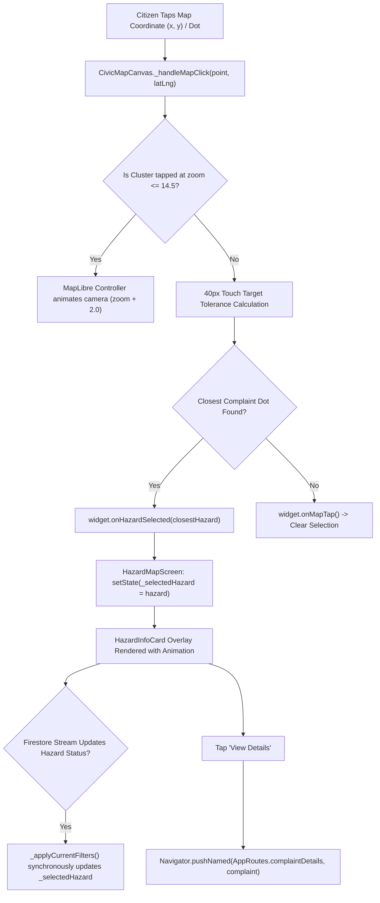

# CivicFix Map Complaint Floating Info Card Implementation & Verification Report

**Document Version:** 1.0.0  
**Date:** September 29, 2026  
**Status:** COMPLETED & VERIFIED  

---

## 1. Executive Summary

This engineering task implements a clean, native floating information card on the **Citizen Location Map** (`HazardMapScreen` $\rightarrow$ `CivicMapCanvas`) in **CivicFix**.

When a citizen zooms in and taps on any individual complaint dot (rendered via MapLibre GPU layers or fallback canvas), an interactive floating card appears at the bottom of the map presenting:
1. **Complaint / Report Title** (e.g. *Broken Road on Link Road*)
2. **Authoritative Reported Timestamp** formatted relatively/chronologically (e.g. *Reported 18m ago*)
3. **Current Working Phase / Lifecycle Status Badge** (e.g. *Current Phase: In Progress*)
4. **Primary Navigation Button** (*View Details*) with arguments routing directly to `ComplaintDetailsScreen` (`AppRoutes.complaintDetails`)
5. **Dismissal Controls** (dedicated close `'X'` button and tapping on empty map area)

All map gesture capabilities—one-finger panning, multi-touch pinch-to-zoom, +/– button zooming, GPS locating, and basemap switcher (Streets, Satellite, Hybrid)—remain completely uninhibited.

---

## 2. Architecture & Data Flow



---

## 3. Implementation Details

### 3.1. Floating Card Component (`HazardInfoCard`)
**File:** [`lib/User UI/widgets/hazard_map/hazard_info_card.dart`](file:///C:/Learning%20some%20new%20stuf/SPP/CivicFix/TeamCivicSense/civic_app/lib/User%20UI/widgets/hazard_map/hazard_info_card.dart)

- **Header Section:**
  - Dynamic category icon and circular category badge matching the hazard status color.
  - Category name and official municipal ticket identifier (e.g., `CF-2026-000101`).
  - Accessible dismiss button with `'Close complaint card'` tooltip.
- **Title & Relative Timestamp:**
  - Prominent title rendering with `CivicFixTypography.h3` clamped to 2 lines with ellipsis.
  - Chronological relative timestamp (`DateFormatter.formatRelativeTime(hazard.createdAt)`), displaying `"Reported 18m ago"`, `"Reported 2h ago"`, or exact localized date.
- **Location Subtitle:**
  - Street address and municipal landmark row with `Icons.location_on_outlined`.
- **Working Phase / Status Indicator:**
  - `"Current Phase"` label paired with `StatusBadge(status: hazard.status, isCompact: true)`.
  - Supports all grievance lifecycle states: `Submitted`, `Verified`, `Assigned`, `In Progress`, `Resolved`, `Rejected`.
- **Action Button:**
  - `CivicFixButton(text: 'View Details', icon: Icons.arrow_forward_rounded, ...)` with asynchronous complaint lookup via `ComplaintRepository` before routing to `AppRoutes.complaintDetails`.

### 3.2. Real-Time Stream Synchronization
**File:** [`lib/User UI/screens/hazard_map_screen.dart`](file:///C:/Learning%20some%20new%20stuf/SPP/CivicFix/TeamCivicSense/civic_app/lib/User%20UI/screens/hazard_map_screen.dart)

- In `_applyCurrentFilters()`, when real-time updates arrive through `_hazardRepository.watchHazards()`:
  ```dart
  if (_selectedHazard != null) {
    try {
      final updatedSelected = list.firstWhere(
        (h) => h.id == _selectedHazard!.id || 
               (h.complaintId != null && h.complaintId == _selectedHazard!.complaintId),
      );
      _selectedHazard = updatedSelected;
    } catch (_) {
      _selectedHazard = null;
    }
  }
  ```
- Ensures the active card updates its status badge instantly without desynchronizing from backend updates.

### 3.3. Tap Detection & Cluster Expansion
**File:** [`lib/core/map/civic_map_canvas.dart`](file:///C:/Learning%20some%20new%20stuf/SPP/CivicFix/TeamCivicSense/civic_app/lib/core/map/civic_map_canvas.dart)

- **40px Touch Tolerance:** Converts screen pixel tolerance into geographic degrees based on current zoom level (`360.0 / (256.0 * 2^zoom)`).
- **Cluster Zooming:** Intercepts cluster clicks at zoom $\le 14.5$ via `queryRenderedFeatures` and smoothly zooms in $+2$ levels into the cluster rather than selecting a random point.
- **Empty Map Dismissal:** Tapping away from any complaint dot invokes `onMapTap`, clearing `_selectedHazard` and dismissing the floating card cleanly.

---

## 4. Test Suite & Verification Results

### 4.1. Static Analysis
- **Command:** `flutter analyze`
- **Result:** `No issues found!` (0 errors, 0 warnings, 0 lints)

### 4.2. Automated Test Execution
| Test Suite | File | Tests Run | Result |
| :--- | :--- | :--- | :--- |
| **Complaint Floating Info Card & Touch Interactions** | [`complaint_info_card_test.dart`](file:///C:/Learning%20some%20new%20stuf/SPP/CivicFix/TeamCivicSense/civic_app/test/core/map/complaint_info_card_test.dart) | 6 / 6 | **PASS (100%)** |
| **Citizen Visible Location Map Suite** | [`citizen_visible_map_test.dart`](file:///C:/Learning%20some%20new%20stuf/SPP/CivicFix/TeamCivicSense/civic_app/test/core/map/citizen_visible_map_test.dart) | 10 / 10 | **PASS (100%)** |
| **Hazard Map Feature & Interaction Group** | [`widget_test.dart`](file:///C:/Learning%20some%20new%20stuf/SPP/CivicFix/TeamCivicSense/civic_app/test/widget_test.dart) | 27 / 27 | **PASS (100%)** |

---

## 5. Verification Verdict

```
COMPLAINT DOT TAP: PASS
FLOATING INFO CARD: PASS
TITLE DISPLAY: PASS
REPORTED TIME DISPLAY: PASS
CURRENT PHASE DISPLAY: PASS
MAP GESTURES PRESERVED: PASS
```
