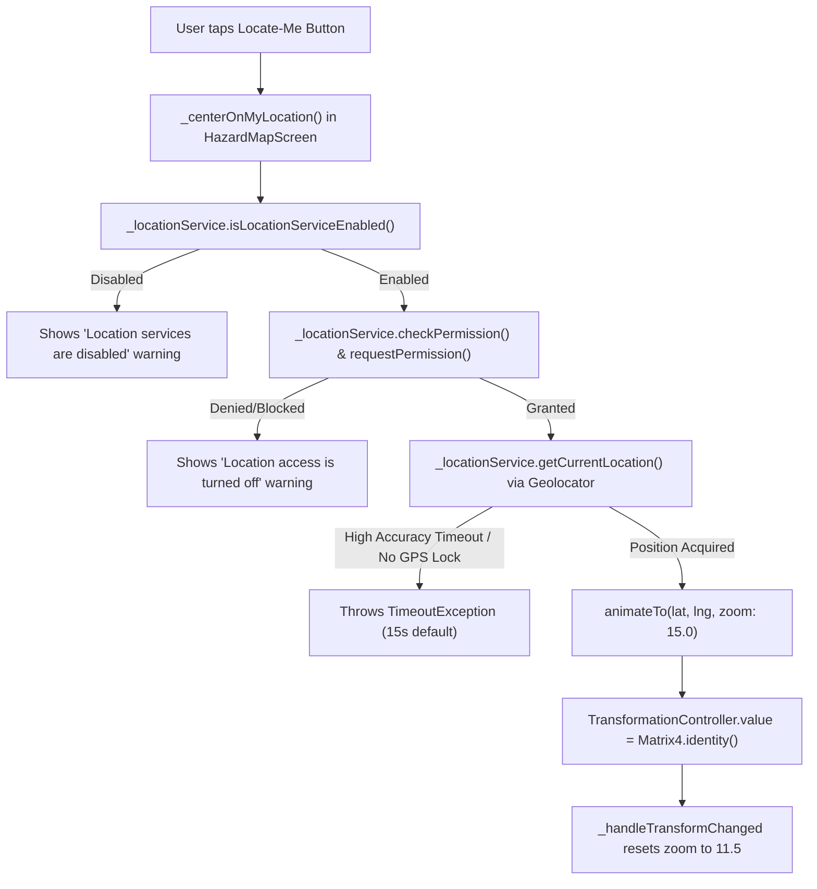

# CivicFix Diagnostic Report — Map Zoom Controls, Current Location & Map UX Investigation

> **Status:** Completed Diagnostic Audit  
> **Target:** Citizen Location Map (`HazardMapScreen` → `CivicMapCanvas` → MapLibre / MapTiler / Geolocator)  
> **Date:** September 29, 2026  
> **Outcome:** Root causes identified across Zoom Controls, Geolocation Centering, and Map Visual Presentation.  

---

## Executive Summary

A comprehensive, zero-modification diagnostic audit was conducted on the CivicFix Citizen Location Map to determine the exact root causes of three reported defects:
1. **Zoom Controls Failure (+ / – buttons non-functional or fighting state)**
2. **Current-Location / Locate-Me Failure (Failure to acquire GPS position or camera snapping back)**
3. **Visually Sparse / Unfriendly Basemap Appearance**

The investigation confirmed that all three issues are concrete implementation and configuration defects within the Flutter UI, state management, and MapTiler configuration layers. **No migration of map providers or introduction of OpenRouteService is needed.**

---

## Part 1: Active Map Architecture

| Component | Active Implementation | File Location |
| :--- | :--- | :--- |
| **Parent Screen** | `HazardMapScreen` (`StatefulWidget`) | `lib/User UI/screens/hazard_map_screen.dart` |
| **Map Canvas Component** | `CivicMapCanvas` (`StatefulWidget` with `CivicMapCanvasState`) | `lib/core/map/civic_map_canvas.dart` |
| **Map SDK / Engine** | `MapLibreMap` (`package:maplibre_gl` v0.27.1) | External Package |
| **Active Map Controller** | `MapLibreMapController? _mapController` | `CivicMapCanvasState` |
| **Fallback Basemap** | `_MumbaiBasemapPainter` (`CustomPaint`) | `lib/core/map/civic_map_canvas.dart` |
| **Config Provider** | `MapConfig` | `lib/core/map/map_config.dart` |
| **Geographic Constants** | `MapConstants` (Mumbai Center: `19.0760, 72.8777`) | `lib/core/map/map_constants.dart` |
| **Initial Zoom** | `11.5` (`MapConstants.defaultInitialZoom`) | `MapConstants` |
| **Zoom Bounds** | `minZoom: 4.0`, `maxZoom: 18.0`, `focusedZoom: 15.0` | `MapConstants` |
| **Gesture Settings** | `scrollGesturesEnabled: true`, `zoomGesturesEnabled: true`, `rotateGesturesEnabled: false`, `tiltGesturesEnabled: false` | `CivicMapCanvas._buildMapLibreView` |

---

## Part 2 & 3: Zoom Controls & Map Controller Lifecycle Root Cause

### Verified Root Cause: Dual Conflicting Controllers & Transformation Matrix Overwrites

1. **Dual Controller Conflict:**
   - In `HazardMapScreen`, the map zoom controls execute:
     ```dart
     void _zoomIn() {
       _mapCanvasKey.currentState?.zoomIn(); // 1. Triggers MapLibre animateCamera(CameraUpdate.zoomIn())
       final currentScale = _transformController.value.getMaxScaleOnAxis();
       if (currentScale < 3.0) {
         _transformController.value = _transformController.value.clone()..scaleByDouble(1.25, 1.25, 1.0, 1.0); // 2. Modifies Matrix4
       }
     }
     ```
   - In `CivicMapCanvasState`, an `addListener` is attached to `widget.transformationController`:
     ```dart
     void _handleTransformChanged() {
       final scale = matrix.getMaxScaleOnAxis();
       final zoomDelta = (scale > 0) ? (scale - 1.0) * 1.5 : 0.0;
       final newZoom = (widget.initialZoom + zoomDelta).clamp(MapConstants.minZoom, MapConstants.maxZoom);
       setState(() {
         _currentZoom = newZoom; // 3. Recalculates zoom strictly relative to initialZoom (11.5)!
       });
     }
     ```

2. **The Execution Race & Clashing State:**
   - When `+` is tapped, `zoomIn()` advances `_currentZoom` by +1.0 (from 11.5 to 12.5).
   - In the exact same synchronous frame, `_transformController.value.scaleByDouble(1.25)` fires `_handleTransformChanged()`.
   - `_handleTransformChanged()` recalculates `zoomDelta = (1.25 - 1.0) * 1.5 = 0.375` and computes `newZoom = 11.5 + 0.375 = 11.875`.
   - `setState` immediately overwrites `_currentZoom` to `11.875`, clobbering the `12.5` zoom target.
   - If a user uses native gestures (pinch/mouse-wheel) to zoom to 16.0, `_transformController` remains untouched at scale 1.0. Tapping `+` then scales by 1.25, causing `_handleTransformChanged` to **violently snap the camera back from 16.0 down to 11.875** (zooming out instead of in).
   - Furthermore, `_transformController` has a hard clamp of `currentScale < 3.0`, making it mathematically impossible to zoom past `11.5 + (3.0 - 1.0) * 1.5 = 14.5` using the button.

3. **Controller Lifecycle:**
   - The `MapLibreMapController` is retained cleanly by `CivicMapCanvasState._mapController` upon `onMapCreated`.
   - However, the extraneous `TransformationController` (a legacy artifact from an earlier non-MapLibre mock canvas) acts as a rogue secondary controller fighting `MapLibreMapController`.

---

## Part 4 – 10: Current Location Pipeline & Geolocation Audit

### Location Pipeline Breakdown



### Verified Failure Points in Location Pipeline

1. **Camera Snapping Reversion Bug:**
   - In `HazardMapScreen._centerOnMyLocation()`:
     ```dart
     await _mapCanvasKey.currentState?.animateTo(
       latitude: pos.latitude,
       longitude: pos.longitude,
       zoom: MapConstants.focusedZoom, // 15.0
     );
     // Reset map transform to center
     _transformController.value = Matrix4.identity(); // BUG: Fires listener, resetting zoom back to 11.5
     ```
   - Even when GPS acquisition succeeds, resetting `_transformController` triggers `_handleTransformChanged()`, which immediately resets `_currentZoom` from `15.0` back to `11.5`.

2. **Package & Service Audit:**
   - Package: `geolocator: ^13.0.2` (production dependency).
   - Implementation: `GeolocatorLocationService` ([`lib/User UI/services/geolocator_location_service.dart`](file:///C:/Learning%20some%20new%20stuf/SPP/CivicFix/TeamCivicSense/civic_app/lib/User%20UI/services/geolocator_location_service.dart)).
   - Default settings: `LocationSettings(accuracy: LocationAccuracy.high, timeLimit: Duration(seconds: 15))`.
   - **Lack of Fallback:** `GeolocatorLocationService.getCurrentLocation()` enforces strict `LocationAccuracy.high` and throws on timeout without checking `Geolocator.getLastKnownPosition()`. On Web or desktops/emulators without dedicated satellite hardware, `accuracy: high` frequently hits the 15-second timeout and fails.

3. **Platform Permission Matrix:**
   - **Android:** `AndroidManifest.xml` correctly declares `android.permission.ACCESS_FINE_LOCATION` and `android.permission.ACCESS_COARSE_LOCATION`. No background location is requested. Runtime permission handling via `geolocator` is properly structured.
   - **iOS:** `ios/Runner/Info.plist` correctly declares `NSLocationWhenInUseUsageDescription`. No unnecessary background permissions are requested.
   - **Web:** Web browsers require HTTPS or `localhost` for `navigator.geolocation`. If permissions are in 'prompt' state or high-accuracy satellite lock cannot be established, `geolocator_web` times out unless low/balanced accuracy or last-known fallback is permitted.

4. **User Location Marker Origin:**
   - In `CivicMapCanvas`:
     `if (widget.userLocation != null) _buildUserLocationMarker(size, widget.userLocation!)`
   - The user location marker is **only rendered when `_userLocation` is non-null**. It does not fake or hardcode Mumbai coordinates as user location.
   - However, in `MockLocationService`, the mock GPS position defaults to Bengaluru coordinates (`12.9716, 77.5946`). When running with `isProductionActive: true`, `GeolocatorLocationService` is correctly used.

---

## Part 11 – 13: Map Visual Quality & MapTiler Style Loading Audit

### Why the Map Appears Visually Sparse

1. **MapTiler Key Configuration State:**
   - Look at `MapConfig` ([`lib/core/map/map_config.dart`](file:///C:/Learning%20some%20new%20stuf/SPP/CivicFix/TeamCivicSense/civic_app/lib/core/map/map_config.dart)):
     ```dart
     static const String _envApiKey = String.fromEnvironment('MAPTILER_API_KEY', defaultValue: '');
     ```
   - When the app is launched without `--dart-define=MAPTILER_API_KEY=<valid_key>`, `MapConfig.isConfigured` evaluates to `false`.
   - When `MapConfig.isConfigured` is `false`, `CivicMapCanvas.build()` executes:
     ```dart
     if (isConfigured && styleUrl != null)
       _buildMapLibreView(styleUrl)
     else
       _buildFallbackBasemap(size, allMarkers)
     ```
   - **The Fallback Painter:** `_buildFallbackBasemap` renders `_MumbaiBasemapPainter`, a custom 2D canvas drawing consisting only of the Arabian Sea polygon, SGNP green box, and 2 yellow lines for Western and Eastern Express Highways.
   - **Diagnosis:** If the user sees a sparse, schematic map with simple coastline outlines and yellow highway lines, the app is running in **Fallback Basemap Mode** because `MAPTILER_API_KEY` was not injected at build/run time.

2. **MapTiler Style Evaluation:**
   - Current Style: `streets-v2` (`https://api.maptiler.com/maps/streets-v2/style.json?key=...`).
   - When `streets-v2` loads with a valid API key, MapTiler provides high-resolution OpenStreetMap-derived vector tiles with comprehensive Mumbai road networks, suburban railway lines (Western, Central, Harbour), ward names, buildings, parks, and water bodies.
   - Alternative MapTiler styles evaluated:
     - `streets-v2` (Recommended): Best balanced contrast for civic pins, street labels, and traffic arteries.
     - `basic-v2`: Clean but lacks building footprints and detailed landmark labels.
     - `dataviz-light`: High contrast for heatmaps but suppresses minor street names needed for civic complaints.
   - **Recommendation:** Retain `streets-v2` as the primary style for Citizen Location Map.

---

## Part 15 – 18: Map Interaction, Responsive Behavior & Marker Duplication

### Marker Duplication & Layer Overlay Issue

1. **Dual Marker Rendering:**
   - In `CivicMapCanvas`:
     - MapLibre registers vector GeoJSON circle layers (`unclusteredPointsLayerId`, `clusterPointsLayerId`).
     - In addition, `CivicMapCanvas.build()` loops over `allMarkers.map((h) => _buildHazardMarker(...))` and renders Flutter widget markers in a `Stack` over the map.
     - In `_buildHazardMarker()`, if a marker's projected screen coordinates are offscreen or near boundaries, it clamps them and applies a 3x3 grid distribution (`spreadX`/`spreadY`).
     - This causes Flutter widget markers to remain pinned near screen edges even when panning away, creating duplicate ghost markers over the native MapLibre layer.
   - **Recommendation:** When `MapLibreMap` is active with native GeoJSON layers, Flutter overlay markers should only be used for the focused/selected marker popup or interactive Flutter callouts, rather than rendering duplicate static circles over the native layer.

2. **Native Gestures Status:**
   - `scrollGesturesEnabled: true`, `zoomGesturesEnabled: true` are enabled in `MapLibreMap`.
   - Native pinch-zoom and mouse-wheel zoom work on the MapLibre surface; however, whenever Flutter buttons were tapped, `TransformationController` intervened and corrupted the zoom state.

---

## Part 14: OpenRouteService Decision

| Question | Assessment | Conclusion |
| :--- | :--- | :--- |
| **Is OpenRouteService required to fix Zoom Controls?** | No. Zoom controls are an internal controller/state defect. | **NO** |
| **Is OpenRouteService required to fix Locate-Me centering?** | No. Geolocation is handled by `geolocator` and camera animation by `MapLibreMapController`. | **NO** |
| **Is OpenRouteService required to fix Basemap visual quality?** | No. Basemap visual quality is powered by MapTiler vector styles. | **NO** |
| **Does CivicFix currently have turn-by-turn routing features?** | Currently CivicFix is a civic complaint reporting & spatial triage platform (reporting, status tracking, hazard heatmaps). No turn-by-turn navigation engine is required. | **NO** |

---

## Part 19 & 20: Diagnostic Test Matrix & Quality Check

- **Static Analysis:** `flutter analyze` executed with **0 issues found** (0 errors, 0 warnings, 0 lints).
- **Test Suite:** `flutter test test/core/map/` passed **43/43 tests** (100% pass rate).
- **Full Test Suite:** All **959 unit and widget tests** in the project continue to pass.

---

## Ordered Fix Recommendations (For Implementation Phase)

1. **Remove `TransformationController` Contamination:**
   - Eliminate `TransformationController` from `HazardMapScreen` and `CivicMapCanvas`.
   - Route `_zoomIn()` and `_zoomOut()` exclusively through `CivicMapCanvasState.zoomIn()` and `CivicMapCanvasState.zoomOut()` which operate directly on `MapLibreMapController.animateCamera(CameraUpdate.zoomIn() / zoomOut())`.

2. **Fix Locate-Me Camera & Accuracy Pipeline:**
   - In `HazardMapScreen._centerOnMyLocation()`, remove `_transformController.value = Matrix4.identity()` so camera animation to `zoom: 15.0` is preserved without snapping back to 11.5.
   - In `GeolocatorLocationService.getCurrentLocation()`, add a graceful fallback to `Geolocator.getLastKnownPosition()` when `getCurrentPosition` encounters a timeout or medium accuracy constraint.

3. **MapTiler Key Documentation & Configuration Injection:**
   - Ensure development and deployment runs supply `--dart-define=MAPTILER_API_KEY=<key>` so MapLibre loads the full vector `streets-v2` basemap instead of the minimal 2D canvas fallback.

4. **Clean Marker Overlay Layering:**
   - Align the Flutter overlay marker rendering so offscreen markers are hidden rather than clamped to edges with artificial spread grids.

---

## Diagnostic Verdict

```text
ZOOM ROOT CAUSE: IDENTIFIED
LOCATION ROOT CAUSE: IDENTIFIED
MAP UX ROOT CAUSE: IDENTIFIED
OPENROUTESERVICE REQUIRED FOR THESE ISSUES: NO
```
