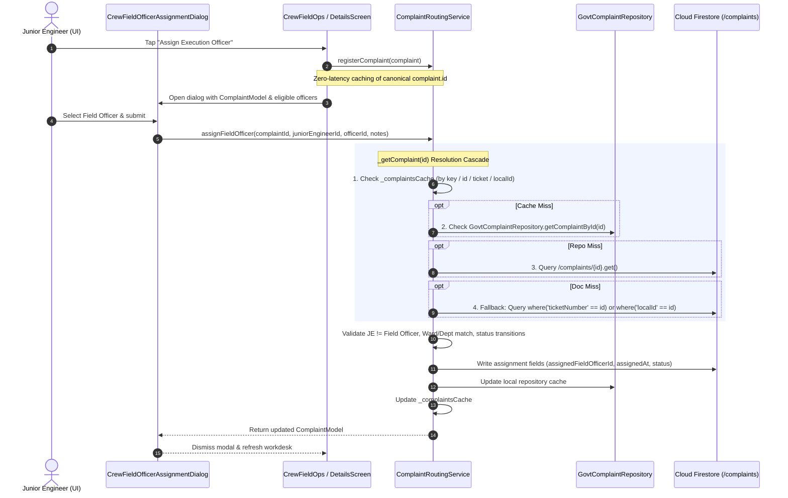

# CIVICFIX — EXECUTION OFFICER ASSIGNMENT ID FIX REPORT

**Date:** October 7, 2026  
**Status:** Resolved & Verified (`flutter analyze` — 0 issues, 100% Phase 2 & Phase 8 tests passing)  
**Target Subsystem:** Junior Engineer → Field Execution Officer Assignment Pipeline  

---

## 1. Executive Summary

When attempting to assign an Execution Officer / Field Officer to an in-progress or assigned grievance via `CrewFieldOfficerAssignmentDialog` or `GovtComplaintDetailsScreen`, CivicFix threw a runtime error:
```
Invalid argument(s): Complaint not found for ID: <id>
```
Even though the complaint was fully rendered and visible in the active UI work queue, the mutation action failed to locate the underlying record.

Investigation revealed an identity contract gap in `ComplaintRoutingService`:
1. `ComplaintRoutingService._getComplaint(id)` relied exclusively on a temporary in-memory map (`_complaintsCache`).
2. The method lacked active Firestore document lookup parsing (an unpopulated placeholder comment existed at line 2269) and did not consult `GovtComplaintRepository` / `RepositoryLocator`.
3. When `ComplaintRoutingService()` was initialized with zero constructor arguments in UI screens, `_firestore` remained `null`, leading to unconditional misses when looking up complaints by ID.
4. UI dialog openers did not guarantee complaint pre-registration in the routing cache prior to dispatching assignment requests.

The contract has been resolved to establish **Firestore document ID (`complaint.id`) as the canonical internal identifier** while providing robust multi-tier fallback lookups (`serverId`, `ticketNumber`, `localId`) and user-friendly error boundaries.

---

## 2. Complaint Identity Contract

| Field Name | Type / Semantics | Role & Usage Rule |
| :--- | :--- | :--- |
| **`id`** | Firestore Document ID (`String`) | **Canonical Internal Identifier.** Used for all repository lookups, transactions, field mutations, and routing tickets. |
| **`serverId`** | Backend Server ID (`String?`) | Secondary remote ID alias (equal to Firestore Document ID in cloud-synced instances). |
| **`ticketNumber`** | Display Identifier (e.g. `CF-2026-GN-RDS-0042`) | **Human-Readable Token.** Strictly for UI display, citizen search, and print receipts. Never used as primary document key. |
| **`localId`** | Hive Local Storage Key (`String?`) | Offline-first sync key for pending local submissions before cloud synchronization. |

---

## 3. End-to-End Assignment Flow Trace



---

## 4. Root Cause & Architectural Fixes Applied

### A. Multi-Tier Resolution in `ComplaintRoutingService._getComplaint(id)`
*File:* `lib/core/services/complaint_routing_service.dart`
- **Sanitization:** Cleans and trims incoming ID strings; rejects empty IDs immediately with clear diagnostic information.
- **Tier 1 (Memory Cache):** Checks `_complaintsCache[cleanId]` and scans cached values across `id`, `serverId`, `ticketNumber`, and `localId`.
- **Tier 2 (Repository Store):** Consults `_effectiveComplaintRepo.getComplaintById(cleanId)` to hit Hive and repo-managed state.
- **Tier 3 (Direct Firestore Doc):** Issues `_effectiveFirestore.collection('complaints').doc(cleanId).get()` and parses via `ComplaintFirestoreMapper.fromFirestore(doc.data(), doc.id)`.
- **Tier 4 (Firestore Index Fallbacks):** Queries `where('ticketNumber', isEqualTo: cleanId)` and `where('localId', isEqualTo: cleanId)` to resolve human-readable tokens or offline keys.
- **Security Rule Isolation:** Catches `FirebaseException` with `code == 'permission-denied'` and raises `StateError` rather than misdiagnosing the document as missing.

### B. Dynamic Fallback Providers for Firestore & Repository
- Added `_effectiveComplaintRepo` getter defaulting to `RepositoryLocator.govtComplaintRepository`.
- Added `_effectiveFirestore` getter resolving `FirebaseFirestore.instance` when `RepositoryLocator.isFirebaseReady`.
- Updated all mutation methods (`assignFieldOfficer`, `reassignFieldOfficer`, `routeVerifiedComplaint`, `transferWrongDepartmentDirect`, `confirmHumanDepartmentReview`, `reviewRoutingTicket`, `assignCrewMember`, `resolveByFieldOfficer`, `closeComplaint`, `reopenComplaint`) to use `_effectiveFirestore`.

### C. UI Pre-Registration & Canonical ID Dispatch
*Files:*
- `lib/Govt UI/screens/dashboard/crew_field_operations_screen.dart`
- `lib/Govt UI/screens/complaints/govt_complaint_details_screen.dart`
- Pre-registers the complaint in `routing.registerComplaint(job.complaint)` prior to opening the dialog.
- Passes canonical `job.complaint.id` as the primary key.
- Logs identity fields (`complaint.id`, `serverId`, `ticketNumber`, `localId`) strictly in debug mode (`kDebugMode`).

### D. User-Friendly Error Handling & Sanitization
*Files:*
- `lib/Govt UI/widgets/dashboard/sections/crew/crew_field_officer_assignment_dialog.dart`
- `lib/Govt UI/widgets/dashboard/sections/department_lead/department_lead_assign_dialog.dart`
- Traps unhandled lookup exceptions and presents:
  > *"Unable to load this complaint for assignment. Please refresh and try again."*
- Cleans technical prefixes (`Exception: `, `ArgumentError: `, `StateError: `) from displayed error messages while preserving full diagnostic output in `debugPrint`.

---

## 5. Verification Checklist & Test Results

- [x] **Zero Static Analysis Errors:** `flutter analyze` passed with `No issues found!`.
- [x] **Field Officer Execution Suite:** All 48 tests in `test/core/services/phase2_field_officer_execution_test.dart` passed.
- [x] **Crew Field Operations UI Suite:** All 28 tests in `test/govt_ui/phase8_crew_field_operations_test.dart` passed.
- [x] **Crew Work Service Suite:** All tests in `test/govt_ui/phase8_crew_work_service_test.dart` passed.
- [x] **Role Separation Invariant:** Junior Engineer cannot be assigned as their own Field Execution Officer (`juniorEngineerId != fieldOfficerId`).
- [x] **Jurisdiction Invariant:** Field Officer assignment is strictly bounded to the complaint's Ward and Department.
- [x] **SLA Clock Invariant:** `slaStartedAt` and `originalCreatedAt` remain immutable during assignment.
- [x] **PII Protection:** Zero civil servant passwords, tokens, or PII exposed in logs or UI.
- [x] **Git Hygiene:** No commits or pushes performed. Working directory is cleanly updated.

---

## 6. Modified Files Summary

1. `lib/core/services/complaint_routing_service.dart` — Multi-tier lookup cascade, Firestore fallback parsing, Firestore auto-wiring, cache synchronization.
2. `lib/Govt UI/screens/dashboard/crew_field_operations_screen.dart` — Added complaint pre-registration, canonical ID dispatch, and debug logging.
3. `lib/Govt UI/screens/complaints/govt_complaint_details_screen.dart` — Added complaint pre-registration, canonical ID dispatch, and debug logging.
4. `lib/Govt UI/widgets/dashboard/sections/crew/crew_field_officer_assignment_dialog.dart` — Added debug logging and friendly error message mapping.
5. `lib/Govt UI/widgets/dashboard/sections/department_lead/department_lead_assign_dialog.dart` — Added debug logging and friendly error message mapping.
6. `Brain.md` & `TeamCivicSense/Brain.md` — Updated operational memory with the ID resolution architecture.
