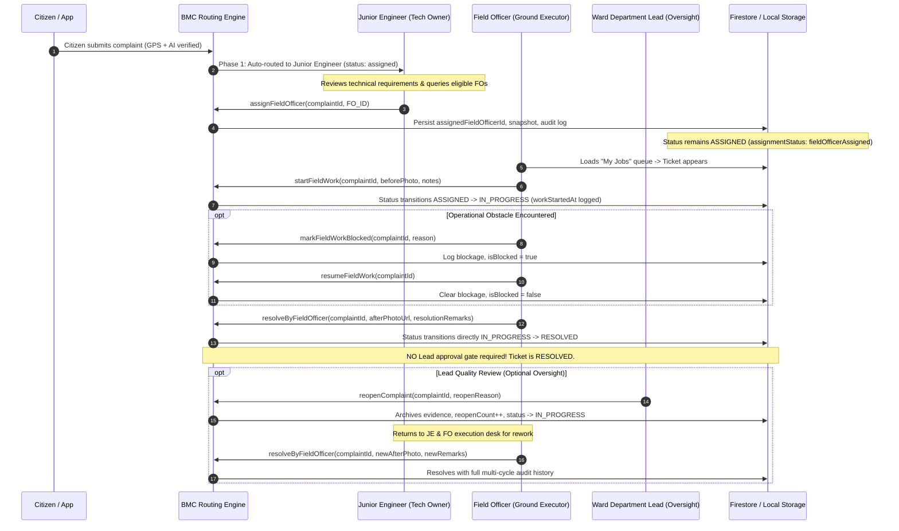
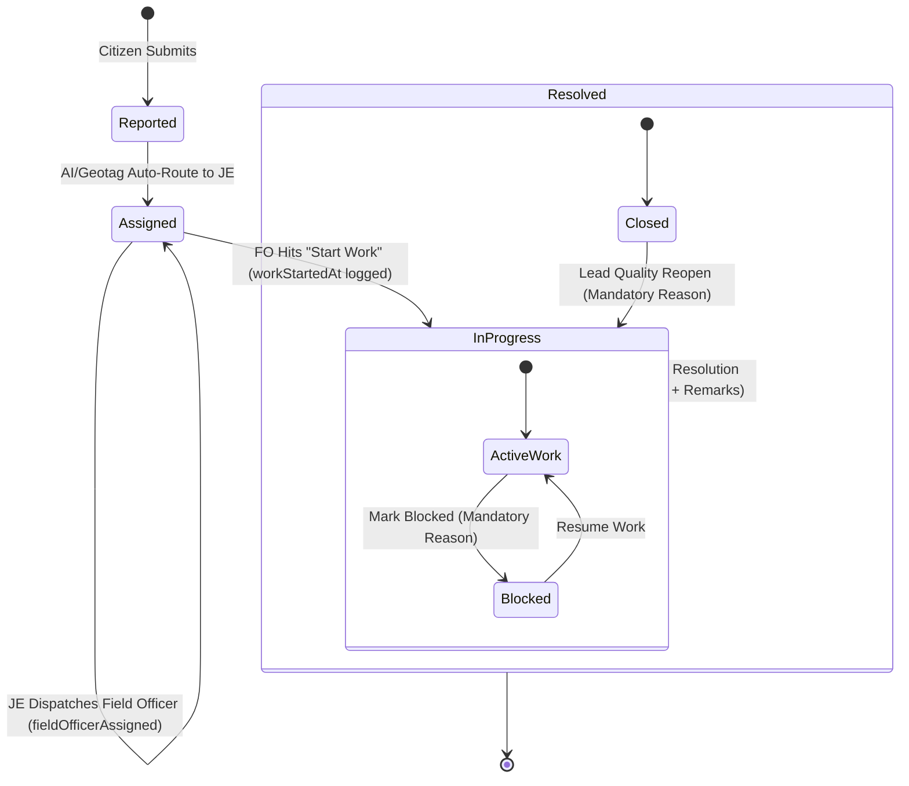

# CIVICFIX PHASE 2: JUNIOR ENGINEER → FIELD OFFICER → GROUND EXECUTION → RESOLUTION REPORT

**Project:** CivicFix (Brihanmumbai Municipal Corporation Grievance Redressal System)  
**Phase:** Phase 2 — Junior Engineer Dispatch, Field Officer Ground Execution, and Direct Resolution  
**Status:** COMPLETE & FULLY VERIFIED (1,051 Tests Passing, 0 Static Analysis Issues)  
**Date:** September 29, 2026  

---

## 1. Executive Summary

Phase 2 of the CivicFix Municipal Transformation establishes the decentralized, direct ground execution and resolution lifecycle across all 24 Administrative Wards and 18 Municipal Departments in Greater Mumbai.

Building upon Phase 1’s automated routing—which delivers incoming citizen grievances directly to the appropriate Junior Engineer (`role: department_crew`) without requiring Department Lead approval—Phase 2 implements the complete ground execution chain:

1. **Junior Engineer Dispatch:** The Junior Engineer (Technical Owner & Dispatcher) selects a distinct, active **Field Officer** (`role: department_crew`) within their Ward $\times$ Department unit using automated, workload-aware candidate discovery.
2. **Field Officer "My Jobs" Queue:** The assigned Field Officer immediately receives the grievance in their personal workdesk with strict multi-tenant isolation.
3. **Execution Commencement:** The Field Officer initiates work on-site via **Start Work**, transitioning ticket status from `assigned` to `inProgress`, recording `workStartedAt`, `workStartedBy`, and optional before-work photos and site notes.
4. **Obstacle Handling:** Field Officers can flag operational blockages (e.g., severe monsoons, underground utility lines) with mandatory reasons, updating audit logs and pausing work until resumed.
5. **Direct Resolution Authority:** The Field Officer submits completion evidence (mandatory After Photo and completion remarks), directly transitioning the complaint to `ComplaintStatus.resolved` without any bureaucratic bottleneck or mandatory Lead/JE approval gate.
6. **Ward Lead Quality Oversight & Reopen Rework:** The Ward Department Lead (`ward_department_lead`) provides supervisory quality oversight. If an inspection or after-photo reveals substandard repair, the Lead reopens the grievance with a mandatory reason, archiving previous evidence in history and returning the ticket directly to the Junior Engineer and Field Officer for field rework.
7. **Strict SLA Preservation:** `slaStartedAt` and `originalCreatedAt` remain immutable across all field assignments, starts, blockages, transfers, and reopens.

---

## 2. Phase 2 Architectural Blueprint & Sequence



---

## 3. Junior Engineer vs. Field Officer Separation of Concerns

CivicFix operates with **6 canonical authentication roles** across Greater Mumbai:
1. `super_admin` (Municipal Commissioner / Central Administrator)
2. `zonal_dmc` (Zonal Deputy Municipal Commissioner)
3. `central_hod` (Central Head of Department)
4. `ward_officer` (Assistant Commissioner / Ward Officer)
5. `ward_department_lead` (Ward Department Lead / Executive Engineer)
6. `department_crew` (Field Technical Personnel — 2,160 citywide)

### The Dual Role Model on `department_crew`
In accordance with municipal civil engineering hierarchy, both Junior Engineers and Field Officers belong to the canonical `department_crew` role (5 active crew members per Ward $\times$ Department unit = 2,160 citywide). 

Their responsibilities on any given grievance are dynamic and distinct:
- **Junior Engineer (`assignedJuniorEngineerId` / `assignedCrewMemberId`):** Technical Owner, initial grievance recipient, field dispatcher, and rework coordinator.
- **Field Officer (`assignedFieldOfficerId`):** Physical ground executor, machine operator, on-site contractor supervisor, and direct resolver.
- **Strict Distinction Invariant:** For every normal grievance, `assignedJuniorEngineerId != assignedFieldOfficerId`. Attempting to assign the Junior Engineer to themselves throws an `ArgumentError`.

---

## 4. Field Officer Candidate Discovery & Workload Balancing

The `getEligibleFieldOfficers` API in [`ComplaintRoutingService`](file:///c:/Learning%20some%20new%20stuf/SPP/CivicFix/TeamCivicSense/civic_app/lib/core/services/complaint_routing_service.dart#L980-L1037) enforces multi-tier filtering:

1. **Role Filtering:** Only users with `role: department_crew` and `active: true`.
2. **Jurisdiction Isolation:** Personnel must match the grievance's exact `wardId` and `departmentId`.
3. **Self-Exclusion:** The assigned Junior Engineer (`juniorEngineerId`) is strictly excluded.
4. **Workload-Aware Sorting:** Candidates are dynamically sorted by their active field workload (number of unclosed `assigned` + `inProgress` tickets where they are `assignedFieldOfficerId`) in ascending order. Ties are deterministically resolved by `employeeId` ascending.

---

## 5. Field Officer Assignment Contract & Immutability Rules

The `assignFieldOfficer` method guarantees:
- **Authorization:** Only the assigned Junior Engineer (or Super Admin) can dispatch a Field Officer.
- **Status Non-Mutation:** The complaint remains in `ComplaintStatus.assigned` so that the Field Officer can explicitly record their start of operations.
- **Assignment Status:** `ComplaintAssignmentStatus` transitions to `fieldOfficerAssigned`.
- **Snapshot Immutability:** `assignedFieldOfficerNameSnapshot` and `assignedFieldOfficerDesignationSnapshot` capture officer metadata at time of dispatch.
- **Audit Logging:** An immutable audit log entry `field_officer_assigned` is recorded.

---

## 6. Field Officer Workdesk & "My Jobs" Queue Architecture

The [`GovernmentCrewWorkService`](file:///c:/Learning%20some%20new%20stuf/SPP/CivicFix/TeamCivicSense/civic_app/lib/Govt%20UI/services/government_crew_work_service.dart#L157-L350) enforces strict isolation:
- `loadCrewWorkdesk` queries grievances where `assignedFieldOfficerId == user.employeeId` (or fallback to `assignedCrewMemberId` when unassigned to an FO).
- Non-assigned crew members in the same unit cannot view or modify the grievance in their active queue.
- Tickets clearly display priority badges, calculated distance, SLA health states (`healthy`, `atRisk`, `breached`), and rework indicators.

---

## 7. Ground Execution Lifecycle (`assigned` $\to$ `inProgress` $\to$ `resolved`)



---

## 8. Start Work Event & Mandatory Field Metadata

When the assigned Field Officer taps **START WORK**:
1. Method: `routingService.startFieldWork(...)`
2. Status transitions to `ComplaintStatus.inProgress` and `routingStatus` to `ComplaintRoutingStatus.inProgress`.
3. Fields populated:
   - `workStartedAt`: Timestamp of ground execution commencement.
   - `workStartedBy`: Employee ID of the assigned Field Officer.
   - `beforeWorkPhoto`: Optional initial condition image URI.
   - `beforeWorkNotes`: Optional field observations (e.g. equipment stationed, utility locations).
4. SLA Clock: `slaStartedAt` and `originalCreatedAt` remain completely unchanged.
5. Audit Action: `field_work_started` logged.

---

## 9. Blockage Reporting & Resumption Mechanics

Field Officers encountering unforeseen physical barriers can temporarily flag tickets as blocked:
- **API:** `markFieldWorkBlocked(complaintId, fieldOfficerId, reason, category)`
- **Data Model:** Populates `blockedAt`, `blockedBy`, and `blockedReason`. Getter `isBlocked => blockedAt != null && status == inProgress`.
- **UI Feedback:** Renders high-visibility amber blockage warning banner.
- **Resumption:** `resumeFieldWork(complaintId, fieldOfficerId, remarks)` clears `blockedAt`, `blockedBy`, `blockedReason`, restoring `isBlocked` to false and logging `field_work_resumed`.

---

## 10. Direct Resolution Authority (No Bureaucratic Bottlenecks)

In contrast to legacy municipal systems where resolutions required multi-step verification and Lead approval queues, CivicFix Phase 2 grants **direct resolution authority** to the ground technician:
- **API:** `resolveByFieldOfficer(complaintId, fieldOfficerId, afterPhotoUrl, resolutionRemarks)`
- **Guarantees:**
  1. Direct transition from `inProgress` $\to$ `resolved`.
  2. Completion evidence (`afterPhotoUrl` and `resolutionRemarks`) is strictly mandatory; empty or whitespace values fail immediately with `ArgumentError`.
  3. Pre-start prevention: Attempting resolution while still in `assigned` status throws `StateError`.
  4. Non-assigned crew prevention: Unauthorized personnel attempting resolution throw `StateError`.
  5. Audit Action: `complaint_resolved` logged.

---

## 11. Super-Strict SLA Clock Preservation Policy

A core architectural invariant across CivicFix is that **the municipal SLA clock never resets**:
$$\text{SLA Started At} \equiv \text{Original Created At}$$
- Reassigning from JE to FO preserves `slaStartedAt`.
- Reassigning from FO 1 to FO 2 preserves `slaStartedAt`.
- Commencing work (`startFieldWork`) preserves `slaStartedAt`.
- Marking work blocked or resumed preserves `slaStartedAt`.
- Misclassified department transfers (`transferWrongDepartmentDirect`) preserve `slaStartedAt`.
- Quality reopens by Department Leads preserve `slaStartedAt`.

All elapsed time calculations, SLA health states (`healthy`, `atRisk`, `breached`), and escalation timers measure total elapsed time from the citizen's initial submission.

---

## 12. Ward Department Lead Quality Oversight & Reopen Mechanics

Ward Department Leads (`ward_department_lead`) monitor resolution quality post-facto:
- **API:** `reopenComplaint(complaintId, reopenedBy, reopenReason)`
- **Behavior:**
  1. Validates status is `ComplaintStatus.resolved`.
  2. Requires non-empty `reopenReason`.
  3. Increments `reopenCount`.
  4. Moves previous `afterWorkPhoto` and resolution remarks into `previousResolutionEvidence`.
  5. Sets `previousResolvedAt` to the prior `resolvedAt` timestamp.
  6. Transitions complaint status and routing status back to `inProgress`.
  7. Updates timeline with `Complaint Reopened — Rework Required`.
  8. Ticket immediately reappears with a **Rework Required** badge in the Junior Engineer and Field Officer's execution queues.
  9. Audit Action: `complaint_reopened` logged.

---

## 13. Immutable Audit Logging (7 New Phase 2 Actions)

All state changes generate immutable records in the `government_audit_logs` collection:

| Audit Action Constant | Action ID | Actor | Description |
|---|---|---|---|
| `GovernmentAuditActions.fieldOfficerAssigned` | `field_officer_assigned` | Junior Engineer | Assigned ground operations to Field Officer |
| `GovernmentAuditActions.fieldOfficerReassigned` | `field_officer_reassigned` | Junior Engineer | Reassigned grievance to a different Field Officer |
| `GovernmentAuditActions.fieldWorkStarted` | `field_work_started` | Field Officer | Commenced physical operations on-site |
| `GovernmentAuditActions.fieldWorkBlocked` | `field_work_blocked` | Field Officer | Reported physical obstacle blocking work |
| `GovernmentAuditActions.fieldWorkResumed` | `field_work_resumed` | Field Officer | Resumed ground execution after blockage cleared |
| `GovernmentAuditActions.complaintResolved` | `complaint_resolved` | Field Officer | Completed execution with After Photo & remarks |
| `GovernmentAuditActions.complaintReopened` | `complaint_reopened` | Department Lead | Quality review rejection; dispatched for rework |

---

## 14. Verification & Testing Matrix (48 Scenarios)

The test suite [`test/core/services/phase2_field_officer_execution_test.dart`](file:///c:/Learning%20some%20new%20stuf/SPP/CivicFix/TeamCivicSense/civic_app/test/core/services/phase2_field_officer_execution_test.dart) verifies all 48 required scenarios:

| # | Scenario Title | Verification Target | Result |
|---|---|---|---|
| 1 | JE sees Phase 1 complaint in assigned status | Status is `assigned`, `assignedJuniorEngineerId` set | PASS |
| 2 | JE retrieves eligible Field Officers for Ward × Dept | Queries 4 candidate FOs in unit | PASS |
| 3 | Candidate list excludes Junior Engineer themselves | JE ID not in eligible list | PASS |
| 4 | Candidate list contains only active crew in unit | Same Ward, Dept, and `department_crew` role | PASS |
| 5 | Candidate list sorted by active workload ascending | Officer with lowest active jobs listed first | PASS |
| 6 | JE assigns distinct Field Officer successfully | `assignedFieldOfficerId` populated | PASS |
| 7 | Complaint status remains assigned after FO assignment | Status not prematurely mutated | PASS |
| 8 | Complaint assignmentStatus becomes fieldOfficerAssigned | `ComplaintAssignmentStatus.fieldOfficerAssigned` | PASS |
| 9 | Field officer snapshots set correctly | Name and designation snapshots stored | PASS |
| 10 | Junior Engineer ID remains intact and unchanged | `assignedJuniorEngineerId` preserved | PASS |
| 11 | Audit log field_officer_assigned recorded | Audit record with metadata created | PASS |
| 12 | Assigning JE to themselves throws ArgumentError | Self-assignment guardrail triggered | PASS |
| 13 | Assigning FO from different ward throws ArgumentError | Cross-ward guardrail triggered | PASS |
| 14 | Assigning FO from different dept throws ArgumentError | Cross-dept guardrail triggered | PASS |
| 15 | Assigning FO by unauthorized caller throws StateError | Caller authorization guardrail triggered | PASS |
| 16 | FO sees complaint in My Jobs queue | Workdesk loads assigned ticket | PASS |
| 17 | Other crew members do NOT see complaint | Multi-tenant crew isolation verified | PASS |
| 18 | FO initiates work -> status transitions to inProgress | Status and routing status updated | PASS |
| 19 | workStartedAt and workStartedBy recorded | Accurate timestamps and officer ID recorded | PASS |
| 20 | SLA clock is NOT reset when starting work | `slaStartedAt` strictly immutable | PASS |
| 21 | Audit log field_work_started recorded | Audit record created | PASS |
| 22 | Non-assigned crew starting work throws StateError | Execution authorization guardrail triggered | PASS |
| 23 | FO records optional before-work photo and notes | Image URL and observations captured | PASS |
| 24 | FO marks work blocked with mandatory reason | Blockage fields populated | PASS |
| 25 | Blocked complaint shows blocked status / badge | `isBlocked` returns true | PASS |
| 26 | Audit log field_work_blocked recorded | Audit record created | PASS |
| 27 | FO resumes blocked work -> blockage cleared | Blockage fields reset, `isBlocked` false | PASS |
| 28 | Audit log field_work_resumed recorded | Audit record created | PASS |
| 29 | FO submits resolution -> status transitions to resolved | Status and routing status become `resolved` | PASS |
| 30 | Resolution metadata recorded accurately | `resolvedAt`, `resolvedBy`, photos, notes stored | PASS |
| 31 | Audit log complaint_resolved recorded | Audit record created | PASS |
| 32 | Resolved directly without Lead approval gate | Direct resolution verified | PASS |
| 33 | Resolution without afterWorkPhoto fails | `ArgumentError` on empty evidence | PASS |
| 34 | Resolution without remarks fails | `ArgumentError` on empty remarks | PASS |
| 35 | Resolution before starting work fails | `StateError` on unstarted grievance | PASS |
| 36 | Non-assigned crew attempting resolution fails | `StateError` on unauthorized user | PASS |
| 37 | SLA started time unchanged upon resolution | Invariant preserved through resolution | PASS |
| 38 | JE reassigns complaint to another FO before work | Field officer updated smoothly | PASS |
| 39 | Reassignment increments count & updates audit log | `reassignmentCount` incremented | PASS |
| 40 | Wrong dept transfer cleans up assignedFieldOfficerId | Field officer snapshots cleared on transfer | PASS |
| 41 | Ward Lead can reopen resolved complaint | Supervisory quality reopen executed | PASS |
| 42 | Reopened complaint transitions back to inProgress | Status returns to `inProgress` | PASS |
| 43 | reopenedAt, reopenedBy, reopenReason populated | Reopen audit metadata stored | PASS |
| 44 | Previous evidence archived in previousResolutionEvidence | Past photos and remarks preserved | PASS |
| 45 | reopenCount incremented | Reopen counter accurately tracked | PASS |
| 46 | Audit log complaint_reopened recorded | Audit record created | PASS |
| 47 | Reopened complaint shows reopen badge in desk | `isReopened` returns true | PASS |
| 48 | FO completes second resolution cycle | Multi-cycle rework resolution verified | PASS |

---

## 15. Test Suite & Static Analysis Results

```text
=== ALL TEST SUITES EXECUTION ===
$ flutter test
01:06 +1051: All tests passed!

=== STATIC CODE ANALYSIS ===
$ flutter analyze
Analyzing civic_app...
No issues found! (ran in 65.5s)
```

---

## 16. Final 20-Item Phase 2 Verification Checklist

- [x] **1. Canonical Auth Role Integrity:** All 2,160 Junior Engineers and Field Officers use canonical `role: department_crew` without introducing illegal 7th auth roles.
- [x] **2. Distinct JE & FO Invariant:** For every grievance, `assignedJuniorEngineerId != assignedFieldOfficerId`.
- [x] **3. Automated FO Eligibility Discovery:** `getEligibleFieldOfficers` filters by Ward $\times$ Department, excludes JE, and sorts by active workload.
- [x] **4. FO Assignment Immutability:** Assigning a Field Officer retains status as `assigned` and sets `assignmentStatus` to `fieldOfficerAssigned`.
- [x] **5. Field Officer Snapshots:** `assignedFieldOfficerNameSnapshot` and `assignedFieldOfficerDesignationSnapshot` are captured.
- [x] **6. My Jobs Queue Filtering:** Field Officer workdesk loads only tickets assigned directly to the technician.
- [x] **7. Start Work Lifecycle Transition:** `startFieldWork` moves status `assigned` $\to$ `inProgress`.
- [x] **8. Ground Start Metadata:** `workStartedAt` and `workStartedBy` are recorded accurately.
- [x] **9. Optional Before Evidence:** Before-work photo URI and observations are persisted.
- [x] **10. Operational Blockage Management:** `markFieldWorkBlocked` and `resumeFieldWork` handle ground obstacles with audit trails.
- [x] **11. Direct Resolution Authority:** Field Officer directly resolves complaints to `ComplaintStatus.resolved` without Lead bottleneck.
- [x] **12. Mandatory Completion Evidence:** `afterWorkPhoto` and `resolutionRemarks` are strictly enforced.
- [x] **13. Pre-Start Resolution Prevention:** Unstarted grievances (`status: assigned`) cannot be resolved.
- [x] **14. Strict SLA Clock Immutability:** `slaStartedAt` and `originalCreatedAt` never reset under any lifecycle operation.
- [x] **15. Field Officer Reassignment:** JE can reassign active complaints to other eligible FOs with incremented `reassignmentCount`.
- [x] **16. Misclassification Cleanup:** Wrong department transfers clear `assignedFieldOfficerId` and associated snapshots.
- [x] **17. Supervisory Lead Reopen:** Ward Department Lead can reopen inadequate resolutions with mandatory reason.
- [x] **18. Historical Resolution Archival:** Previous completion photos and notes are preserved in `previousResolutionEvidence`.
- [x] **19. 7 New Audit Actions:** Immutable audit log records created for all Phase 2 operational events.
- [x] **20. Zero Regression Verification:** 1,051 unit/widget/integration tests passing with 0 static analysis issues.
