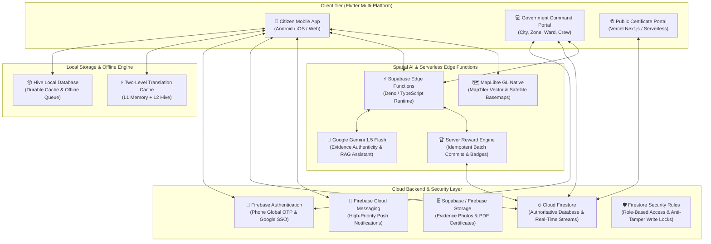
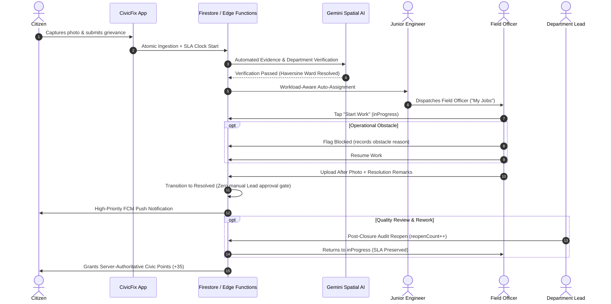

<div align="center">

# 🏛️ CivicFix (Team CivicSense)
### AI-Powered Municipal Grievance Redressal, Spatial Workflow Automation & Citizen Engagement Platform
#### Engineered for the Brihanmumbai Municipal Corporation (BMC / MCGM)

[](https://flutter.dev)
[](https://dart.dev)
[](https://firebase.google.com)
[](https://supabase.com)
[](https://ai.google.dev)
[](https://maplibre.org)
[](https://web-mauve-delta-9mb2333dgo.vercel.app)
[](LICENSE)

---

### 🌐 [Live Web App](https://web-mauve-delta-9mb2333dgo.vercel.app) • 📜 [Certificate Verification Portal](https://web-mauve-delta-9mb2333dgo.vercel.app/verify) • 📑 [Architecture Documentation](Brain.md)

</div>

---

## 📖 Table of Contents

- [Overview](#-overview)
- [Key Features](#-key-features)
- [End-to-End System Architecture](#-end-to-end-system-architecture)
- [Municipal Hierarchy & Multi-Tier Governance](#-municipal-hierarchy--multi-tier-governance)
- [5-Stage Grievance Redressal Workflow](#-5-stage-grievance-redressal-workflow)
- [Spatial GIS & MapLibre Mapping](#-spatial-gis--maplibre-mapping)
- [AI Civic Assistant & Multilingual Translation](#-ai-civic-assistant--multilingual-translation)
- [Gamification, Rewards & Cryptographic Certificates](#-gamification-rewards--cryptographic-certificates)
- [Offline-First Architecture](#-offline-first-architecture)
- [Technology Stack](#-technology-stack)
- [Project Directory Structure](#-project-directory-structure)
- [Getting Started & Local Setup](#-getting-started--local-setup)
- [Testing & Quality Assurance](#-testing--quality-assurance)
- [Deployment Architecture](#-deployment-architecture)
- [Security & Privacy Governance](#-security--privacy-governance)
- [Contributors & License](#-contributors--license)

---

## 🌟 Overview

**CivicFix** is a next-generation municipal governance and civic engagement platform developed by **Team CivicSense** for the **Brihanmumbai Municipal Corporation (BMC / MCGM)**. The platform bridges the gap between Greater Mumbai's citizens and the municipal administrative machinery across **24 Administrative Wards (A to T)** and **18 Canonical Municipal Departments**.

Built with an **offline-first Flutter architecture**, real-time **Firebase Cloud Firestore**, **Supabase Serverless Edge Functions**, **MapLibre GL Native GIS**, and **Google Gemini AI**, CivicFix transforms civic grievance redressal from a fragmented, opaque process into an accountable, transparent, and gamified civic loop:

$$\text{Citizen Report} \xrightarrow{\text{Spatial AI}} \text{Automated Routing} \xrightarrow{\text{Field Officer Work}} \text{Verified Resolution} \xrightarrow{\text{Citizen Reward}}$$

---

## ✨ Key Features

### 👤 Citizen Mobile & Web Experience
- **Geotagged Grievance Ingestion:** GPS-tagged issue capture with camera photo evidence, automatic Haversine ward centroid clustering, and automated department categorization.
- **Real-Time SLA & Officer Transparency:** Live tracking timeline with SLA countdown timer, supervisory Junior Engineer snapshot, executing Field Officer designation, and side-by-side Before/After resolution evidence.
- **Spatial Hazard Map:** Interactive MapLibre GL map with dynamic clustering, spatial chunking, and neighborhood hazard awareness.
- **Multilingual Support:** Seamless on-the-fly switching between **English (en)**, **Hindi (hi)**, and **Marathi (mr)** across all static UI and dynamic AI translations.
- **AI Civic Assistant with TTS:** Natural language voice-enabled assistant powered by Google Gemini, equipped with a 100+ topic BMC municipal knowledge base and live in-app context.
- **Server-Authoritative Gamification:** Earn up to 100 civic points per resolved complaint, level progression (Civic Starter to Civic Hero), and community upvote badges.
- **Cryptographic Certificates:** Claim official downloadable PDF Certificates of Appreciation with tamper-evident digital signatures and QR codes for public verification.

### 🏢 Government Multi-Tier Command Centers
- **City Command Center (Super Admin / Municipal Commissioner):** City-wide executive dashboard, live BMC KPI metrics, cross-ward heatmaps, and city-wide SLA breach tracking.
- **Zone Command Center (Deputy Municipal Commissioner):** Multi-ward zonal operations overview across Zone 1 to Zone 7.
- **Ward Command Center (Assistant Municipal Commissioner):** Ward-level tactical dispatch, department lead directories, and critical complaint queues.
- **Ward Department Lead Portal (Executive Engineer):** Automated triage oversight, workload balancing, and supervisory post-closure audit with reopen rework authority.
- **Field Engineer & Crew Portal (Junior Engineer / Field Crew):** Dedicated "My Jobs" queue, 1-tap **Start Work**, operational roadblock flagging (`isBlocked`), and photographic resolution proof submission.

---

## 🏗️ End-to-End System Architecture



---

## 🏛️ Municipal Hierarchy & Multi-Tier Governance

CivicFix models the exact administrative structure of the Brihanmumbai Municipal Corporation:

| Tier | Role ID | Administrative Scope | Key Responsibilities |
| :--- | :--- | :--- | :--- |
| **Tier 1: City Admin** | `government_super_admin` | Greater Mumbai (All 24 Wards) | Executive oversight, city-wide KPI monitoring, SLA escalations, cross-ward policy management |
| **Tier 2: Zonal Lead** | `zone_officer` | Zones 1 through 7 (3–4 Wards/Zone) | Zonal resource coordination, inter-ward dispute resolution, high-level backlog triage |
| **Tier 3: Ward Officer** | `ward_officer` | Administrative Wards (A to T) | Ward-level operations, department performance audits, ward council reports |
| **Tier 4: Dept Lead** | `ward_department_lead` | Ward + Specific Department (e.g. K/W Roads) | Supervisory quality control, field work review, audit & reopen authority |
| **Tier 5: Junior Engineer** | `department_crew` (Lead) | Unit Workgroup Dispatch | Technical ownership, automated workload-aware field officer assignment |
| **Tier 6: Field Officer** | `department_crew` (Crew) | On-Ground Execution | Ground work execution, roadblock reporting, mandatory After Photo resolution evidence |

---

## 🔄 5-Stage Grievance Redressal Workflow



---

## 🗺️ Spatial GIS & MapLibre Mapping

- **Vector & Satellite Basemaps:** Powered by MapLibre GL Native with dynamic MapTiler vector styles (`streets`, `satellite`, `hybrid`).
- **Spatial Chunking Manager:** Coordinates divided into deterministic geographic chunks (`SpatialChunk`), preventing unbounded viewport queries and enabling fast caching.
- **Cluster & Point Rendering:** High-performance clustered marker circles with incident counts that expand on tap (+2 zoom level) and single-point feature selection.
- **Interactive Floating Hazard Card:** Tapping any marker on the map surfaces a real-time summary card with severity badges, category icons, upvote controls, and one-tap navigation to the complaint details screen.

---

## 🤖 AI Civic Assistant & Multilingual Translation

```
                        ┌───────────────────────────────┐
                        │   User Query (Voice / Text)   │
                        └──────────────┬────────────────┘
                                       │
                  ┌────────────────────┴────────────────────┐
                  ▼                                         ▼
       [Active UI Context]                        [BMC RAG Knowledge Base]
  - Citizen Active Complaints                - 18 Municipal Departments
  - GPS Ward & Location Coordinates          - 24 Ward Office Addresses
  - App Status & Session Data                - Standard SLAs & Escalations
                  │                                         │
                  └────────────────────┬────────────────────┘
                                       ▼
                    ┌───────────────────────────────────────┐
                    │      Google Gemini 1.5 Inference      │
                    └──────────────────┬────────────────────┘
                                       ▼
                    ┌───────────────────────────────────────┐
                    │    Localized Response + TTS Audio     │
                    │   (English 🇬🇧 | Hindi 🇮🇳 | Marathi 🇮🇳) │
                    └───────────────────────────────────────┘
```

- **3-Tier Decoupled Localization:**
  1. `Static UI Strings`: 100% catalog-backed via ARB files (`app_en.arb`, `app_hi.arb`, `app_mr.arb`) and `gen_l10n`.
  2. `Backend Canonical Values`: Roles, statuses, and categories stored as invariant ASCII tokens in Firestore, mapped dynamically at the UI boundary.
  3. `User-Generated Content`: Translated on demand via server-side Gemini Cloud Functions with two-level caching (L1 Memory LRU + L2 Persistent Hive).
- **Text-to-Speech (TTS) Engine:** Integrated speech playback supporting regional Indian accents and pronunciation for Marathi and Hindi civic terms.

---

## 🏆 Gamification, Rewards & Cryptographic Certificates

### Point Allocation Policy (Max 100 pts / Complaint)
| Lifecycle Stage | Points Granted | Requirement / Verification |
| :--- | :---: | :--- |
| **Submitted** | **+10** | Valid geotagged complaint submitted |
| **Verified** | **+20** | AI evidence analysis and department verification passed |
| **Assigned** | **+15** | Assigned to Junior Engineer / Field Crew |
| **In Progress** | **+20** | Field officer starts ground execution |
| **Resolved** | **+35** | After photo uploaded and grievance closed |
| **Community Helper** | **+10 (One-Time)** | Unlocked upon supporting 10 verified reports by others |
| **Total Possible** | **100 pts** | *Strictly server-authoritative batch writes* |

### Canonical MVP Badges
1. 📷 **Evidence Expert:** Provide clear photographic evidence on 5 verified complaints (Target: 5).
2. 📍 **Ground Reporter:** Provide precise GPS coordinates matching assigned wards (Target: 5).
3. 👍 **Community Voice:** Receive support from 10 different citizens on verified complaints (Target: 10).
4. 🤝 **Community Helper:** Support 10 verified complaints submitted by other citizens (Target: 10, **+10 bonus points**).
5. 🏆 **Resolution Champion:** Follow 5 complaints completely through to verified resolution (Target: 5).

### 📜 Tamper-Evident Certificates & Public QR Verification
- **PDF Certificate Generation:** Built with `pdf` and `printing` packages, rendering official BMC branding, citizen name, lifetime civic impact metrics, and cryptographic signature hash.
- **Verification Portal:** Public verification web app hosted on Vercel at `/verify` validating QR code payload hashes against Firestore.

---

## 📦 Offline-First Architecture

CivicFix operates reliably even in areas with spotty or zero cellular connectivity:

```
[Citizen Action] ──► [Write to Hive Cache] ──► [Instant Optimistic UI Update]
                              │
                      (Connectivity Check)
                              │
                 ┌────────────┴────────────┐
                 ▼                         ▼
            [Online 🟢]               [Offline 🔴]
                 │                         │
     [Direct Firestore Commit]     [Enqueue to PendingSyncQueue]
                                           │
                                  (Auto-Sync on Reconnect)
                                           │
                                 [Replay to Firestore]
```

- **Data Integrity:** `OfflineFirstUserRepository` detects account switching and purges stale local cache, preventing cross-user data leakage.
- **Conflict Free:** Atomic batch commits with deterministic SHA-256 idempotency keys prevent duplicate awards upon offline replay.

---

## 💻 Technology Stack

| Category | Technologies / Libraries |
| :--- | :--- |
| **Frontend Framework** | Flutter 3.x, Dart 3.8+, Material 3 Design System |
| **State & Repositories** | Repository Pattern, ValueNotifier, ValueListenable, Provider |
| **Local Database & Cache** | Hive, Hive Flutter, Encrypted Box Storage |
| **Spatial GIS & Maps** | MapLibre GL Native, MapTiler Vector/Satellite Tiles, GeoJSON, Haversine |
| **Backend & Cloud** | Firebase Cloud Firestore, Firebase Auth, Firebase Storage, Firebase Cloud Messaging |
| **Serverless Edge** | Supabase Edge Functions (Deno / TypeScript), Node.js (18+) |
| **Artificial Intelligence** | Google Gemini 1.5 Flash (Vision & Text), RAG Knowledge System |
| **Document Generation** | PDF Generator (`pdf`, `printing`), Barcode & QR Engine (`qr_flutter`) |
| **Web & Hosting** | Vercel Serverless Hosting, GitHub Actions CI/CD |

---

## 📁 Project Directory Structure

```
Team-civics-sense/
├── civic_app/                           # 📱 Core Flutter Application
│   ├── lib/
│   │   ├── core/                        # Shared Core Infrastructure
│   │   │   ├── assistant/               # RAG Knowledge Base & Knowledge Graph
│   │   │   ├── auth/                    # Firebase Auth & Global OTP Session Locators
│   │   │   ├── constants/               # Brand Colors, Typography, Spacing, Radius
│   │   │   ├── firebase/                # Firestore Data Sources, Mappers & Error Handlers
│   │   │   ├── local/                   # Hive Local Storage Models & TypeAdapters
│   │   │   ├── localization/            # Decoupled Translation, TTS & Locale Controller
│   │   │   ├── map/                     # MapLibre Spatial Chunk Manager & Canvas
│   │   │   ├── models/                  # Immutable Domain Models (Complaint, User, Reward, Certificate)
│   │   │   ├── repositories/            # Offline-First & Remote Repository Implementations
│   │   │   ├── routing/                 # AppRouter & Deep-Link Route Definitions
│   │   │   ├── services/                # Routing, Verification, Certificate & Gamification Services
│   │   │   ├── theme/                   # CivicFix Design System & Brand Tokens
│   │   │   └── widgets/                 # Reusable CivicFix Core UI Widgets
│   │   ├── Govt UI/                     # 🏢 Multi-Tier Municipal Government Portal
│   │   │   ├── screens/                 # Command Centers (City, Zone, Ward, Lead, Crew)
│   │   │   ├── services/                # Dashboard Aggregation & Workload Services
│   │   │   └── widgets/                 # Data Tables, KPI Cards, Drilldown Dialogs
│   │   ├── User UI/                     # 👤 Citizen Portal
│   │   │   ├── screens/                 # Home, Report Issue, Hazard Map, Rewards, Assistant
│   │   │   └── widgets/                 # Complaint Cards, Trackers, Evidence Pickers, Badges
│   │   ├── l10n/                        # 🌐 ARB Localization Catalogs (en, hi, mr)
│   │   └── main.dart                    # Application Entrypoint & Isolate Handlers
│   ├── test/                            # 🧪 94+ Automated Test Suites (Unit, Widget, Repositories)
│   ├── web/                             # 🌐 Flutter Web Target & Vercel Config
│   ├── firestore.rules                  # 🛡️ Production Firestore Security Rules
│   └── pubspec.yaml                     # Dependencies & Asset Declarations
├── supabase/                            # ⚡ Supabase Serverless Infrastructure
│   └── functions/                       # Deno Edge Functions
│       ├── _shared/                     # Shared Policy, Firestore REST, and Auth Modules
│       ├── civicfix-notification/       # Automated FCM Multicast Notifications
│       ├── send-otp/                    # Global OTP Dispatcher
│       ├── verify-otp/                  # Global OTP Verification & Account Claim
│       ├── sync-civic-rewards/          # Server-Authoritative Gamification Engine
│       ├── verify-complaint/            # Gemini Multimodal Evidence AI Analyzer
│       └── upload-complaint-evidence/   # Signed Evidence URL Generator
├── verification_portal/                 # 📜 Public Certificate QR Verification Portal
│   ├── api/verify.js                    # Serverless Signature Verification API
│   └── public/                          # Public Verification Frontend
├── resources/                           # 📊 BMC Wards, Zones, Departments & Hierarchy Data
├── scripts/                             # 🛠️ Administrative & Provisioning Scripts
├── Brain.md                             # 🧠 Comprehensive Engineering & Architectural Ledger
├── REPOSITORY_INTEGRATION_PHASE_1_REPORT.md
└── REPOSITORY_RELEASE_PHASE_2_REPORT.md
```

---

## 🚀 Getting Started & Local Setup

### 1. Prerequisites
- **Flutter SDK:** `^3.8.0` or higher ([Install Flutter](https://docs.flutter.dev/get-started/install))
- **Node.js:** `v18.0.0` or higher ([Install Node.js](https://nodejs.org))
- **Git:** Installed and configured
- **MapTiler API Key:** Required for MapLibre basemaps ([Get Key](https://www.maptiler.com))

### 2. Clone & Install Dependencies
```bash
# Clone the repository
git clone https://github.com/Shreyas-84524/Team-civics-sense.git
cd Team-civics-sense/civic_app

# Fetch Flutter dependencies
flutter pub get

# Generate multilingual localizations
flutter gen-l10n
```

### 3. Run the Application
```bash
# Run on connected Android / iOS device
flutter run

# Run on Chrome (Web)
flutter run -d chrome

# Build production Web release
flutter build web --release
```

### 4. Run Supabase Edge Functions Locally
```bash
cd ../supabase
npx supabase start
npx supabase functions serve
```

---

## 🧪 Testing & Quality Assurance

CivicFix maintains a comprehensive testing pipeline across client, backend, and security domains:

```bash
cd civic_app

# 1. Run static analysis (0 warnings / 0 errors enforced)
flutter analyze

# 2. Run all 94+ automated unit, widget, and workflow tests
flutter test

# 3. Run specific test suites
flutter test test/core/services/reward_evaluation_service_test.dart
flutter test test/core/services/automated_junior_engineer_routing_test.dart
flutter test test/core/map/map_feature_selection_test.dart
flutter test test/core/services/certificate_system_test.dart

# 4. Run backend reward engine tests (Node.js)
cd ../supabase/functions
node test_civic_rewards_engine.js
```

### Test Suite Coverage Matrix:
- ✅ **Automated JE & Field Officer Routing:** Least-loaded workload dispatch, transfers, and rework cycles.
- ✅ **Gamification & Rewards Engine:** 100 pt lifecycle ceiling, idempotency keys, duplicate submission blocking.
- ✅ **Community Anti-Abuse:** Reopened complaint protection, fraud/AI-rejection blocking, one-time Community Helper bonus.
- ✅ **MapLibre Feature Selection:** Spatial chunking, cluster queries, unclustered point selection, card dismissals.
- ✅ **Certificate Verification:** PDF generation, SHA-256 digital signature creation, public portal QR verification.
- ✅ **Multilingual Mappers:** 100% token translation fidelity across English, Hindi, and Marathi.

---

## 🌐 Deployment Architecture

| Service | Component | Platform / URL | Configuration |
| :--- | :--- | :--- | :--- |
| **Citizen & Govt Web App** | Flutter Web Release | [https://web-mauve-delta-9mb2333dgo.vercel.app](https://web-mauve-delta-9mb2333dgo.vercel.app) | SPA Rewrites, COOP headers enabled |
| **Certificate Verification** | Public QR Portal | Vercel Serverless (`verification_portal/`) | Node.js Serverless API (`/api/verify`) |
| **Database & Realtime** | Cloud Firestore | Firebase (`civicfix-38d53`) | Multi-region Mumbai (`asia-south1`) |
| **Edge Functions** | Deno Serverless | Supabase (`hkgwsqasmboadvpjckbj`) | Region `ap-south-1` |
| **Map Tiles** | Vector / Satellite | MapTiler Cloud Native | Dynamic API Key Provisioning |

---

## 🛡️ Security & Privacy Governance

1. **Owner-Only Read & Server-Authoritative Writes:**
   - Client applications are strictly prohibited from mutating user points, reward balances, or complaint assignment records (`allow write: if false` on `rewards/`, `reward_events`, `civicPoints`).
   - Reward points and milestone bonuses are written exclusively by authenticated serverless functions running with service credentials.
2. **Civil Servant PII Protection:**
   - Citizen apps never execute direct queries against `government_users`.
   - Officer names and designations are exposed to citizens exclusively via immutable string snapshots (`assignedJuniorEngineerNameSnapshot`, `assignedFieldOfficerDesignationSnapshot`), protecting personal phone numbers, emails, and UIDs.
3. **Cryptographic Idempotency:**
   - Every lifecycle reward event is keyed using deterministic SHA-256 hashes (`SHA256("${citizenId}:${ticketNumber}")_${stage}`), preventing duplicate credit during network retries or replay attacks.

---

## 👥 Contributors & Acknowledgments

- **Team CivicSense** — Architecture, Engineering & Design
- **Brihanmumbai Municipal Corporation (BMC / MCGM)** — Administrative Domain & Municipal Hierarchy Specifications
- **Google DeepMind / Antigravity Team** — AI Agents & Optimization

---

<div align="center">

### 🌟 Star this repository if you find CivicFix impactful for smart civic governance! 🌟

</div>
