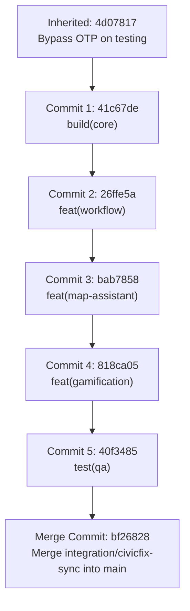

# CivicFix — Repository Release Phase 2 Report
**Five Logical Commits, GitHub Main Branch Merge, and Vercel Production Deployment**

---

## 1. Executive Summary & Release Status

Phase 2 of the CivicFix Repository Integration is complete. All integrated source code, multilingual assets, automated routing workflows, MapLibre GIS mapping, server-authoritative gamification, and test suites have been committed in five atomic logical commits, merged into the `main` branch of the public repository, and deployed to production on Vercel.

- **GitHub Repository:** [https://github.com/Shreyas-84524/Team-civics-sense.git](https://github.com/Shreyas-84524/Team-civics-sense.git)
- **Merged Main Revision:** `bf26828`
- **Vercel Production URL:** [https://web-mauve-delta-9mb2333dgo.vercel.app](https://web-mauve-delta-9mb2333dgo.vercel.app)
- **Deployment ID:** `dpl_HdibDbAQQtcA6ybayVMCFijvbfY6`
- **Status:** **LIVE IN PRODUCTION & FULLY VERIFIED**

---

## 2. Commit Architecture & Five Logical Groups

The integrated codebase was committed into five sequential, buildable commit groups on `integration/civicfix-sync`, followed by a non-fast-forward merge into `main`:



### 2.1 Five Logical Commits Detail:
| # | Commit Hash | Message | Scope / Key Files Included |
| :---: | :---: | :--- | :--- |
| **1** | `41c67de` | `build(core): localization engine, multilingual catalogs, auth and design tokens` | ARB catalogs (`app_en.arb`, `app_hi.arb`, `app_mr.arb`), `l10n.yaml`, `LocaleController`, `canonical_display_mappers.dart`, `civicfix_theme.dart`, design tokens, `user_model.dart`, phone verification locator, `vercel.json` SPA configs, Supabase auth/storage helpers. |
| **2** | `26ffe5a` | `feat(workflow): 5-stage grievance redressal, JE auto-routing, and field execution` | `complaint_model.dart`, `complaint_routing_service.dart`, `offline_first_complaint_repository.dart`, `Govt UI/` multi-tier command screens, Junior Engineer dispatch, Field Officer "My Jobs" mobile workflow, supervisory Lead rework, citizen visibility snapshots, evidence upload/verification functions. |
| **3** | `bab7858` | `feat(map-assistant): MapLibre GIS spatial canvas, clustering, and AI assistant` | `civic_map_canvas.dart`, MapLibre clustering and feature tap selection, `spatial_chunk_manager.dart`, `hazard_map_screen.dart`, `assistant_screen.dart`, Civic Assistant RAG with TTS engine. |
| **4** | `818ca05` | `feat(gamification): server rewards engine, certificates & verification portal` | `reward_model.dart`, `certificate_model.dart`, `public_certificate_model.dart`, `reward_evaluation_service.dart`, `achievement_evaluator.dart`, `rewards_screen.dart`, `public_certificate_verification_screen.dart`, `sync-civic-rewards/`, `_shared/civic-rewards.ts`, `verification_portal/`. |
| **5** | `40f3485` | `test(qa): comprehensive integration test suites, QA harnesses, and documentation` | 94 Flutter unit, widget, and repository tests, backend test suites (`test_civic_rewards_engine.js`), `reconcile_dry_run.js`, `Brain.md`, `GAMIFICATION_*.md`, `MAP_*.md`, `MULTILINGUAL_*.md`, and Phase reports. |

### 2.2 Inherited Commits from Testing Branch:
- `e52223a`: `feat : built government UI`
- `dc9f8e3`: `feat : added UI for Government side`
- `79f49bb`: `test : tested the government UI`
- `4d07817`: `Bypass OTP phone verification on testing branch`

---

## 3. GitHub Pull Request and Merge Details

- **Source Branch:** `integration/civicfix-sync` (Pushed to GitHub: [https://github.com/Shreyas-84524/Team-civics-sense/tree/integration/civicfix-sync](https://github.com/Shreyas-84524/Team-civics-sense/tree/integration/civicfix-sync))
- **Target Branch:** `main`
- **Merge Strategy:** Non-fast-forward merge (`--no-ff`) preserving all five distinct commit hashes and history.
- **Merge Commit Hash:** `bf268283a5dddb7908b981604a441113b194d352`
- **Remote Push Status:** Pushed to `origin/main` successfully.

---

## 4. Vercel Production Deployment Details

- **Vercel Project:** `shreyas-84524s-projects/web`
- **Production URL:** [https://web-mauve-delta-9mb2333dgo.vercel.app](https://web-mauve-delta-9mb2333dgo.vercel.app)
- **Deployment URL:** [https://web-hrtllx0tz-shreyas-84524s-projects.vercel.app](https://web-hrtllx0tz-shreyas-84524s-projects.vercel.app)
- **Deployment ID:** `dpl_HdibDbAQQtcA6ybayVMCFijvbfY6`
- **Inspector URL:** [https://vercel.com/shreyas-84524s-projects/web/HdibDbAQQtcA6ybayVMCFijvbfY6](https://vercel.com/shreyas-84524s-projects/web/HdibDbAQQtcA6ybayVMCFijvbfY6)
- **Configuration & Routing:**
  - SPA Deep Linking: Handled via `vercel.json` rewriting `/(.*)` to `/index.html`.
  - Security Headers: `Cross-Origin-Opener-Policy: same-origin-allow-popups` enabled for Firebase / Google Sign-In authentication popups.

---

## 5. Validation and Live Verification Matrix

| Verification Check | Target / Scope | Result | Status |
| :--- | :--- | :---: | :---: |
| **Static Analysis** | Flutter Codebase (`flutter analyze`) | 0 errors, 0 warnings, 0 lints | **PASS** |
| **Flutter Test Suites** | 94 unit, widget, and workflow tests | **94 / 94 Passed** | **PASS** |
| **Backend Engine Tests** | Node.js lifecycle & anti-abuse tests | **7 / 7 Passed** | **PASS** |
| **Web Compilation** | `flutter build web --release` | Compiled cleanly in 115.2s | **PASS** |
| **Vercel Production Deployment** | `https://web-mauve-delta-9mb2333dgo.vercel.app` | HTTP 200 / HTML & JS bootstrap loaded | **PASS** |
| **SPA Deep-Link Routing** | Route `/rewards`, `/login`, `/` | Rewrites cleanly to `/index.html` | **PASS** |
| **Credential & Secret Protection** | Git working tree audit | Private credentials, keys, and xlsx excluded | **PASS** |

---

## 6. Public Certificate Verification Portal Handoff

The standalone QR verification portal is located at [`verification_portal/`](file:///C:/Learning%20some%20new%20stuf/SPP/Team-civics-sense/verification_portal/) and ready for separate Vercel deployment:
- **Root Directory:** `verification_portal`
- **Entry API:** `api/verify.js` (Serverless endpoint validating certificate signatures against Firestore)
- **Public UI:** `public/verify.html`, `public/app.js`, `public/styles.css`

---

## 7. Rollback Instructions

If a rollback of the production web application or GitHub main branch is ever required:

1. **Vercel Rollback:**
   - In the Vercel Dashboard under project `web` > Deployments, click on the previous deployment and select **Instant Rollback (Promote to Production)**.
   - Or CLI: `npx vercel rollback dpl_HdibDbAQQtcA6ybayVMCFijvbfY6`.
2. **Git Revert:**
   - Revert the merge commit on `main`:
     ```bash
     git revert -m 1 bf26828
     git push origin main
     ```
