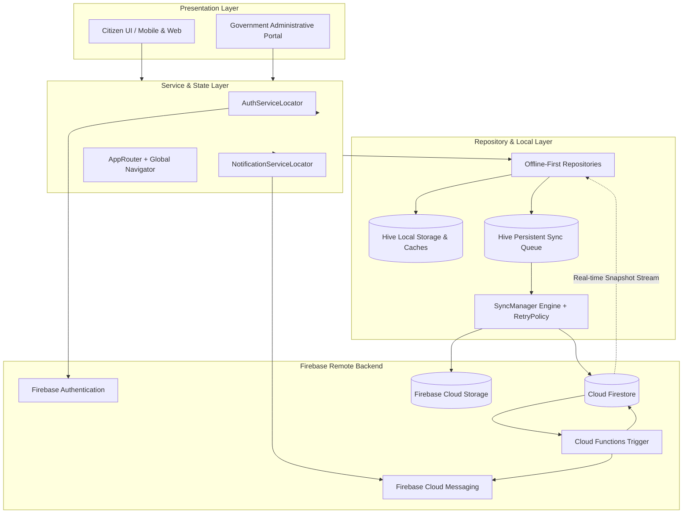

# CivicFix — Final Production Firebase Architecture & System Specification

## 1. Complete System Architecture

CivicFix is an offline-first, citizen-government civic grievance redressal and engagement platform. The architecture unites **Hive local storage** for sub-millisecond local reads and robust offline filing with **Google Cloud Firebase** (`civicfix-38d53`) as the authoritative remote backend and real-time synchronization fabric.

---

## 2. Authentication Architecture

- **Dual Mode**: Seamlessly switches between in-memory mock authentication (`MockAuthService`, `MockGovtAuthService`) for instant local testing and production Firebase Authentication (`FirebaseAuthService`, `FirebaseGovtAuthService`).
- **Canonical Identity**: All user profiles, grievance records, and notification documents strictly bind to the authenticated Firebase User UID (`request.auth.uid`).
- **Role Resolution**: Auth tokens with custom claims (`request.auth.token.role`) take precedence, with a secure fallback to `users/{uid}` profile documents in Firestore.
- **Session Cleanup**: On logout, active real-time Firestore listeners are unsubscribed via `RealtimeSubscriptionManager.instance.cancelAll()` and device push registration tokens are removed from `users/{uid}/devices`.

---

## 3. Roles & Authorization

1. **Citizen (`role = 'citizen'`)**:
   - Permitted to register with standard user privileges.
   - Can create grievances, view own grievances, upvote public hazards, read own notifications, and update notification read status (`isRead`).
   - Profile update security: Cannot self-assign administrative roles, mutate civic points, or alter report counters.
2. **Municipal Government Officer (`role = 'government'` / `role = 'admin'`)**:
   - Access strictly gated behind server-side custom claims or verified Firestore officer profiles.
   - Authorized to triage, verify, assign, update workflow status, attach official timeline messages, and resolve grievances across departments.
   - Protected client-side routing: `AppRouter` blocks unauthenticated access to all `/govt/*` routes.

---

## 4. Cloud Firestore Database Design

### Collections Schema:
- **`users/{userId}`**: Profile documents (name, email, phone, ward, civic points, statistics, role).
- **`users/{userId}/devices/{deviceId}`**: Active device registration tokens for multi-device push routing.
- **`complaints/{complaintId}`**: Master grievance documents (title, description, category, status, priority, location, evidence URLs, timestamps, upvotes).
- **`complaints/{complaintId}/updates/{updateId}`**: Immutable chronological audit timeline events.
- **`departments/{departmentId}`**: Municipal department catalog and triage squad mappings.
- **`notifications/{notificationId}`**: Authoritative notification documents created by Cloud Functions.
- **`hazards/{hazardId}`**: Sanitized public GIS hazard markers without citizen PII.
- **`rewards/{userId}`**: Server-authoritative gamification badges, milestones, and reward redemptions.

---

## 5. Firebase Cloud Storage

- **Complaint Evidence Hierarchy**: `complaints/{complaintId}/images/{fileName}` & `complaint_evidence/{complaintId}/{fileName}`.
- **Avatar Storage**: `user_avatars/{userId}/{fileName}` and `govt_avatars/{officerId}/{fileName}`.
- **Upload Constraints**:
  - Maximum size: 10 MB for evidence photos, 5 MB for profile avatars.
  - Allowed MIME types: `image/jpeg`, `image/jpg`, `image/png`, `image/webp`.
  - Security rules enforce authenticated write access with file size and format validation.

---

## 6. Hive Local Persistence Layer

CivicFix operates local-first using 10 specialized Hive boxes:
1. `complaints_box`: Local cache for grievances.
2. `complaint_updates_box`: Local timeline events cache.
3. `pending_sync_box`: Persistent FIFO offline queue.
4. `notifications_box`: Local notification history.
5. `user_box`: Local session profile cache.
6. `rewards_box`: Gamification points and achievement cache.
7. `settings_box`: UI theme, language, and notification preferences.
8. `hazards_box`: Geotagged hazard cache.
9. `sync_metadata_box`: Cache TTL and synchronization watermarks.
10. `departments_box`: Department metadata cache.

All boxes use type adapters with stable Hive type IDs (IDs 0–9).

---

## 7. Offline Synchronization Engine

The synchronization pipeline is managed by `SyncManager`:
- **Offline Filing**: Citizen grievances created without network connectivity are assigned a local ID (`cmp_local_...`), stored in Hive with `SyncStatus.pending`, and enqueued in `HiveSyncQueue`.
- **Automatic Sync**: Upon network recovery (`ConnectivityService`), `SyncManager` processes queued items via `FirebaseSyncProvider`.
- **Evidence Uploads**: Photographic evidence is uploaded to Firebase Storage, returning remote URLs that are patched into the complaint record.
- **Exponential Backoff**: `RetryPolicy` calculates backoff delays with jitter, capping retries at `maxRetries` (default: 5). Failed items transition to `SyncStatus.failed` with manual retry capability.
- **Idempotency & Deduplication**: Identity reconciliation indexes records across `localId`, `serverId`, and `ticketNumber`, ensuring zero duplication when online snapshots arrive.

---

## 8. Real-Time Synchronization Architecture

- **No Polling**: Data sync uses native Firestore snapshot streams (`snapshots()`).
- **Scoped Subscriptions**: Handled by `RealtimeSubscriptionManager` with group tags.
- **Unidirectional Flow**: Remote Firestore snapshots mutate Hive cache via `cacheComplaints()`. Caching purely mutates local storage and never re-enqueues items into `pendingSync`, preventing infinite echo loops.
- **Pending Draft Preservation**: Local offline drafts (`SyncStatus.pending`) are merged at the top of query streams and preserved until server confirmation.

---

## 9. Firebase Cloud Messaging (FCM)

- **Entry Point**: Top-level `@pragma('vm:entry-point') firebaseMessagingBackgroundHandler` executes in background isolates without UI dependencies.
- **Service Abstraction**: `NotificationService` interface implemented by `FirebaseNotificationService` (production) and `MockNotificationService` (testing).
- **Foreground Handling**: Foreground pushes display an unobtrusive floating banner via `MockNotificationService.showInAppAlert` with a "VIEW" deep-link action.
- **Deep Linking**: Background/terminated push taps parse payload data (`complaintId`, `targetRoute`, `role`) and navigate directly to `ComplaintDetailsScreen` or `GovtComplaintDetailsScreen` via the global `navigatorKey`.

---

## 10. Cloud Functions Triggers

Located in `functions/src/index.ts`:
1. **`onComplaintStatusChanged`**:
   - Triggered on `complaints/{complaintId}` document update.
   - Diffs `before.status !== after.status` to skip non-status edits.
   - Generates deterministic `sourceEventId` and doc ID (`notif_status_${complaintId}_${newStatus}_${timestamp}`).
   - Writes authoritative Firestore notification document.
   - Dispatches multicast FCM push to all tokens registered in `users/{citizenId}/devices`.
   - Automatically batch-deletes stale/unregistered tokens (`messaging/registration-token-not-registered`, `messaging/invalid-registration-token`).
2. **`onComplaintCreated`**:
   - Triggered on initial grievance creation.
   - Writes submission confirmation notification and sends FCM confirmation push.

---

## 11. Security Threat Model & Mitigations

| Threat Scenario | Implemented Mitigation |
|---|---|
| **Citizen impersonates another citizen** | Firestore rules enforce `request.resource.data.citizenId == request.auth.uid`. |
| **Citizen self-assigns Government role** | Profile creation rule requires `role == 'citizen'`. Profile update rule strictly prohibits mutating `role`, `permissions`, or `departmentId`. |
| **Citizen reads another's private complaint** | Firestore rule permits read only if `citizenId == request.auth.uid`, user is `isGovernment()`, or `isHazard == true`. |
| **Citizen modifies another's complaint** | Update rules allow author editing only when `isOwner(resource.data.citizenId)` and status is `reported`/`verified`. |
| **Citizen forges Government status update** | Status mutation rules require `isGovernment()`. Timeline subcollection creation enforces officer authorization. |
| **User reads another's notifications** | Rule enforces `resource.data.userId == request.auth.uid`. Direct client creation is blocked (`allow create: if false`). |
| **Attacker accesses device tokens** | Subcollection `users/{uid}/devices/{deviceId}` is restricted to `isOwner(userId)`. |
| **Cloud Function retry duplicate notifications** | Idempotency enforced via deterministic document IDs (`notif_${complaintId}_${status}_${timestamp}`). |
| **Network drops during submission** | Local-first architecture stores complaint in Hive and enqueues to `HiveSyncQueue` for deferred sync. |
| **User logs out on shared device** | Logout deletes device token document, resets local user cache, and terminates all active real-time listeners. |

---

## 12. Verification & Testing Matrix

- **Unit, Widget, & Integration Tests**: **400 tests passing 100%**.
- **Static Analysis**: `flutter analyze` $\rightarrow$ **0 issues**.
- **Cloud Functions Unit Tests**: `node --test functions/test/notifications.test.js` $\rightarrow$ **3/3 passing**.

---

## 13. Deployment & Environment Readiness

- **Flutter Android Build**: Configured via `android/app/google-services.json` and Gradle build scripts.
- **Flutter Web Build**: Configured with `firebase_options.dart` web configuration.
- **Firebase Deploy Ready**: Rules, indexes, and Cloud Functions verified and structured for `firebase deploy`.
