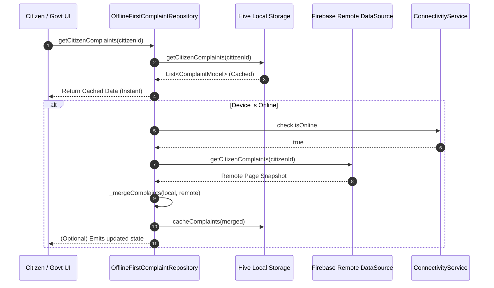
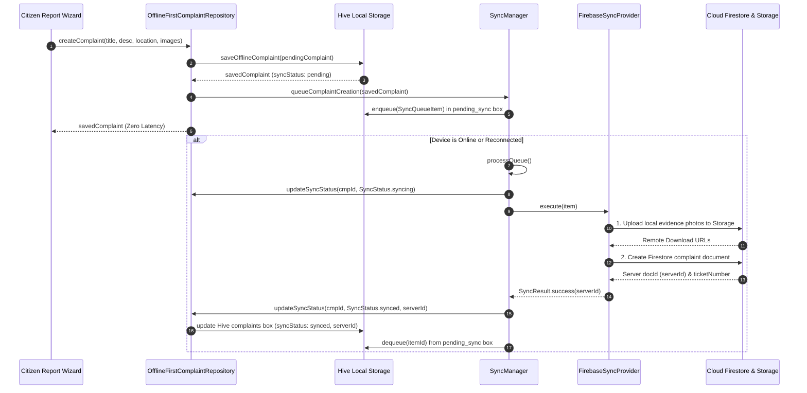
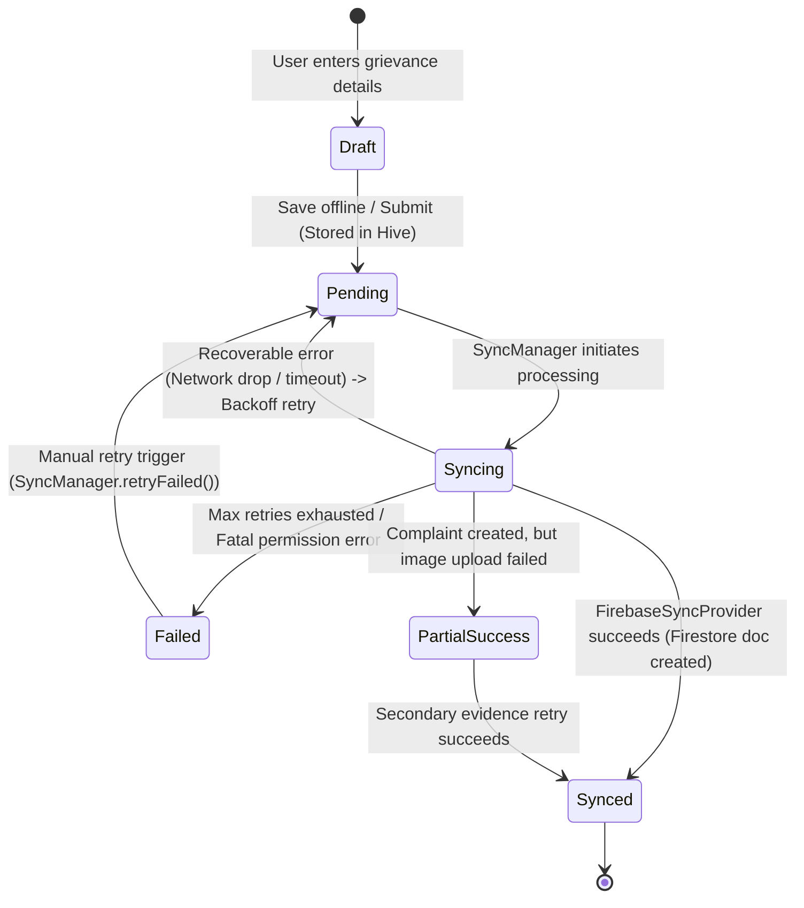

# CivicFix — Offline-First Architecture & Synchronization Engine

## 1. Executive Summary & Core Value Proposition

CivicFix is designed from the ground up as a **first-class offline-first municipal civic engagement platform**. In real-world urban and rural settings, citizens reporting potholes, open garbage dumps, water leakages, or electrical hazards often encounter low-connectivity zones, dead spots, or intermittent network disruptions.

The CivicFix offline-first architecture guarantees:
1. **Zero UI Blocking:** Every user interaction—including complaint filing, profile editing, upvoting, and status triage—is written immediately to local persistent storage (Hive) and reflected instantly on the screen with 0ms artificial latency.
2. **Deterministic Data Integrity:** No complaint or evidence photo is ever dropped, overwritten, or silently lost due to connection timeouts or app terminations.
3. **Smart Synchronization:** As soon as connectivity is restored, the `SyncManager` automatically drains the queued mutations via `FirebaseSyncProvider`, executing idempotent operations on Cloud Firestore and Cloud Storage.
4. **Authoritative Field Reconciliation:** Local drafts, client identifiers, and un-synced user edits are preserved, while server-assigned ticket numbers, municipal triage statuses, and officer notes are merged cleanly.

---

## 2. Architecture Topology

```
                              ┌───────────────────────────────────┐
                              │            UI Layer               │
                              │    (Citizen UI & Govt Portal)     │
                              └─────────────────┬─────────────────┘
                                                │
                                    Domain Repository Layer
                              ┌─────────────────┴─────────────────┐
                              │  OfflineFirstComplaintRepository  │
                              │  OfflineFirstGovtComplaintRepo    │
                              │  OfflineFirstUserRepository       │
                              │  OfflineFirstHazardRepository     │
                              │  OfflineFirstNotificationRepo     │
                              │  OfflineFirstRewardsRepository    │
                              └────────┬─────────────────┬────────┘
                                       │                 │
                         Cache-First / │                 │ Enqueue Mutation
                         Revalidate    │                 │ (SyncQueueItem)
                                       ▼                 ▼
                        ┌────────────────────────┐  ┌────────────────────────┐
                        │    Hive Local Layer    │  │      SyncManager       │
                        │  (HiveStorageService   │  │  - HiveSyncQueue (FIFO)│
                        │   + MockDataSource)    │  │  - RetryPolicy         │
                        │  - complaints box      │  │  - Mutex Lock          │
                        │  - hazards box         │  │  - Connectivity Listen│
                        │  - pending_sync box    │  └───────────┬────────────┘
                        │  - user box            │              │
                        │  - notifications box   │              │ Dispatches
                        │  - rewards box         │              ▼
                        └─────────────▲──────────┘  ┌────────────────────────┐
                                      │             │  FirebaseSyncProvider  │
                                      │ Cache       └───────────┬────────────┘
                                      │ Updates                 │
                                      │                         │
                                      └─────────────────────────┼─────────────────────────┐
                                                                │                         │
                                                                ▼                         ▼
                                                    ┌──────────────────────┐  ┌──────────────────────┐
                                                    │ Cloud Firestore SDK  │  │ Firebase Storage SDK │
                                                    │ (Remote Data Sources)│  │ (Evidence Service)   │
                                                    └──────────────────────┘  └──────────────────────┘
```

---

## 3. Read Strategy: Cache-First / Stale-While-Revalidate

For all read operations (`getCitizenComplaints`, `getComplaints`, `getComplaintById`, `getNearbyHazards`):

1. **Immediate Cache Return:** The repository immediately queries the local Hive box (`HiveComplaintRepository`) and loads in-memory domain models. This ensures instantaneous screen rendering without spinner jank or network wait times.
2. **Background Remote Query:** If `ConnectivityService.isOnline == true`, an asynchronous background request is issued to `FirebaseComplaintDataSource`.
3. **Data Merging:** Remote documents are reconciled with local items using `_mergeComplaints`:
   - Records with `syncStatus == SyncStatus.pending` or `syncing` are preserved (user's pending draft title/description are never clobbered).
   - Synced records adopt the latest workflow status, officer notes, resolution timestamps, and upvote counts from Firestore.
4. **Cache Invalidation & Storage:** The merged dataset is written back to Hive (`cacheComplaints`) and the in-memory fallback list.



---

## 4. Write Strategy: Instant Local Persistence + Async Queue Mutation

When a citizen submits a complaint (`createComplaint` or `saveOfflineComplaint`):

1. **Local Ticket Assignment:** A temporary local reference (`LOCAL-2026-XXXXXX`) and local ID (`cmp_local_...`) are assigned.
2. **Hive Persistence:** The complaint is saved into Hive `complaints` box with `syncStatus = SyncStatus.pending`.
3. **Sync Queue Enqueue:** A `SyncQueueItem` is created with operation `SyncOperation.createComplaint`, payload metadata, and idempotency key `complaint_${id}_create`, then stored in the Hive `pending_sync` box.
4. **UI Return:** The newly created complaint is returned immediately to the UI layer.
5. **Draining:**
   - If offline: The item rests safely in Hive across app restarts and device reboots.
   - If online: `SyncManager` immediately triggers `processQueue()`.



---

## 5. Synchronization State Machine & Lifecycle

The lifecycle of each grievance complaint transitions through deterministic states:



### State Definitions
| State | Location | Meaning |
| :--- | :--- | :--- |
| `SyncStatus.pending` | Local (Hive) | Saved locally on device; awaiting network connectivity or queue dispatcher. |
| `SyncStatus.syncing` | In-Flight | Actively being processed by `SyncManager` & `FirebaseSyncProvider`. |
| `SyncStatus.synced` | Cloud & Local | Successfully committed to Cloud Firestore and Firebase Storage; has remote `serverId`. |
| `SyncStatus.failed` | Local (Hive) | Encountered non-recoverable error or exhausted retry attempts. Requires manual user retry. |

---

## 6. Data Merge & Conflict Resolution Matrix

When local cached data and remote Firestore documents intersect, the following authoritative reconciliation rules apply:

| Entity Attribute | Authoritative Source | Reconciliation Logic |
| :--- | :--- | :--- |
| **`syncStatus`** | **Local (Hive)** | Remains `pending` / `syncing` until `SyncManager` completes remote sync. Remote cannot force `synced` on an un-synced local edit. |
| **`localId`** | **Local (Hive)** | Persisted indefinitely as a client correlation token. Written to Firestore document as `localId` field for lookup. |
| **`title` / `description`** | **Local (while Pending)**<br>**Server (when Synced)** | If a local record is `pending`, local text is preserved. Once synced, remote edits take effect. |
| **`ticketNumber`** | **Server (Cloud)** | Temporary `LOCAL-2026-XXXXXX` ticket is replaced by authoritative `CF-2026-XXXXXX` once synced. |
| **`status` (Workflow)** | **Server (Cloud)** | Administrative status transitions (`verified`, `assigned`, `inProgress`, `resolved`, `rejected`) override local status once synced. |
| **`assignedTo` / `department`** | **Server (Cloud)** | Nodal officer assignment and municipal crew dispatching are server-authoritative. |
| **`officerNotes` / `timeline`** | **Server (Cloud)** | Official inspection remarks and timeline audit history are merged from server. |
| **`upvotes`** | **Server / Max** | Optimistic local count (`local + 1`) is sent to server; merged count adopts `max(local, remote)`. |
| **`civicPoints` / `badges`** | **Server (Cloud)** | Citizen gamification scores and unlocked achievements reconcile to remote totals. |

---

## 7. Data Loss Protection & Idempotency Guarantees

### A. Cache Eviction Protection
The repository's `clearStaleComplaints` and `clearStaleHazards` methods enforce a strict safety invariant:
```dart
// STRICT INVARIANT: Never purge pending offline records!
if (item.syncStatus == 'pending' || item.syncStatus == 'syncing') {
  continue; // Skip purge
}
```
Even if an offline complaint is older than the cache retention window (e.g. 14 days), it will **never** be deleted until it has been successfully synchronized to Firebase.

### B. Idempotent Remote Replay
If the device loses connection during the HTTP response phase of document creation, the document might exist in Firestore while the client didn't receive the confirmation. Upon reconnecting, `FirebaseSyncProvider` performs an idempotency lookup:
```dart
final existingDoc = await _findExistingRemoteComplaint(complaintId, localId);
if (existingDoc != null) {
  // Found existing Firestore document! Return success without creating duplicate.
  return SyncResult.success(serverId: existingDoc.id);
}
```

---

## 8. Partial Failure Isolation (Evidence Uploads vs Complaints)

Evidence image uploads over cellular connections are more prone to failure than lightweight JSON payloads. CivicFix implements **discrete two-phase partial failure isolation**:

1. If 3 photos are attached and 1 fails to upload due to a network blip:
   - The complaint document is **still created** on Cloud Firestore with the 2 successful photos.
   - `FirebaseSyncProvider` returns `SyncResult.partial(serverId: docId, failedImageUrls: [failedPath])`.
   - The complaint's status is updated to `synced` (with `serverId`).
   - `SyncManager` automatically enqueues a secondary, lightweight `SyncOperation.uploadEvidence` task for the failed photo.
   - When the secondary task succeeds, it appends the new image URL to the existing Firestore document.

---

## 9. Government Administrative Workflow Synchronization

Government officers managing grievances via the Government Portal utilize `OfflineFirstGovtComplaintRepository`:

1. **Status Updates (`updateStatus`):**
   - Transitions status (`reported` -> `verified` -> `assigned` -> `inProgress` -> `resolved` -> `rejected`).
   - Appends audit `TimelineEvent` with officer name and timestamp.
   - Updates local cache immediately for zero-delay UI responsiveness.
   - Synchronizes directly to Firestore via `FirebaseComplaintDataSource.updateComplaintStatus(...)`. If offline, enqueues to `SyncManager`.
2. **Crew Assignment (`assignComplaint`):**
   - Assigns field officer and department crew.
   - Immediately updates local cache and pushes to Firestore `assignedTo`, `departmentId`, and `departmentName`.
3. **Executive Dashboard Metrics (`getDashboardMetrics`):**
   - Calculates aggregate metrics across total, reported, verified, assigned, in-progress, resolved, and critical hazard complaints from merged cache data.

---

## 10. Summary Matrix of Offline-First Repositories

| Repository | Interface | Local Cache Layer | Remote Backend Layer | Queue Orchestrator |
| :--- | :--- | :--- | :--- | :--- |
| `OfflineFirstComplaintRepository` | `ComplaintRepository` | `HiveComplaintRepository` | `FirebaseComplaintDataSource` | `SyncManager` + `FirebaseSyncProvider` |
| `OfflineFirstGovtComplaintRepository` | `GovtComplaintRepository` | `HiveComplaintRepository` | `FirebaseComplaintDataSource` + `FirebaseDepartmentDataSource` | `SyncManager` |
| `OfflineFirstUserRepository` | `UserRepository` | `HiveUserRepository` | `FirebaseUserDataSource` + `FirebaseRewardsDataSource` | `SyncManager` |
| `OfflineFirstHazardRepository` | `HazardRepository` | `HiveHazardRepository` | `FirebaseHazardDataSource` | Local + Remote Query |
| `OfflineFirstNotificationRepository` | `NotificationRepository` | `HiveNotificationRepository` | `FirebaseNotificationDataSource` | Direct Sync + Cache |
| `OfflineFirstRewardsRepository` | `RewardsRepository` | `HiveRewardsRepository` | `FirebaseRewardsDataSource` | Direct Sync + Cache |
