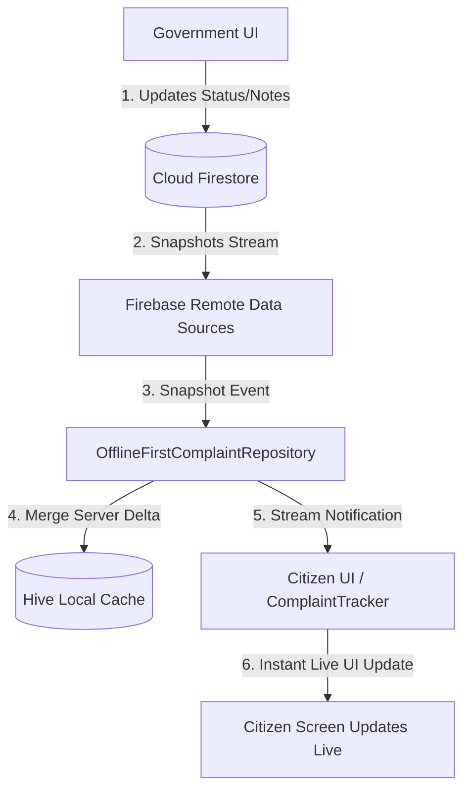

# CivicFix Real-Time Listeners & Reactive Synchronization Architecture

## 1. Overview & Objectives
CivicFix combines an **offline-first local Hive persistence layer** with **Cloud Firestore real-time snapshot streams** to enable zero-latency local interactions and instantaneous multi-party state synchronization.

When a municipal officer changes a complaint status or adds an audit note in the Government UI, the change is written to Firestore, triggers a Firestore snapshot event, flows through repository stream subscriptions, updates the local Hive cache, and dynamically refreshes the Citizen UI (Complaint Tracker, Details, and My Complaints) in real-time.

---

## 2. Key Architecture Principles

### 2.1 No Polling Prohibition
Periodic timers (`Timer.periodic`) are strictly prohibited for data synchronization. All reactive updates leverage native Firestore document and query snapshot streams (`snapshots()`).

### 2.2 Unidirectional Flow & Loop Prevention
Remote Firestore snapshot events update the local Hive cache exclusively via `cacheComplaints()`. Caching purely mutates local storage and **never** enqueues items into `pendingSync` or `SyncManager`, preventing infinite echo loops.

### 2.3 Offline Pending Draft Protection
Local drafts that are created offline (`syncStatus == SyncStatus.pending` or `SyncStatus.syncing`) are explicitly protected during remote snapshot merges:
- Pending local items are preserved at the top of query results even when absent from remote Firestore query results.
- Authoritative remote metadata (`ticketNumber`, `status`, `assignedTo`, `officerNotes`, `timeline`) is merged into the record once synchronized, without erasing local user inputs.

### 2.4 Entity Deduplication & Identity Mapping
Records transition through three lifecycle keys:
- `localId`: Assigned at creation on device (`cmp_local_...`).
- `serverId`: Generated by Cloud Firestore upon remote creation.
- `ticketNumber`: Official municipal identifier (`CF-2026-000025`).

`OfflineFirstComplaintRepository._mergeComplaints` indexes existing local items by `serverId`, `localId`, `id`, and `ticketNumber`, ensuring zero duplication across offline-to-online transitions.

---

## 3. Component Architecture

### 3.1 Remote Data Source Streams
Located in `lib/core/firebase/firestore/`:
- `FirebaseComplaintDataSource`:
  - `watchComplaint(String id)`: Document snapshot mapped to `ComplaintModel` with live timeline updates.
  - `watchComplaintTimeline(String complaintId)`: Subcollection snapshots ordered chronologically by `timestamp`.
  - `watchCitizenComplaints({required String citizenId, int limit})`: Real-time query for citizen's grievances.
  - `watchGovernmentComplaints({departmentId, status, priority, assignedTo, limit})`: Real-time triage stream for municipal desks.
  - `watchNearbyHazards({int limit})`: Community safety hazard stream.
- `FirebaseNotificationDataSource`:
  - `watchUserNotifications({required String userId, bool? unreadOnly, int limit})`: Live notification feed.
  - `watchUnreadCount(String userId)`: Live unread badge count.
- `FirebaseHazardDataSource`:
  - `watchHazards({categoryId, status, severity, limit})`: Live hazard GIS stream.

### 3.2 Offline-First Repositories
Located in `lib/core/repositories/`:
- `OfflineFirstComplaintRepository`: Emits cached Hive records first, attaches to remote streams, merges remote deltas, updates Hive cache, and emits merged domain models.
- `OfflineFirstGovtComplaintRepository`: Real-time filtered complaint streaming and live dashboard metrics.
- `OfflineFirstNotificationRepository`: Live unread badges and notification feed.
- `OfflineFirstHazardRepository`: Live hazard map synchronization.

### 3.3 Subscription Lifecycle Management
`RealtimeSubscriptionManager` (`lib/core/sync/realtime_subscription_manager.dart`):
- Tracks all active `StreamSubscription` instances across the application.
- Grouping mechanism for tagging subscriptions by user or department scope.
- `cancelAll()` is automatically executed upon Citizen and Government logout (`FirebaseAuthService.logout` / `FirebaseGovtAuthService.logout`) to prevent memory leaks and cross-user data exposure.

---

## 4. UI Real-Time Integration

| Screen | Stream Consumed | Reactive Behavior |
|---|---|---|
| `ComplaintTrackerScreen` | `watchComplaint(id)` | 5-stage progress tracker and audit timeline update dynamically in real time. |
| `ComplaintDetailsScreen` | `watchComplaint(id)` | Ticket details, status badge, officer notes, and evidence update live. |
| `MyComplaintsScreen` | `watchCitizenComplaints(citizenId)` | Live grievance list reflects newly synced records and status transitions. |
| `GovtComplaintListScreen` | `watchComplaints(...)` | Triage table and cards update instantly as citizens report issues or colleagues assign tickets. |

---

## 5. Performance & Resource Optimization
- **Initial Data Fast-Path**: UI renders cached Hive records instantly while Firestore streams establish in the background.
- **Backpressure & Clean Teardown**: Subscriptions are strictly cancelled in `dispose()` methods and centrally on authentication changes.
- **Index-Optimized Queries**: Firestore streams use composite indexes (`citizenId + createdAt`, `departmentId + status + createdAt`, etc.) to minimize server read latency.
