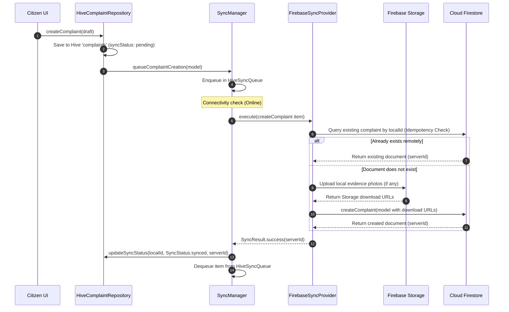
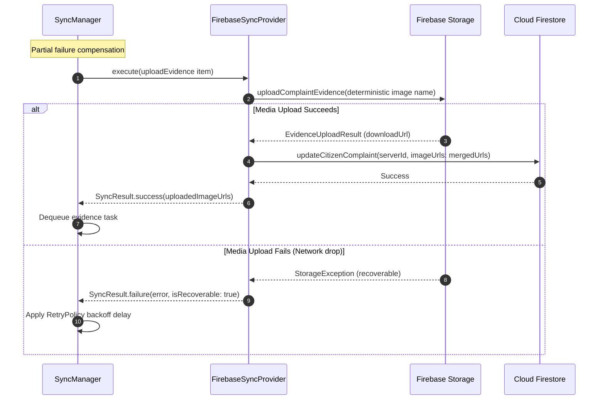

# CivicFix — FirebaseSyncProvider & Remote Synchronization Specification

> **Version**: 1.0  
> **Status**: Approved Foundation  
> **Target Project**: `civicfix-38d53` (CivicFix)  
> **Architecture Principle**: `FirebaseSyncProvider` bridges the offline-first `SyncManager` queue with Cloud Firestore and Firebase Cloud Storage, ensuring guaranteed delivery, strong idempotency, and partial failure resilience without violating local Hive persistence.

---

## 1. System Overview & Component Topology

The synchronization engine in CivicFix adheres to a strictly layered architecture. Offline mutations are enqueued locally in Hive and drained asynchronously when network connectivity is confirmed.

```text
+-------------------------------------------------------------------------+
|                          Citizen App / Govt UI                          |
+-------------------------------------------------------------------------+
                                     |
                                     v
+-------------------------------------------------------------------------+
|                           ComplaintRepository                           |
|   +---------------------------------+  +----------------------------+   |
|   |   Hive Local Data Source (Box)  |  | Cloud Firestore DataSource |   |
|   +---------------------------------+  +----------------------------+   |
+-------------------------------------------------------------------------+
                                     |
                        (Enqueues Mutation to Queue)
                                     v
+-------------------------------------------------------------------------+
|                               SyncManager                               |
|   +----------------------------+   +--------------------------------+   |
|   | HiveSyncQueue (Persistent) |   | ConnectivityService (Observer) |   |
|   | Mutex Lock / In-Flight Set |   | RetryPolicy (Exponential Backoff)| |
|   +----------------------------+   +--------------------------------+   |
+-------------------------------------------------------------------------+
                                     |
                                     v
+-------------------------------------------------------------------------+
|                          SyncProvider Contract                          |
|             +----------------------------------------------+            |
|             |              SyncResult execute()            |            |
|             +----------------------------------------------+            |
|                   /                                  \                  |
|                  v                                    v                 |
|       MockSyncProvider (Test/Offline)       FirebaseSyncProvider        |
+-------------------------------------------------------------------------+
                                                        |
                            +---------------------------+---------------------------+
                            |                                                       |
                            v                                                       v
        +---------------------------------------+               +---------------------------------------+
        |      FirebaseComplaintDataSource      |               |     FirebaseEvidenceStorageService    |
        +---------------------------------------+               +---------------------------------------+
                            |                                                       |
                            v                                                       v
               Cloud Firestore (Database)                              Firebase Storage (Media Bucket)
```

---

## 2. Synchronization Operation Mapping

The synchronization queue items map directly to specific backend tasks:

| `SyncOperation` | Description | Remote Target Service | Idempotency Key |
| :--- | :--- | :--- | :--- |
| `createComplaint` | Creates a new civic grievance document & initial timeline event. | Cloud Firestore (`complaints` & subcollection `complaint_updates`) + Storage | `complaint_{id}_create` |
| `uploadEvidence` | Uploads photographic evidence attachments for an existing complaint. | Firebase Cloud Storage + Cloud Firestore | `evidence_{complaintId}_upload` |
| `updateComplaint` | Updates grievance details (title, description, location) or triage status. | Cloud Firestore (`complaints/{complaintId}`) | `complaint_{id}_update` |
| `upvoteComplaint` | Increments community upvote count atomically. | Cloud Firestore (`complaints/{complaintId}`) | `complaint_{id}_upvote` |
| `deleteComplaint` | Soft-deletes or archives a grievance ticket. | Cloud Firestore (`complaints/{complaintId}`) | `complaint_{id}_delete` |

---

## 3. End-to-End Workflow: `CREATE_COMPLAINT`



---

## 4. End-to-End Workflow: `UPLOAD_EVIDENCE` & Partial Failure Recovery

When evidence images fail to upload during initial complaint creation, the complaint is created on Firestore and a secondary `uploadEvidence` task is queued automatically.



---

## 5. Idempotency & Duplicate Prevention Strategy

Network partitions and timeouts can cause responses to be dropped even after Firestore or Cloud Storage successfully processes a write. `FirebaseSyncProvider` prevents duplicates through three levels of defense:

1. **Pre-Write Idempotency Verification**:
   Before creating a complaint, `_findExistingRemoteComplaint(complaintId, localId)` queries Firestore:
   - First by primary document key `complaintId`.
   - Second by indexed field `localId == localId`.
   - If a matching document exists, it is adopted immediately without re-executing `set` or `add`.

2. **Deterministic Document Naming**:
   When client-generated UUIDs or local identifiers are supplied, Firestore documents are set using deterministic paths (`_complaintsRef.doc(id)`), eliminating duplicate random auto-IDs.

3. **Deterministic Storage Object Keys**:
   Evidence uploads use deterministic object names:
   `complaint_evidence/{complaintId}/evidence_{complaintId}_{index}.jpg`.
   If a queued upload task is retried after a partial timeout, it overwrites the exact same Storage path rather than generating redundant files.

---

## 6. Error Classification Taxonomy & Retry Integration

`FirebaseSyncProvider` classifies errors to optimize retry behavior in `SyncManager`:

| Error Scenario | Exception Class | `isRecoverable` | `SyncManager` Action |
| :--- | :--- | :---: | :--- |
| Network unavailable / offline | `SocketException`, `HttpException` | **`true`** | Scheduled for exponential backoff retry via `RetryPolicy`. |
| Firebase Storage timeout | `TimeoutException`, `retry-limit-exceeded` | **`true`** | Re-queued with backoff delay. |
| Firestore `unavailable` / `deadline-exceeded` | `FirestoreException` | **`true`** | Re-queued with backoff delay. |
| MD5 checksum mismatch | `invalid-checksum` | **`true`** | Retried immediately. |
| Firestore `permission-denied` | `FirestoreException` | **`false`** | Marked as `failed` immediately (no wasted retries). |
| Cloud Storage `unauthorized` | `StorageException` | **`false`** | Marked as `failed` immediately. |
| Invalid file / payload corruption | `invalid-file`, `invalid-argument` | **`false`** | Marked as `failed` immediately. |

---

## 7. Provider Selection & Dependency Injection

`SyncManager` provides dynamic provider selection:

```dart
// Default configuration (MockSyncProvider for offline development & tests):
final syncManager = SyncManager();

// Switch to production Firebase provider:
syncManager.setProvider(FirebaseSyncProvider());
```

---

## 8. Security & Authentication Constraints

* **Normal Client SDK Access**: `FirebaseSyncProvider` operates strictly within the security rules defined in `firestore.rules` and `storage.rules`. No Admin SDK or service account credentials are used.
* **Current Authentication Limitation**: Until Firebase Authentication is implemented in subsequent prompts, remote Firestore operations against authenticated security rules must be executed in emulator mode or with active Auth tokens. `MockSyncProvider` remains the default provider for non-authenticated test scenarios.
