# Phase 3 — Government Super Admin / Municipal Commissioner City Command Center Verification Report

## Executive Summary
Phase 3 establishes the apex citywide command and control interface for the **Municipal Commissioner & Super Admin** (`government_super_admin`) role within the CivicFix Government Portal.

The dashboard integrates real-time telemetry, geographic intelligence, multi-tier operational metrics, and executive interventions across Mumbai's municipal administrative hierarchy:
- **7 Canonical Administrative Zones** (Zone 1 to Zone 7)
- **24 Canonical Municipal Wards** (Ward A to Ward T)
- **18 Technical Municipal Departments** (Roads, Solid Waste, Water Supply, Storm Water Drains, etc.)
- **432 Ward-Department Operational Units** ($24 \text{ Wards} \times 18 \text{ Departments}$)
- **2,642 Verified Government Identities** (Dual-Supervisory Chain of Command)

---

## Architecture & Data Flow

```mermaid
graph TD
    A[CityCommandCenterScreen] --> B[GovernmentCityDashboardService]
    B --> C[GovtComplaintRepository]
    B --> D[LocalGovernmentHierarchyRepository]
    B --> E[ComplaintRoutingService]
    B --> F[DefaultGovernmentAuditService]
    B --> G[HazardRepository]
    
    A --> H[14 Visual Command Sections]
    H --> H1[CityKpiSection: 8 Executive Metric Cards]
    H --> H2[CityAttentionSection: Deterministic Alert Triage]
    H --> H3[CityOperationsOverviewSection: Operational Distribution]
    H --> H4[ZonePerformanceSection: 7-Zone Table & Matrix]
    H --> H5[WardPerformanceSection: 24-Ward Ledger & Chart]
    H --> H6[DepartmentPerformanceSection: 18-Department Table]
    H --> H7[CityComplaintTrendSection: 7D/30D/90D Time Series]
    H --> H8[CriticalComplaintsSection: Urgent Dispatch Queue]
    H --> H9[SlaBreachesSection: Statutory SLA Breach Queue]
    H --> H10[RoutingRequestsSection: Reassignment & Executive Overrides]
    H --> H11[EscalationOverviewSection: Escalation Matrix Tracker]
    H --> H12[PersonnelOverviewSection: 2,642 Staff Breakdown]
    H --> H13[CityComplaintMapSection: Geographic GIS Heatmap & Pins]
    H --> H14[RecentAdministrativeActivitySection: Audit Trail Ledger]
```



---

## Comprehensive Feature Matrix

| Section / Component | Purpose | Data Source / Logic | Verified Features |
| :--- | :--- | :--- | :--- |
| **City KPI Section** | 8 High-Level Vital Cards | `CityDashboardData.kpis` | Open Complaints, Critical Grievances, Resolved Today, SLA Compliance %, SLA Breached, Pending Routing Requests, Active Personnel (2,642), Avg Resolution Time. |
| **City Attention Section** | Priority Action Triggers | Dynamic Alert Derivation | Critical volume alerts, SLA breach surges, routing bottlenecks, disaster/hazard clusters with interactive CTA triggers. |
| **Operations Overview Section** | Status breakdown & workload | Real-time complaint aggregation | Status pipeline (Submitted, Verified, In Progress, Resolved, Closed), Criticality distribution, and operational metrics. |
| **Zone Performance Section** | 7-Zone Performance Table | Zone-level metrics aggregator | Tabular metrics with column sorting (Total, Open, Critical, SLA %, Overdue, Routing, Personnel), status indicators, and view actions. |
| **Ward Performance Section** | 24-Ward Performance Ledger | Ward-level metrics aggregator | Dependent Zone dropdown filter, Ward volume comparison chart, sortable data table with 10/25/50 pagination. |
| **Department Performance Section** | 18 Technical Departments | Department-level metrics aggregator | Multi-column sortable table for all 18 departments with status badges and SLA health indicators. |
| **City Complaint Trend Section** | Temporal analysis | Historical daily time series | 7 Days, 30 Days, and 90 Days multi-granularity trend charts with incoming vs resolved volume comparisons. |
| **Critical Complaints Section** | High-severity dispatch panel | `GovtComplaintRepository` | Filtered list for high/critical priority tickets with one-click detail navigation and status overrides. |
| **SLA Breaches Section** | Statutory SLA compliance | SLA deadline calculation | Overdue duration tracker, department routing badges, and priority escalations. |
| **Routing Requests Section** | Reassignment transfer queue | `ComplaintRoutingService` | Inter-department and inter-ward transfers with **Super Admin Executive Override Dialog**. |
| **Escalation Overview Section** | Multi-tier grievance escalation | Statutory grievance matrix | Tier 1/2/3 escalation tickets with countdown timelines and escalation triggers. |
| **Personnel Overview Section** | Dual-supervisory governance | `LocalGovernmentHierarchyRepository` | 2,642 verified municipal identities across Administrative vs Technical supervisory reporting chains. |
| **City Complaint Map Section** | Geographic spatial intelligence | `HazardRepository` & coordinates | Interactive GIS heatmap canvas, cluster markers, severity indicators, and hazard layer filters. |
| **Administrative Activity Section** | Immutable audit log | `DefaultGovernmentAuditService` | Timestamped administrative audit records with officer IDs, event categories, and action descriptions. |

---

## Role-Based Access Control (RBAC) Enforcement

The City Command Center enforces a strict authorization gate at both the router and widget level:
- **Authorized Role**: `government_super_admin` (Municipal Commissioner & Super Admin) $\rightarrow$ Full unrestricted access.
- **Unauthorized Roles**:
  - `zonal_administrative_officer` (Zonal DMC) $\rightarrow$ `GovernmentAccessDeniedScreen`
  - `department_head` (Central HOD) $\rightarrow$ `GovernmentAccessDeniedScreen`
  - `ward_administrative_officer` (Ward Officer) $\rightarrow$ `GovernmentAccessDeniedScreen`
  - `ward_department_lead` (Ward Department Lead) $\rightarrow$ `GovernmentAccessDeniedScreen`
  - `field_technician` (Department Field Crew) $\rightarrow$ `GovernmentAccessDeniedScreen`
  - `citizen` / Unauthenticated $\rightarrow$ Redirect to `GovtLoginScreen`

---

## Verification & Test Results

### 1. Static Analysis
```
flutter analyze
No issues found! (0 errors, 0 warnings, 0 infos)
```

### 2. Automated Test Suite Execution
```
flutter test
00:50 +735: All tests passed!
```

### 3. Phase-Specific Test Coverage
| Test Suite File | Tests | Status |
| :--- | :--- | :--- |
| `test/govt_ui/phase1_government_design_system_test.dart` | 20 / 20 | **PASS** |
| `test/govt_ui/phase2_government_auth_routing_test.dart` | 35 / 35 | **PASS** |
| `test/govt_ui/phase3_city_dashboard_service_test.dart` | 17 / 17 | **PASS** |
| `test/govt_ui/phase3_city_command_center_test.dart` | 26 / 26 | **PASS** |
| `test/widget_test.dart` | 185 / 185 | **PASS** |
| **Total Test Suite** | **735 / 735** | **PASS (100%)** |

---

## Compliance & Non-Regressions
- **Firebase Schema Stability**: Zero modifications to Firestore collections, document structures, or security rules.
- **Design System Fidelity**: Full adherence to `GovtThemeTokens`, `GovtTypography`, `GovtResponsiveBreakpoints`, and CivicFix government color palettes.
- **Form Factor Adaptability**: Flawlessly validated on Desktop ($1280 \times 800$), Tablet ($768 \times 1024$), and Mobile ($390 \times 844$) without viewport overflow or constraint degradation.
