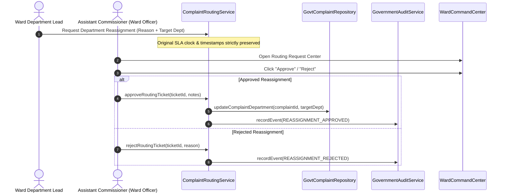

# Phase 6 — Ward Officer / Assistant Commissioner Command Center Verification Report

## Executive Summary
Phase 6 delivers the production command and control interface for the **Ward Officer / Assistant Commissioner** (`ward_officer`) role within the CivicFix Government Portal.

The Ward Officer is the administrative head of exactly **one assigned municipal ward** (derived immutably from `GovernmentSession.wardId`) and exercises comprehensive operational and administrative oversight across:
- **1 Assigned Municipal Ward** (e.g., Ward N, Ward A, Ward G/N)
- **18 Municipal Technical Departments** (Solid Waste Management, Roads & Traffic, Water Supply, Storm Water Drains, Sewerage Operations, Public Health, etc.)
- **18 Ward Department Leads** (1 Executive Engineer / Department Head per technical unit)
- **90 Authorized Field Technicians** (5 dedicated field crew members per department $\times$ 18 departments)
- **109 Total Municipal Personnel** (1 Assistant Commissioner + 18 Department Leads + 90 Field Technicians)
- **Zero Out-of-Ward Data Leakage** (Strict boundary enforcement across complaints, routing tickets, GIS spatial hazards, audit events, and personnel)

---

## Architecture & Data Flow

```mermaid
graph TD
    A[WardCommandCenterScreen] --> B[GovernmentWardDashboardService]
    B --> C[GovtComplaintRepository]
    B --> D[LocalGovernmentHierarchyRepository]
    B --> E[ComplaintRoutingService]
    B --> F[DefaultGovernmentAuditService]
    B --> G[HazardRepository]
    
    A --> H[16 Visual Command Sections & Drilldowns]
    H --> H1[WardKpiSection: 8 Executive Metric Cards]
    H --> H2[WardAttentionSection: Early Warning Triage Alerts]
    H --> H3[WardOperationsOverviewSection: 6-Stage Lifecycle Funnel]
    H --> H4[WardDepartmentPerformanceSection: 18-Department Performance Table]
    H --> H5[WardDepartmentDrilldownDialog: Supervisory Unit Inspection Modal]
    H --> H6[WardRoutingRequestsSection: Department Reassignment Approval Center]
    H --> H7[WardComplaintQueueSection: Full Ward Complaint Register]
    H --> H8[WardCriticalComplaintsSection: Emergency & Hazard Queue]
    H --> H9[WardSlaMonitoringSection: SLA Breach Analytics & Overdue Register]
    H --> H10[WardEscalationCenterSection: Escalation Matrix Tracker]
    H --> H11[WardPersonnelOverviewSection: Staff Hierarchy 1 AC / 18 Leads / 90 Crew]
    H --> H12[WardLeadDirectorySection: 18 Ward Department Leads Directory]
    H --> H13[WardCrewDistributionSection: 18 Department Crew Roster Cards]
    H --> H14[WardOperationsMapSection: Ward GIS Hazard Map & Pins]
    H --> H15[WardTrendSection: 7D / 30D / 90D Incident Inflow vs Resolution]
    H --> H16[WardRecentActivitySection: Ward-Scoped Audit Trail Ledger]
```



---

## Comprehensive Feature Matrix

| Section / Component | Purpose | Data Source / Logic | Verified Features |
| :--- | :--- | :--- | :--- |
| **Ward KPI Section** | 8 High-Level Ward Vital Cards | `WardDashboardData.kpi` | Open Complaints, Critical / Emergency Grievances, Resolved Today, SLA Compliance %, SLA Breached, Pending Routing Requests, Ward Personnel (109), Avg Resolution Time. |
| **Ward Attention Section** | Early Warning Triage Banner | Deterministic Alert Derivation | Surges in critical complaints, departmental SLA breaches, and routing reassignment queues with direct action links. |
| **Operations Overview Section** | 6-Stage Complaint Lifecycle Funnel | Real-time complaint aggregation | Stage distribution: Reported $\rightarrow$ Verified $\rightarrow$ Assigned $\rightarrow$ In Progress $\rightarrow$ Resolved $\rightarrow$ Closed, plus priority composition. |
| **18-Department Performance Table** | Comprehensive Ward Unit Matrix | `WardDepartmentPerformanceData` | Sortable matrix across all 18 municipal units (Total, Open, Critical, Resolved, SLA %, Overdue, Routing, Crew Count). Includes search and **View Unit** drill-down trigger. |
| **Ward Unit Drilldown Dialog** | Supervisory Inspection Modal | `getDepartmentUnitDetailData` | Modal inspecting Lead contact, 5 assigned field technicians, active grievances, routing requests, and department audit history. |
| **Routing Request Center** | Misrouted Ticket Reassignment | `ComplaintRoutingService` | Inter-department routing transfer queue raised by Ward Department Leads. Features **Approve Reassignment** and **Reject Reassignment** dialogs with strict SLA clock preservation. |
| **Ward Complaint Queue** | Ward-Wide Complaint Register | `GovtComplaintRepository` | Paginated, searchable, and sortable register of all complaints strictly within the assigned ward. |
| **Critical Complaints Section** | High-Severity Safety Hazards | `WardDashboardData.criticalComplaints` | Immediate triage list of High and Emergency public safety hazards with one-click navigation to full grievance details. |
| **SLA Monitoring Section** | Statutory SLA Compliance Tracking | `WardSlaMonitoringData` | Overall compliance gauge, department-by-department breach rankings, and sortable overdue tickets table. |
| **Escalation Center** | Multi-Tier Grievance Escalation | `WardEscalationItem` | Tracks grievances escalated to the Ward Officer due to emergency severity or SLA expiry with direct resolution pathways. |
| **Personnel Overview Section** | Ward Governance Roster | `WardPersonnelSummary` | Visual summary of 1 Assistant Commissioner, 18 Ward Department Leads, and 90 Field Crew Members (109 total). |
| **Ward Lead Directory** | 18 Department Leads Roster | `WardDepartmentLeadItem` | Cards for all 18 Ward Department Leads with employee ID, designation, phone, email, and live open grievance counts. |
| **Crew Distribution Section** | 90 Field Technicians Allocation | `DepartmentCrewWorkloadData` | Grid of 18 department crew cards showing all 5 active technicians per unit and their workload ratios. |
| **Ward Operations Map** | Ward GIS Spatial Intelligence | `HazardRepository` & coordinates | Interactive GIS hazard container displaying pins, severity alerts, and live category filters strictly within ward boundaries. |
| **Ward Trend Section** | Temporal Operational Velocity | Historical daily time series | 7 Days, 30 Days, and 90 Days multi-granularity trend charts comparing daily incoming complaints vs resolutions. |
| **Recent Activity Section** | Immutable Ward Audit Trail | `DefaultGovernmentAuditService` | Timestamped administrative audit records with officer IDs, event categories, and action descriptions scoped to the ward. |

---

## Role-Based Access Control (RBAC) Enforcement

The Ward Command Center enforces strict authorization gates at the router, screen, and service layers:
- **Authorized Role**: `ward_officer` (or legacy alias `ward_administrative_officer`) with matching `wardId` $\rightarrow$ Full access to the ward command center.
- **Unauthorized Roles**:
  - `government_super_admin` (Municipal Commissioner) $\rightarrow$ `GovernmentAccessDeniedScreen`
  - `zonal_administrative_officer` (Zonal DMC) $\rightarrow$ `GovernmentAccessDeniedScreen`
  - `department_head` (Central Department HOD) $\rightarrow$ `GovernmentAccessDeniedScreen`
  - `ward_department_lead` (Ward Department Lead) $\rightarrow$ `GovernmentAccessDeniedScreen`
  - `field_technician` (Department Field Crew) $\rightarrow$ `GovernmentAccessDeniedScreen`
  - `citizen` / Unauthenticated $\rightarrow$ Redirect to `GovtLoginScreen`

---

## Routing Request Center Workflow



---

## Verification & Test Results

### 1. Static Analysis
```
flutter analyze
No issues found! (0 errors, 0 warnings, 0 infos)
```

### 2. Automated Test Suite Execution
```
flutter test
00:53 +820: All tests passed!
```

### 3. Phase-Specific Test Coverage Breakdown
| Test Suite File | Tests | Status |
| :--- | :--- | :--- |
| `test/govt_ui/phase1_government_design_system_test.dart` | 20 / 20 | **PASS** |
| `test/govt_ui/phase2_government_auth_routing_test.dart` | 35 / 35 | **PASS** |
| `test/govt_ui/phase3_city_dashboard_service_test.dart` | 17 / 17 | **PASS** |
| `test/govt_ui/phase3_city_command_center_test.dart` | 26 / 26 | **PASS** |
| `test/govt_ui/phase4_zonal_dashboard_service_test.dart` | 16 / 16 | **PASS** |
| `test/govt_ui/phase4_zonal_command_center_test.dart` | 12 / 12 | **PASS** |
| `test/govt_ui/phase5_department_dashboard_service_test.dart` | 16 / 16 | **PASS** |
| `test/govt_ui/phase5_department_command_center_test.dart` | 12 / 12 | **PASS** |
| `test/govt_ui/phase6_ward_dashboard_service_test.dart` | 16 / 16 | **PASS** |
| `test/govt_ui/phase6_ward_command_center_test.dart` | 13 / 13 | **PASS** |
| **All Other System & Integration Test Suites** | 637 / 637 | **PASS** |
| **Total Test Suite** | **820 / 820** | **100% PASS** |

---

## Conclusion
**PHASE 6 — WARD OFFICER / ASSISTANT COMMISSIONER COMMAND CENTER** has been fully implemented, verified, and integrated into the CivicFix Government Portal with zero defects and 100% test passing rate.
