# Phase 7 — Ward Department Lead Operations Dashboard Verification Report

## Executive Summary
Phase 7 delivers the production operations center for the **Ward Department Lead** (`ward_department_lead`) role within the CivicFix Government Portal.

The Ward Department Lead manages operational grievance handling and field execution for exactly **1 Municipal Ward $\times$ 1 Technical Department $\times$ 5 Authorized Crew Members** (derived immutably from `GovernmentSession.wardId` and `GovernmentSession.departmentId`).

Key capabilities delivered and verified:
- **Authoritative Scope**: Immutable Ward $\times$ Department unit context dynamically bound from session.
- **Top KPI Grid**: 8 Unit-level KPI metric cards (Unassigned, Assigned, In Progress, Critical, SLA At Risk, SLA Breached, Awaiting Verification, Resolved Today).
- **Operations Funnel**: 6-stage lifecycle distribution (`Unassigned` $\rightarrow$ `Assigned` $\rightarrow$ `Accepted` $\rightarrow$ `In Progress` $\rightarrow$ `Awaiting Verification` $\rightarrow$ `Resolved`).
- **Needs Assignment Section & Crew Dispatch Modal**: Unassigned complaint triage with assignment restricted strictly to the 5 authorized crew members belonging to the same Ward $\times$ Department unit.
- **Complaint Queue**: Full operational complaint table with priority, status, crew, SLA, and date range filters plus real-time search.
- **Crew Workload**: Capacity and active assignment cards for all 5 authorized field technicians.
- **Complaint Detail View**: Operational inspection dialog showing citizen evidence, work logs, routing history, and context-sensitive action triggers.
- **Wrong Department & Routing Requests**: Reassignment ticket creation via `ComplaintRoutingService` with SLA preservation and self-approval prevention (approval authority strictly held by Ward Officer).
- **SLA Monitor**: SLA health distribution (Healthy, At Risk $\le$ 12h, Breached $>$ 48h) and sortable overdue complaints register.
- **Work Awaiting Verification & Review Modal**: Field completion inspection interface with **Verify & Resolve** and **Return for Rework** workflows.
- **Completed Work History**: Historical ledger of verified grievances with resolution durations and SLA compliance results.
- **Critical Grievance Triage**: Emergency hazard queue scoped strictly to current unit.
- **Localized GIS Map**: Unit-isolated GIS marker map.
- **Unit-Scoped Audit Activity**: Filtered event stream powered by `GovernmentAuditService`.

---

## Architecture & Data Flow

```mermaid
graph TD
    A[DepartmentOperationsScreen] --> B[GovernmentDepartmentLeadDashboardService]
    B --> C[GovtComplaintRepository]
    B --> D[LocalGovernmentHierarchyRepository]
    B --> E[ComplaintRoutingService]
    B --> F[DefaultGovernmentAuditService]
    B --> G[HazardRepository]
    
    A --> H[11 Operational Sections & Modals]
    H --> H1[DepartmentLeadKpiSection: 8 Operational KPI Cards]
    H --> H2[DepartmentLeadOperationsFunnelSection: 6-Stage Lifecycle Funnel]
    H --> H3[DepartmentLeadUnassignedSection: Triage & Crew Dispatch Modal]
    H --> H4[DepartmentLeadComplaintQueueSection: Full Unit Complaint Table]
    H --> H5[DepartmentLeadCrewWorkloadSection: 5 Authorized Crew Workload Cards]
    H --> H6[DepartmentLeadAwaitingVerificationSection: Verification Review Modal]
    H --> H7[DepartmentLeadSlaMonitorSection: SLA Breakdown & Overdue Register]
    H --> H8[DepartmentLeadRoutingRequestsSection: Routing Ticket Tracker]
    H --> H9[DepartmentLeadCompletedWorkSection: Unit Resolution History]
    H --> H10[DepartmentLeadCriticalComplaintsSection: Emergency Hazard Alerts]
    H --> H11[DepartmentLeadMapSection & DepartmentLeadRecentActivitySection]
```

---

## Comprehensive Feature Matrix

| Section / Component | Purpose | Data Source / Logic | Verified Features |
| :--- | :--- | :--- | :--- |
| **Top KPI Grid** | 8 Unit-Level Metric Cards | `DepartmentLeadKpiData` | Real-time counts for Unassigned, Assigned, In Progress, Critical, SLA At Risk, SLA Breached, Awaiting Verification, and Resolved Today. |
| **Operations Funnel** | 6-Stage Complaint Lifecycle | Real-time complaint aggregation | Stage distribution: Unassigned $\rightarrow$ Assigned $\rightarrow$ Accepted $\rightarrow$ In Progress $\rightarrow$ Awaiting Verification $\rightarrow$ Resolved. |
| **Needs Assignment** | Unassigned Grievance Triage | `GovtComplaintRepository` | Identifies complaints requiring field dispatch. Features prominent **ASSIGN CREW** button launching the technician selector. |
| **Crew Assignment Modal** | Field Technician Dispatch | `LocalGovernmentHierarchyRepository` | Lists exactly the 5 authorized unit crew members with live workload badges (Active, In Progress, Awaiting Verification). Strictly rejects cross-unit crew assignments. |
| **Complaint Queue** | Primary Operational Register | Scoped query (`wardId` + `deptId`) | Filterable, searchable table with Priority, Status, SLA, Crew, and Date filters. Direct triggers for Assign, Routing, Detail, and Verification. |
| **Crew Workload** | Unit Crew Capacity Cards | `CrewWorkloadData` | Renders cards for all 5 authorized field technicians with assigned, in-progress, awaiting verification, and resolved today counts. |
| **Complaint Detail Modal** | Grievance Inspection | `ComplaintModel` | Citizen evidence viewer, location coordinates, priority, SLA countdown timer, work evidence, and audit timeline. |
| **Wrong Department Modal** | Inter-Department Reassignment | `ComplaintRoutingService` | Form requiring reason and target department selection. Submits ticket in `pending` state and updates complaint routing status to `reassignment_requested`. |
| **Routing Requests Center** | Unit Reassignment Tracker | `ComplaintRoutingService` | Displays all routing tickets raised by this unit with status badges and review remarks. Department Lead is prevented from self-approving tickets (Ward Officer ownership). |
| **SLA Monitor** | SLA Health & Overdue Tracker | 48-Hour SLA Lifecycle | Healthy ($>$ 12h), At Risk ($\le$ 12h), and Breached ($>$ 48h) categorization, priority breakdowns, and overdue complaints register. |
| **Awaiting Verification** | Completed Field Work Queue | Status = `resolved` / submitted | Lists completed jobs with before/after evidence previews and **REVIEW WORK** trigger. |
| **Review Work Modal** | Final Administrative Verification | `GovernmentDepartmentLeadDashboardService` | Side-by-side original evidence vs completion photos, crew remarks, and completion timestamp. Features **VERIFY & RESOLVE** and **RETURN FOR REWORK** actions. |
| **Completed Work** | Resolved Complaints Ledger | Status = `closed` / verified | Historical records with resolution duration, SLA compliance status, and date/crew search filters. |
| **Critical Complaints** | Urgent Hazard Alerts | Priority = `critical` / `urgent` | Prominent high-priority emergency queue. |
| **Department GIS Map** | Localized Spatial Intelligence | `HazardRepository` | Interactive map displaying only unit-scoped complaint markers with status and severity filters. |
| **Recent Activity** | Unit Audit Stream | `GovernmentAuditService` | Chronological audit trail of assignments, reassignments, work submissions, and verifications within the unit. |

---

## Role-Based Access Control (RBAC) & Boundary Isolation

### 1. Route Implementation
- **Route**: `/government/department-operations`
- **Controller Screen**: `DepartmentOperationsScreen`
- **Authorized Role**: `GovernmentRole.wardDepartmentLead` (with matching `wardId` and `departmentId`).
- **Access Gating**:
  - `GovernmentRole.superAdmin` $\rightarrow$ `GovernmentAccessDeniedScreen` (DENIED)
  - `GovernmentRole.zonalOfficer` $\rightarrow$ `GovernmentAccessDeniedScreen` (DENIED)
  - `GovernmentRole.departmentHead` $\rightarrow$ `GovernmentAccessDeniedScreen` (DENIED)
  - `GovernmentRole.wardOfficer` $\rightarrow$ Follows Ward Command Center (`/government/ward-operations`)
  - `GovernmentRole.fieldTechnician` $\rightarrow$ `GovernmentAccessDeniedScreen` (DENIED)
  - `GovernmentRole.citizen` / Unauthenticated $\rightarrow$ Redirect to `GovtLoginScreen`

### 2. Authoritative Scope & Strict Unit Isolation
- **Session Enforcement**: `session.wardId` and `session.departmentId` are immutable from the UI.
- **Zero Cross-Ward Leakage**: Grievances, personnel, routing tickets, audit entries, and map markers belonging to other wards are strictly excluded at the service layer.
- **Zero Cross-Department Leakage**: Grievances and crew belonging to other departments within the same ward (e.g., SWM vs Roads & Maintenance) are strictly excluded at the service layer.
- **Crew Authorization Enforcement**:
  - Exactly 5 authorized field crew members per Ward $\times$ Department unit.
  - Manual injection or manipulation of a Crew ID from another ward or department is intercepted and rejected with an authorization exception.

---

## SLA & Routing Governance Rules

1. **Routing Request Lifecycle**:
   - When a Department Lead raises a wrong-department ticket, the ticket status becomes `pending`.
   - The complaint routing status becomes `reassignment_requested`.
   - The complaint remains active in the unit queue until acted upon.
   - **No Self-Approval**: The Department Lead cannot approve their own routing request; approval authority belongs exclusively to the Ward Officer.
   - **SLA Preservation**: The complaint's original `createdAt` and SLA clock are strictly preserved (no resetting or mutation).
2. **Resolution & Rework Workflow**:
   - Field crew members submit completion evidence (before/after photos and notes).
   - Final administrative resolution authority belongs to the Ward Department Lead.
   - **Verify & Resolve**: Validates evidence and transitions complaint to verified resolution with audit logging.
   - **Return for Rework**: Returns complaint to `in_progress` / `assigned` with mandatory rejection remarks and audit trail logging.

---

## Responsive Layout Verification

| Breakpoint | Target Device | Layout Adaptation | Status |
| :--- | :--- | :--- | :--- |
| **390 px** | Mobile (iPhone/Android) | Single-column stacking, collapsible KPI list, responsive card items, overflow-safe badges, touch-friendly action buttons. | **PASS** |
| **768 px** | Tablet (iPad Portrait/Landscape) | 2-column KPI grid, dual-pane crew workload cards, responsive scrollable data tables. | **PASS** |
| **1024 px** | Laptop / Small Desktop | 4-column KPI grid, standard operational layout with side-by-side action bars. | **PASS** |
| **1440 px** | Standard Desktop Monitor | 4-column KPI grid, complete data tables with inline quick actions and full preview panels. | **PASS** |
| **1920 px** | High-Res Command Console | 4-column wide grid, expanded funnel flow, full-width GIS spatial container. | **PASS** |

---

## Files Changed and Added

### 1. New Services & Models
- `lib/Govt UI/services/government_department_lead_dashboard_service.dart`

### 2. New Dashboard Widgets & Sections
- `lib/Govt UI/widgets/dashboard/sections/department_lead/department_lead_kpi_section.dart`
- `lib/Govt UI/widgets/dashboard/sections/department_lead/department_lead_operations_funnel_section.dart`
- `lib/Govt UI/widgets/dashboard/sections/department_lead/department_lead_unassigned_section.dart`
- `lib/Govt UI/widgets/dashboard/sections/department_lead/department_lead_complaint_queue_section.dart`
- `lib/Govt UI/widgets/dashboard/sections/department_lead/department_lead_crew_workload_section.dart`
- `lib/Govt UI/widgets/dashboard/sections/department_lead/department_lead_awaiting_verification_section.dart`
- `lib/Govt UI/widgets/dashboard/sections/department_lead/department_lead_sla_monitor_section.dart`
- `lib/Govt UI/widgets/dashboard/sections/department_lead/department_lead_routing_requests_section.dart`
- `lib/Govt UI/widgets/dashboard/sections/department_lead/department_lead_completed_work_section.dart`
- `lib/Govt UI/widgets/dashboard/sections/department_lead/department_lead_critical_complaints_section.dart`
- `lib/Govt UI/widgets/dashboard/sections/department_lead/department_lead_map_section.dart`
- `lib/Govt UI/widgets/dashboard/sections/department_lead/department_lead_recent_activity_section.dart`

### 3. New Operational Dialog Modals
- `lib/Govt UI/widgets/dashboard/sections/department_lead/department_lead_assign_dialog.dart`
- `lib/Govt UI/widgets/dashboard/sections/department_lead/department_lead_routing_dialog.dart`
- `lib/Govt UI/widgets/dashboard/sections/department_lead/department_lead_verification_dialog.dart`
- `lib/Govt UI/widgets/dashboard/sections/department_lead/department_lead_complaint_detail_dialog.dart`

### 4. New Production Screen & Route Wiring
- `lib/Govt UI/screens/dashboard/department_operations_screen.dart`
- `lib/Govt UI/screens/landing/government_role_landing_screens.dart` (Replaced placeholder with production screen)

### 5. New Test Suites
- `test/govt_ui/phase7_department_lead_dashboard_service_test.dart` (14 tests)
- `test/govt_ui/phase7_department_operations_test.dart` (13 tests)

---

## Verification & Test Results

- **`flutter analyze`**: **0 issues found** (clean static analysis across all files)
- **`flutter test` (Phase 7 Unit & Service Tests)**: **14 / 14 passed**
- **`flutter test` (Phase 7 Widget & UI Tests)**: **13 / 13 passed**
- **`flutter test` (Full Project Regression Suite)**: **847 / 847 passed** (100% pass rate)
  - Baseline tests (Phases 1–6 + Core App): **820 / 820**
  - Phase 7 tests: **27 / 27**
  - Final total test count: **847 / 847**
- **Unresolved Issues**: None.

---

## Acceptance Criteria Summary

- [x] `/government/department-operations` is a real Department Lead dashboard.
- [x] Ward comes immutably from `session.wardId`.
- [x] Department comes immutably from `session.departmentId`.
- [x] Neither authoritative scope can be switched or tampered with from the UI.
- [x] No cross-ward data leakage.
- [x] No cross-department data leakage.
- [x] Top KPI grid with 8 unit metrics works.
- [x] 6-stage Operations Workflow Funnel works.
- [x] Complaint queue with multi-dimensional filtering works.
- [x] Needs Assignment section works.
- [x] Crew assignment works and strictly enforces own-crew authorization (5 technicians).
- [x] Crew workload section shows live capacity for all 5 authorized crew members.
- [x] Complaint detail view displays evidence, timer, and action pathways.
- [x] Wrong Department action creates routing tickets via `ComplaintRoutingService`.
- [x] Department Lead cannot approve own routing requests (Ward Officer ownership preserved).
- [x] Original complaint SLA timestamps remain preserved upon reassignment.
- [x] Routing Request Center displays active requests and review status.
- [x] SLA Monitor displays health breakdowns and overdue complaints register.
- [x] Awaiting Verification queue displays completed field work.
- [x] Completion evidence can be reviewed with side-by-side before/after photos.
- [x] Lead can perform final administrative verification (**Verify & Resolve**).
- [x] Return for Rework workflow supported with mandatory feedback notes.
- [x] Completed Work section displays verified resolutions.
- [x] Critical / urgent hazard triage queue works.
- [x] Localized GIS map shows only unit-scoped complaints.
- [x] Activity log is strictly unit-scoped.
- [x] Zero mock or hardcoded data in production widgets.
- [x] Backend schemas and Firestore rules remain untouched.
- [x] Firebase MCP is not required.
- [x] All previous Phase 1–6 tests and citizen features remain 100% passing.
