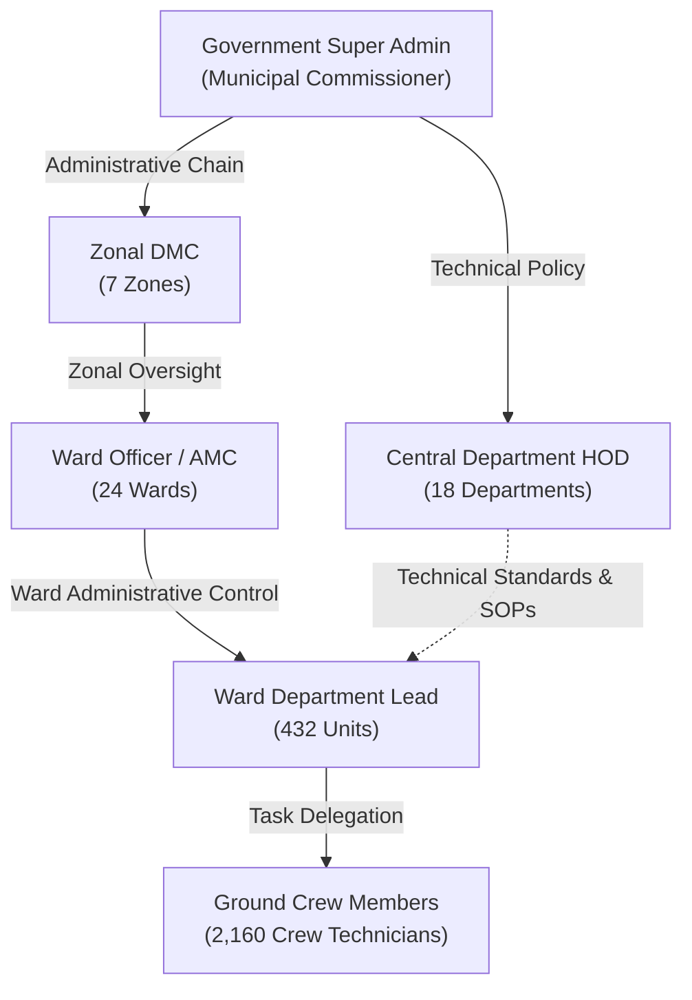
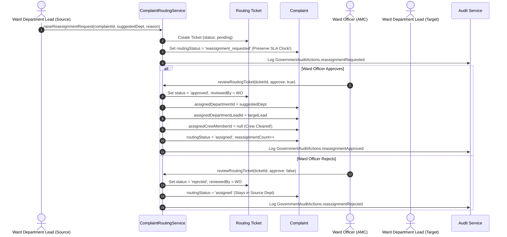

# CivicFix: BMC-Style Hierarchical Government Backend Architecture

## Executive Overview

CivicFix has transitioned from a flat municipal role model to a full-scale, production-grade **Brihanmumbai Municipal Corporation (BMC) Ward + Departmental Matrix Governance Architecture**.

This architecture reflects Mumbai's civic governance matrix, ensuring that every citizen grievance is routed with geographic and functional precision, supervised through a dual reporting chain, auditable via an immutable event ledger, and protected against SLA clock manipulation during inter-departmental transfers.

---

## 1. Core Structural Units

### 1.1 7 Administrative Zones
Mumbai is partitioned into 7 administrative oversight zones:
- `ZONE_1`: Zone 1 (City South) — Wards A, B, C (3 Wards)
- `ZONE_2`: Zone 2 (City Central) — Wards D, E, F_NORTH, F_SOUTH, G_NORTH, G_SOUTH (6 Wards)
- `ZONE_3`: Zone 3 (Western Suburbs South & Central) — Wards H_EAST, H_WEST, K_EAST, K_WEST (4 Wards)
- `ZONE_4`: Zone 4 (Western Suburbs North) — Wards P_NORTH, P_SOUTH (2 Wards)
- `ZONE_5`: Zone 5 (Eastern Suburbs South) — Wards L, M_EAST, M_WEST (3 Wards)
- `ZONE_6`: Zone 6 (Eastern Suburbs North) — Wards N, S, T (3 Wards)
- `ZONE_7`: Zone 7 (Northern Suburbs) — Wards R_CENTRAL, R_NORTH, R_SOUTH (3 Wards)

### 1.2 24 Administrative Wards
24 administrative wards cover the entire geographical footprint of Greater Mumbai:
`A`, `B`, `C`, `D`, `E`, `F_NORTH`, `F_SOUTH`, `G_NORTH`, `G_SOUTH`, `H_EAST`, `H_WEST`, `K_EAST`, `K_WEST`, `L`, `M_EAST`, `M_WEST`, `N`, `P_NORTH`, `P_SOUTH`, `R_NORTH`, `R_CENTRAL`, `R_SOUTH`, `S`, `T`.

### 1.3 18 Municipal Departments
18 technical departments handle all civic grievance categories:
1. `maintenance_roads` — Roads & Maintenance (Potholes, resurfacing, trenches, footpaths)
2. `water_works` — Water Supply & Hydraulics (Pipelines, valves, water quality, contamination)
3. `solid_waste_management` — Solid Waste Management (Garbage heaps, dustbins, compactor routes)
4. `building_factory` — Building & Factory (Structural stability, illegal sheds, dilapidated buildings)
5. `garden_trees` — Gardens & Tree Authority (Pruning, fallen trees, parks, dangerous branches)
6. `public_health` — Public Health (Vector-borne diseases, clinics, health inspections)
7. `pest_control_insecticide` — Pest Control & Insecticide (Mosquito fogging, rat control, fumigation)
8. `encroachment` — Encroachment Removal (Unauthorized hawkers, illegal pavement structures)
9. `licence` — Municipal Licensing (Trade permits, advertisement boards, signboards)
10. `shops_establishments` — Shops & Establishments (Gumastha compliance, commercial operating hours)
11. `assessment_collection` — Assessment & Property Tax (Civic billing, tax assessments, property disputes)
12. `estate` — Municipal Estates (Municipal tenancy, leased lands, civic premises)
13. `colony_slum` — Slum Improvement & Sanitation (Chawl pathways, community toilet blocks, slums)
14. `education_schools` — Municipal School Infrastructure (BMC school premises, classrooms, facilities)
15. `security` — Municipal Vigilance & Security (BMC security, gated municipal grounds)
16. `legal` — Legal & Regulatory Affairs (Statutory compliance, legal notices)
17. `administration_establishment` — Ward Administration & Personnel (Civic establishment, staff welfare)
18. `town_planning_development_plan` — Town Planning & DP (Zoning compliance, development plan violations)

### 1.4 432 Ward-Department Operational Units
Each of the 24 wards contains a dedicated cell for each of the 18 departments ($24 \times 18 = 432$ units).
- Each unit is led by exactly **1 designated Ward Department Lead**.
- Each unit has an assigned ground squad of exactly **5 Crew Technicians**.

---

## 2. Government Role Hierarchy & Headcount

CivicFix establishes **exactly 2,642 deterministic government identities** across 6 standardized backend roles:

| Backend Role Identifier | Level | Display / Designation Title | Count | Scope |
| :--- | :---: | :--- | :---: | :--- |
| `government_super_admin` | 6 | Municipal Commissioner & Addl. MC | **1** | Greater Mumbai (Full City) |
| `zonal_dmc` | 5 | Zonal Deputy Municipal Commissioner | **7** | Zonal Oversight (1 per Zone) |
| `central_department_hod` | 4 | Chief Engineer / Central Head of Dept | **18** | Functional Discipline (All Wards) |
| `ward_officer` | 3 | Assistant Municipal Commissioner (AMC) | **24** | Ward Administrative Control (1 per Ward) |
| `ward_department_lead` | 2 | Ward Department Lead (e.g. AE / EE / MOH / PCO) | **432** | Ward-Dept Unit ($24 \times 18$) |
| `department_crew` | 1 | Sub-Engineer / Junior Engineer / Field Crew | **2,160** | Operational Squads ($432 \times 5$) |
| **TOTAL IDENTITIES** | — | — | **2,642** | **100% Deterministic** |

> **Role Separation Rule**:
> Sub-designations (e.g. `Assistant Engineer (Roads)`, `Medical Officer of Health (MOH)`, `Pest Control Officer (PCO)`) are stored in `displayDesignation`. The backend authorization role remains strictly `ward_department_lead`.

---

## 3. Dual-Chain Matrix Reporting Hierarchy

CivicFix models the BMC dual-reporting matrix:

### 3.1 Administrative Hierarchy (Jurisdictional Line of Command)
1. **Crew Member** reports to their **Ward Department Lead** (`administrativeSupervisorId: GOV-WDL-...`).
2. **Ward Department Lead** reports to the **Ward Officer** (`administrativeSupervisorId: GOV-WO-...`).
3. **Ward Officer** reports to the **Zonal DMC** (`administrativeSupervisorId: GOV-DMC-...`).
4. **Zonal DMC** reports to the **Municipal Commissioner (Super Admin)** (`administrativeSupervisorId: GOV-SA-001`).

### 3.2 Technical Hierarchy (Functional Line of Command)
1. **Ward Department Lead** reports functionally to the **Central Department HOD** (`technicalSupervisorId: GOV-HOD-...`).
2. **Central Department HOD** reports directly to the **Municipal Commissioner (Super Admin)** (`administrativeSupervisorId: GOV-SA-001`).

---

## 4. Wrong-Department Reassignment Ticket Workflow

When a citizen files a complaint that is misclassified by AI or manual triage, the assigned Ward Department Lead raises a first-class **Complaint Routing Ticket** (`complaint_routing_tickets` collection).

### Strict SLA Clock Preservation Rule
> [!IMPORTANT]
> **Anti-Tampering SLA Guarantee**: When a complaint is reassigned to a new department, `originalCreatedAt` and `slaStartedAt` are **NEVER** modified. The citizen's grievance SLA continues to tick without interruption. `currentDepartmentAssignedAt`, `lastReassignedAt`, and `reassignmentCount` are recorded for departmental KPI accountability.

---

## 5. Security & RBAC Policies

1. **Routing Ticket Creation**:
   - Only `ward_department_lead` assigned to that ward and department (or `government_super_admin`) can raise a reassignment ticket.
2. **Routing Ticket Approval / Rejection**:
   - Only `ward_officer` whose `wardId` matches the ticket's `wardId` (or `government_super_admin`) has the authority to approve or reject. Cross-ward actions are blocked.
3. **Crew Delegation**:
   - Only the assigned Ward Department Lead can assign crew members within their 5-technician squad.
4. **Complaint Visibility**:
   - `government_super_admin`: Full Greater Mumbai visibility.
   - `zonal_dmc`: Wards belonging to their zone.
   - `central_department_hod`: Complaints assigned to their department across all 24 wards.
   - `ward_officer`: All complaints in their administrative ward.
   - `ward_department_lead`: Complaints in their ward and department.
   - `department_crew`: Assigned complaints or squad tasks.
5. **Immutable Audit Trails**:
   - All critical actions are recorded to `government_audit_logs` with actor details, timestamps, and metadata. Writes are append-only; updates and deletions are strictly rejected.

---

## 6. Canonical Dataset Catalog (`resources/Govt Data/`)

| File Name | Records | Description |
| :--- | :---: | :--- |
| `zones.json` | 7 | 7 BMC Administrative Zones |
| `wards.json` | 24 | 24 Administrative Wards with GIS coordinates |
| `departments.json` | 18 | 18 Municipal Departments with designations |
| `ward_departments.json` | 432 | 432 Ward-Department Operational Cells |
| `government_users.json` | 2,642 | Deterministic municipal accounts with dual supervisors |
| `government_hierarchy.json` | Full Tree | Nested administrative & technical hierarchy trees |
| `seed_manifest.json` | 1 | Integrity hash & count manifest |
